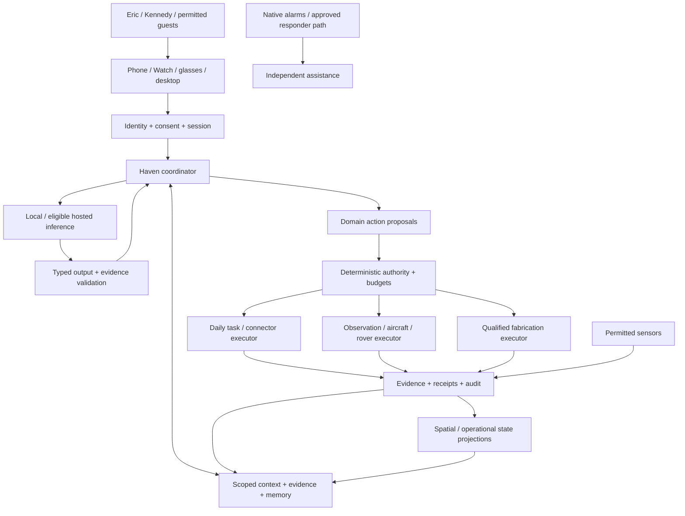

# Integrated system architecture

**Design proposal.** Preserve the existing M0 application and its later approved simulation branch. Expand through separately owned domain modules and narrowly isolated executors, not one new service per diagram box.

## Four cooperating planes

**Human and identity plane:** phone/browser now, native Apple companions later, glasses/Watch interfaces, per-user sessions, consent screens, visible receipts and manual controls. Authentication identifies the permitted principal; voice or a model-generated actor name does not.

**Knowledge and reasoning plane:** context assembly, local/eligible remote models, task-specific perception, evidence retrieval, spatial estimates, project memory and bounded agent jobs. It produces answers, hypotheses and action proposals. It cannot grant itself resources or physical permission.

**Authority and execution plane:** domain-specific policy, permission/consent checks, rate/cost/energy reservations, valid action authorizations, deterministic schedulers, simulator/aircraft bridge, robot/fabrication adapters. Different executors have different credentials and cannot forward arbitrary commands to each other.

**Assurance plane:** append-oriented audit, artifact versioning, qualification profiles, resource health, independent measurements, regression suites, human review and revocation. It reports separately from conversational fluency. It must detect a stalled worker instead of accepting its last cached heartbeat as health.

## Source-of-truth boundaries

Use explicit identifiers to relate domains, not a universal state machine. `Conversation`, `DailyTask`, `Incident`, `SpatialMap`, `Experiment`, `DesignArtifact`, `DeviceQualification` and `Authorization` have distinct lifecycles. A calendar reminder is not an OUTSIDE_CHECK incident. A design revision is not a new flight policy. A physical test result is not a model memory.

Stable IDs and schema versions allow cross-references. The existing M0 event/incident schema remains authoritative for that slice. The draft schemas here illustrate later boundaries and cannot be migrated into M0 without an approved adapter/change.

Store private per-user state separately from intentionally shared household state. A selected evidence package contains only authorized references and needed content; the model is not given unrestricted database credentials. Metadata can itself be sensitive. Shared inference weights do not justify shared prompts, caches or application sessions.

## Initial deployment and later placement

Continue Ubuntu/WSL and the small existing application for the bench. Use local files for immutable fixtures and SQLite for the current transaction ledger. The new coordinator can be an application module once approved. A model-serving process, a simulator namespace and eventual robot/printer gateways deserve separation because of concrete authority/resource boundaries.

A desktop that sleeps is a valid development host but not continuously available help. Measure uptime requirements before selecting an always-on host or private remote-access gateway. The phone should show local/remote availability explicitly. Never turn away-from-home convenience into an automatic internet-exposed service.

M0 has no broker/MCP/ROS2. Later sensor fleets may justify MQTT, a robot navigation stack may justify ROS2, and a reviewed tool facade may justify MCP. Adopt each for a documented need and test its authentication and failure modes. None belongs in the initial build merely because it appears in a long-term diagram.

## Resource governance

Reserve CPU/memory for receipt and status operations before allocating heavy inference or simulation. Queue inference fairly between users. A long engineering search cannot starve a current incident or consume the entire GPU. Cap concurrent agent jobs, tool steps, budget and stored media. Independent alarms remain outside optional inference and cloud spending.

No distributed physical exactly-once claim is made. Record intent, dispatch attempt, acknowledgement and observed effect separately. When a side effect may have happened but the response is missing, reconcile before retrying. A stopped print, missing drone or late health sample must not be normalized into a fictitious successful state.

## Integration strategy

First freeze shared vocabulary and adapter boundaries. Then implement daily read-only capabilities without waiting for aircraft purchases. Run research prototypes in separate workspaces against synthetic/offline evidence. A promising prototype enters the application only with a versioned qualification profile, input/output contract and failure tests. Preserve a review-only import path that cannot accidentally run historical actions.
