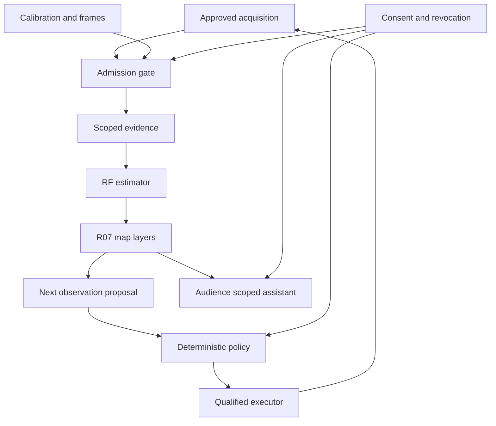

# R06 architecture — RF evidence toward spatial understanding

Version 1.0 · 2026-09-28, UTC · **DESIGN_PROPOSAL**

Recommendation: build a local, replay-first RF perception module with replaceable acquisition adapters. Begin with motion evidence and honest unknown states. Add cooperative ranging for device localization, then controlled edge/surface reconstruction. Keep semantic interpretation as a separately evaluated layer. Haven remains the daily assistant for two independently consenting people; this module provides scoped evidence to that assistant.

This document proposes a design. No hardware, native app, RF algorithm, mobile carrier, or physical experiment has been qualified by Haven. Source IDs resolve in [EVIDENCE_REGISTER.md](EVIDENCE_REGISTER.md). All proposed thresholds and budgets are engineering choices, not reported performance.

## 1. Decisions and alternatives

| Decision | Preferred path | Bounded alternative and decision trigger |
|---|---|---|
| Start without buying | Synthetic/offline replay and evidence integrity, E0 | A permitted public dataset for E1 after license, subject provenance, and label checks |
| First future RF acquisition | One documented ESP32 receiver and an owned, permitted AP; add a second receiver only for a stated comparison | A qualified fixed mmWave sensor if still-presence utility matters more than learning Wi-Fi CSI |
| Device localization | Cooperative UWB or supported Wi-Fi RTT; exact device and firmware gate | Coarse room/zone evidence when distance or direction is unavailable |
| Geometry | Controlled targets, known sample poses, classical reconstruction before learned completion | Direct-view depth/manual geometry as reference, clearly retaining its origin |
| Carrier | Fixed stand, then human-moved indexed fixture | Rover when positioning value exceeds calibration/maintenance cost; drone remains a later independent branch |
| Model use | Deterministic quality checks, features, inversion, and view selection | A qualified compact local model only after a held-out improvement; hosted analysis only for eligible summaries |
| Shared interfaces | R06 sidecars and explicit H00 change requests | A reviewed SpatialEstimate v2 later; do not expand the inert v1 examples in place |

Presence infrastructure teaches acquisition, calibration, uncertainty, privacy, and evaluation. It does **not** establish that the same radio has sufficient observability for geometry.

## 2. What each measurement can support

| Method | Actual observable and prerequisites | Useful output | Main limitation / disposition |
|---|---|---|---|
| RSSI | Packet received power, usually dBm; known source, gain state and geometry | Link change; coarse fingerprint/attenuation hypotheses | A scalar mixes many paths. An RSSI coverage map is an acquisition aid. Distance from path loss is unreliable without environmental assumptions. |
| Wi-Fi CSI | Complex per-subcarrier channel estimates, antenna/LTF indices, packet times and configuration | Motion features, link dynamics; qualified localization/inverse models | Oscillator offsets, AGC, firmware scaling and multipath matter. Ordinary API access is not implied by owning Wi-Fi. An ESP32 stream is not automatically a synchronized MIMO array. [R06-S02, R06-S03] |
| Wi-Fi ToF/FTM/RTT | Cooperative range to a capable AP/peer; surveyed anchor positions for localization | Device range and multilateration | Locates the participating radio, not an untagged person or wall. Platform, foreground/permission and NLOS limits apply. [R06-S07] |
| UWB ranging | TWR or synchronized TDoA; supported tags/anchors, antenna-delay calibration | Tag/device position regions | Phone NI measurements are not raw channel-impulse-response radar. NLOS bias and poor anchor geometry can overwhelm nominal precision. CIR access, if desired on an accessory, is a separate SDK gate. [R06-S05, R06-S08] |
| FMCW mmWave radar | Known chirp bandwidth/slope, array layout, RF/ADC calibration; point clouds or raw samples depending on hardware | Range–Doppler–angle evidence, tracking; controlled surface inference | Sparse/specular returns and ghosts; point-cloud firmware can discard static surfaces. Obstacle/material penetration is configuration-specific. [R06-S09, R06-S10] |
| 802.11bf sensing | Standardized sensing procedures and measurement exchange on supporting implementations | A future acquisition adapter | Publication is not an imaging algorithm, raw-data API, interoperability test, or deployment permission. [R06-S01, R06-S22] |
| Radio tomography | Many known TX/RX links and a stated propagation model; useful path diversity | Attenuation/change field and coarse localization or controlled structure estimates | Ill-posed inversion needs regularization. One-side sparse data and unknown material responses introduce major ambiguity. [R06-S11, R06-S12] |
| Diffraction / edge tracing | Spatial power samples over a measured aperture; geometric diffraction assumptions | Supported edges and orientation hypotheses | Edge visibility depends on illumination and sample geometry; missing edges do not imply empty space. [R06-S13] |
| Mobile / multi-view sensing | Every sample tied to calibrated TX/RX pose and time; stable scene or explicit motion model | More diverse constraints; potentially larger synthetic aperture | Movement also changes the measurement. Freehand motion/consumer flight telemetry may be inadequate for coherent reconstruction. |

### Physics checks before selecting a rig

For an ideal monostatic bandwidth-limited radar, range resolution is approximately `c/(2B)`. Illustratively, 20 MHz corresponds to 7.5 m, 160 MHz to 0.94 m, and 4 GHz to 0.0375 m. These are calculated resolution scales, **not** accuracy claims for Wi-Fi RTT, CSI sensing, or Haven. Bistatic path-length resolution and target-position geometry differ; precision on one isolated path can be better than two-target resolution. Carrier frequency and antenna aperture govern other dimensions. [R06-S10]

At 60 GHz, wavelength is about 5 mm. A two-way path change of 0.5 mm contributes about 72° of phase shift. This calculated example explains why millimeter-scale pose errors can matter to coherent scanning. It is not a universal motion tolerance: the experiment must derive allowable translation, rotation, clock and phase error from its own model and error budget.

Record usable bandwidth, not the product's maximum advertised band. More nominal voxels do not create resolution. A calibration model may explain known wall delay, but cannot recover information that never reached the receiver. Wall material, moisture, metal/foil, incidence angle, target reflectivity, clutter and sample placement must remain explicit unknowns or controlled variables.

## 3. Carrier comparison

| Carrier | Credible role | Acquisition / spatial access | Main gate | Recommendation |
|---|---|---|---|---|
| Phone only | Consent UI, status, manual labels, direct-view camera/IMU; supported cooperative ranging | No supported stock-iPhone raw CSI path was established in this review. RoomPlan requires compatible camera/LiDAR hardware. [R06-S04–R06-S06] | Exact SKU/OS/API, permissions, background behavior, pose quality | Reuse as interface; no purchase and no universal scanner promise |
| Phone + accessory | Explicit on-demand ranging or handheld sensing | NI-compatible UWB, or accessory-owned CSI/radar acquisition sent through a narrow bridge | Accessory firmware, pairing, exported fields, actual transport and update behavior | Practical later product direction; start foreground |
| Fixed nodes | Repeatable CSI motion/presence or radar/range reference | Stable baselines and surveyed links; multiple nodes add geometry | Authorized sensing footprint, still-person confounders, clock/gain drift | Preferred first physical research arrangement |
| Handheld scanner | Indexed multi-view observations of controlled targets | Sensor-to-phone extrinsics plus fiducial/fixture pose | Freehand pose may not support coherent processing; operator body also perturbs RF | Start with marked, stationary sample positions |
| Scanning fixture | Repeatable aperture and ground-truth poses | Measured rail/grid/turntable with fixture revision | Material influence, metrology and motion repeatability | Preferred bridge to ambitious geometry |
| Rover | Movable sensor stand and approved viewpoints | Rigid mount and separately qualified localization | Wheel slip, SLAM resets, collision boundary, scan stability | Advance only if useful versus human fixture |
| Drone | Access to heights/viewpoints unavailable from the ground | Qualified payload, pose/time stream, energy and recovery | RF category, vibration, payload, permitted airspace/site and SDK | Defer. EC120 programmability remains unverified; airborne UWB has a specific regulatory blocker [R06-S21] |

A receiver on the far side of a partition is an **other-side sensor**. A radio-derived estimate from outside is **through-obstruction evidence** only when that path is established. Reflected paths around an occlusion are a third mechanism. An old visual scan is historical direct-view evidence. These can coexist; none may be renamed to make the result look stronger.

## 4. Components and trust boundaries

These are logical components, not a proposal for eight permanently running services or agents.

| Component | Owns | Input → output | Must not do |
|---|---|---|---|
| Acquisition adapter | Exact device/firmware parser, bounded buffer, quality metadata | Approved profile + bytes → RFObservationBatch / acquisition status | General scanning, arbitrary shell/network target, identity inference |
| Admission gate | Source authentication, scope, integrity, time/sequence checks | Batch + current policy → accepted/rejected reference | Trust a MAC address or model-generated grant |
| Calibration/frame registry | Immutable calibration, pose transforms, validity | Survey / reference measurements → versioned records | Silently realign data after a frame reset |
| Evidence store | Encrypted scoped bytes and dependency lineage | Accepted records → opaque evidence IDs | Make an inference authoritative because its hash matches |
| RF estimator | Features/inversion and epistemic status | Scoped evidence + method → SpatialEstimate + sidecar | Treat no packets/no motion as an empty room |
| R07 world projection | Layer fusion and historical state | Compatible estimates → scoped map layers | Merge incompatible frames or erase conflicts |
| View selector | Rank pre-enumerated useful observations | Ambiguity + catalog + budget → ObservationProposal | Command motors/radios, open new areas, see held-out truth |
| Authority/executor | Current grants, resource leases and bounded effects | Reviewed proposal → acquisition/motion receipt | Delegate authorization to a model |

Raw CSI, range histories, floorplans and radar data stay local by default. A daily answer uses a small current scoped claim, such as “The sensor reported movement in the approved area 4 seconds ago; it cannot tell who caused it.” This is an illustrative future answer, not a current observation. Shared displays receive only independently granted shared data.

### Model routing

Deterministic code owns parsing, clocks, transforms, validity, thresholds, budgets and permissions. Classical signal processing owns the first baseline. A compact local model may later handle difficult classification or evidence-grounded semantics if it beats that baseline on held-out data. Eligible cheap hosted inference may explain redacted summaries. Stronger reasoning may help analyze an experiment, but gets neither raw household feeds by default nor extra execution authority. Start with one queued analysis job, no hosted calls and no always-on LLM.

## 5. Frames, calibration and ground truth

Use a right-handed local metric frame `map:<site>:<revision>`, anchored to a surveyed origin: x and y lie in the agreed floor plane, z is up. Record axis definitions; “world” alone is invalid. Each room, fixture, carrier body, RF array and native phone session has its own frame ID. Maintain optical/radio native axes explicitly rather than assuming they coincide.

`T_parent_child` maps child coordinates into parent coordinates. Store translation in meters and a normalized quaternion `[x,y,z,w]`; positive rotations follow the right-hand rule. Store transform uncertainty, validity interval and calibration revision. Use an SE(3) small-error covariance only with its perturbation convention, axis order and units defined. Disconnected frames remain separate. A phone AR reset or moved anchor produces a new revision; it never silently relocates old evidence.

Calibration has separate layers: radio response/gain/antenna delays; antenna geometry/extrinsics; site survey; clock mapping; environmental baseline; and statistical uncertainty calibration. Changing firmware, channel, bandwidth, enclosure or fixture can invalidate only the relevant layers, but the dependency must be explicit. Background subtraction must not adapt an unmoving consenting person into the “empty” baseline. Baseline updates require an independently established permitted reference state.

Use monotonic acquisition ticks and boot IDs alongside UTC intervals and measured clock offset uncertainty. Network synchronization adequate for window-level features is not coherent RF synchronization. Software timestamp alignment cannot manufacture phase coherence between independent receivers.

For ground truth, start with tape/laser measured fixture coordinates, documented instrument uncertainty and independent capture logs. Optional direct-view depth/video needs its own consent and deletion plan. Human posture/position labels need time synchronization and adjudication; model-generated camera labels are pseudo-ground truth. A UWB estimate cannot be its own localization reference. Direct room scans require geometric checks; learned RoomPlan semantics are not certified truth. Evaluation truth is withheld from the selector and estimator.

## 6. Uncertainty and representation

Keep six layers: direct-view measured geometry; RF-derived geometry; inferred motion/presence/location; historical priors; semantic hypotheses; and unknown/unobserved space. Illustrations are a separate presentation artifact, default off.

An inverse reconstruction is still an estimate. “Measurement-supported” means linked to an explicit forward model, residual checks, sample coverage and validation; it does not mean every filled pixel was measured. Learned completion gets a support mask and prior/contribution annotation. If a method cannot identify supported versus completed portions, label its entire output `MIXED_INFERENCE` and exclude it from the measured layer.

Use interval/region coverage on held-out data, with region volume and abstention rate so enormous regions cannot game the metric. Disjoint hypotheses remain disjoint; a multimodal posterior must not be reduced to a misleading central dot. Unknown covariance stays null. A score of 0.9 for a class is neither a 90% position region nor 90% certainty that a room is safe. Never write generative textures, guessed furniture or inferred identity into measurement evidence. Schematic rendering of estimated edges is allowed with labels and unknown regions visible.

All R06 outputs retain `supports_safe_route_claim=false`. No negative RF result clears a space, rules out a person in distress, or grants a robot permission to enter.

## 7. Active perception

For a question such as “which of these two permitted regions contains the source?”, build a finite candidate catalog: another replay view, a repeat from the current position, another authorized link, a different approved fixture position, or STOP/ASK_OPERATOR. Each candidate binds the equipment, pose, profile, scope, expected duration, energy and byte cost. New frequencies, raw transmitter settings and unconstrained routes are outside the selector.

First use deterministic expected information gain or expected reduction in task loss under the current measurement model. Subtract time/energy/privacy cost and enforce hard policy constraints before scoring. Prefer diverse measurements when ambiguity arises from correlated links. When that forward model is unreliable, use a conservative fixed schedule or ask for direct-view/manual confirmation; do not invent a precise information-gain number.

A future local model can rank those same candidates or explain the ambiguity. The deterministic policy validates its choice. Compare fixed, random, deterministic adaptive, and optional learned selection with equal views, time and energy. The acquisition simulator releases only the selected observation. No access to future frames, held-out geometry or labels; an oracle comparison, if used, is labeled unattainable upper bound. A proposed acquisition is not a completed observation; failed/uninformative attempts count against the budget.

## 8. Maturity ladder and purchase gates

| Level | Externally available or feasible | Haven disposition |
|---|---|---|
| Available now | Documented CSI acquisition; supported cooperative ranging; development radar; direct-view scan APIs; published 802.11bf | `DOCUMENTED_EXTERNAL`; exact owned devices and all RF behavior remain unqualified |
| Feasible prototype | Fixed-node motion baseline; coarse permitted presence evidence; tag localization; frame/provenance replay; finite next-view selection | Proposed E0–E3; still-presence, multi-person and cross-room results must be measured separately |
| Research-stage | Controlled diffraction/tomography, coherent mobile radar, constrained non-line-of-sight object reconstruction, radar layout/semantic inference | E4/E5; licensed data and specialized apparatus may be substantial prerequisites |
| Speculative for Haven | General semantic 3D room recovery from an arbitrary exterior viewpoint or ordinary phone, robust through varied walls/clutter, useful live airborne reconstruction | Retained ambition; no qualification, timeline or guaranteed hardware path |

Gate G0: accept the design and offline contract scope; spend $0 externally. Gate G1: exact adapter/SDK/data-access evidence plus successful replay and privacy-footprint review. Gate G2: approve one complete BOM, qualified radio configuration, permitted site and physical protocol. Gate G3: acquire supervised calibration/holdout evidence. Gate G4: independently qualify a narrow household advisory use. Gate G5: separately qualify geometry, then each mobile carrier.

Candidate shortlist: an exact ESP32 development-board/module combination for CSI; Qorvo DWM3001CDK for accessory-ranging evaluation; TI IWRL6432BOOST for radar evaluation. These are alternatives, not a shopping list. Verify module certification, antenna/enclosure configuration, SKU/revision, firmware license and exported data before choosing. The TI raw-data route may add DCA1000EVM, host requirements and storage; a detection-only radar module is not a geometry rig. [R06-S02, R06-S03, R06-S08, R06-S09]

Suggested **planning ceilings, not quotations or spending authority**: $150 complete CSI pilot; $350 single-accessory ranging pilot; $750 radar point-cloud pilot. If a complete qualified configuration does not fit, return to review—do not omit cables, power, metrology or software from the budget. No geometry, rover, printer or aircraft purchase is recommended now. Reuse existing compute; GPU capacity is not freshly verified.

Regulatory gate: §15.510 restricts UWB through-wall systems operating under that section. §15.521(a) prohibits aircraft operation for UWB under that subpart. Neither a certified tag nor consent alone settles a modified imaging or airborne use; document exact applicable authorization and any specific exception before changing the blocked state. Do not generalize these provisions to every Wi-Fi or mmWave system. [R06-S20, R06-S21]

## 9. Failure, privacy and security behavior

| Condition | Required behavior |
|---|---|
| No packets, stream loss, host sleep, quota reached | Report unavailable/stale; stop current claims; keep ordinary daily assistance usable |
| Motion absent, stationary person possible | `NO_MOTION_OBSERVED`; occupancy remains unknown unless separately qualified |
| Fan/pet/curtain/door/furniture change | Flag confounder or abstain; no human identity or emergency conclusion |
| Multiple people or ambiguous source | Preserve multiple regions/unknown count; never bind anonymous RF to Eric/Kennedy |
| Borrowed phone/tag | Treat device position as device position; ownership does not prove who carries it |
| Timing/pose/calibration mismatch | Reject fusion or publish separate degraded layers; no silent repair |
| Model OOD, conflicting sensors | Expose conflict/unknown; retain independent source lineage; no confidence averaging by default |
| Spoofed RF or forged/replayed batch | Authenticate adapter transport, check boot/sequence/hash and rate limits; RF authenticity remains a residual limitation |
| Malformed binary input / malicious metadata | Constrained parser, size/shape limits, no deserialization of executable objects, no eval/shell; metadata cannot alter policy |
| Consent revoked mid-job | Stop acquisition, invalidate queued work/derived visibility, block publication/export, reconcile deletion through lineage |
| Privacy footprint extends into unapproved space | Do not collect. A map crop or directional antenna is not proof of containment. Use synthetic data or a controlled isolated site |
| Unapproved entrant / session boundary lost | Operator stops capture and quarantines affected data under the agreed deletion procedure; no automatic identity investigation |
| Physical outcome unknown | Reconcile through domain receipt/read-only status before retrying; independent recovery stays with carrier owner |

Shared spaces require both people's independent grants where both can be sensed. Guests and neighboring areas are not covered by a household member's permission. The first proposed physical site is a controlled approved area, not an assumed apartment installation. RF can reveal behavior without images; it is sensitive data, not automatically privacy-preserving.

Proposed default research retention: raw and ground-truth data for at most 7 days after a session; selected approved benchmark subsets for at most 30 days; thereafter aggregate metrics and minimized provenance. Actual policy must be approved per subject/dataset. Audit records keep opaque IDs/reasons where possible, not reconstructive RF streams. No training on private household data by default; model deletion/unlearning is not promised. Encryption and per-user scopes do not protect plaintext inference from a trusted host administrator.
