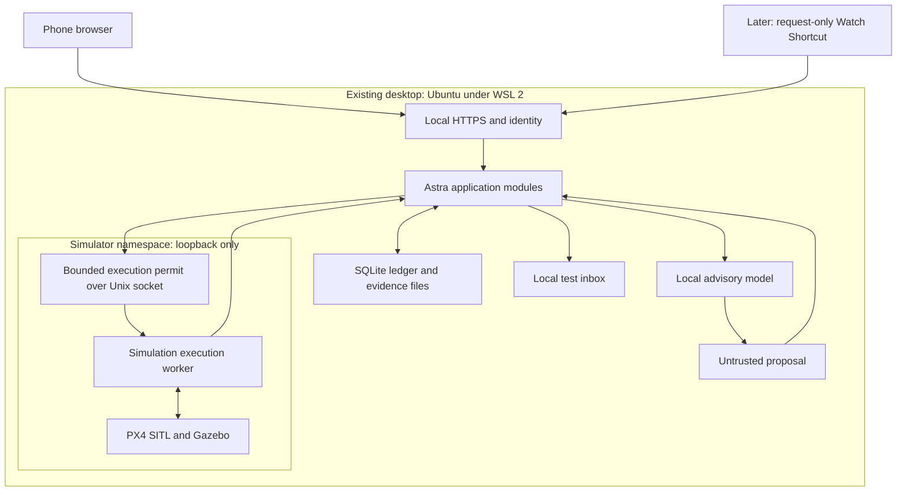

# PROJECT ASTRA — Generation 0 Implementation & Validation Plan

**Status:** Proposed plan for review; no implementation or equipment connection authorized by this document.  
**Prepared:** 27 September 2026.  
**Basis:** `PROJECT_ASTRA_Reference_Architecture_v0.1.md`, especially its AI/control separation, mission lifecycle, incident evidence, failure behavior, and Generation 0 recommendations.

## 1. The deliverable and the boundary

Build one local bench application that demonstrates the complete request-to-evidence workflow. Reuse the existing desktop, iPhone, and Apple Watch. The first demonstration ends with a simulated aircraft demonstrably landed, a linked evidence summary, and an honest incident timeline.

The core project is **M0–M5** below. M6 adds a manual Watch entry point after the phone demonstration passes. Two later simulation scenarios evaluate concurrent aircraft and preauthorized incapacitation dispatch. A separate four-hour research track investigates the existing EC120 without connecting to it.

This plan does not qualify outdoor deployment, real emergency communications, perception accuracy, or any physical aircraft. Deployment-regulatory review remains a separate workstream and does not constrain these bench scenarios. No replacement aircraft, dedicated AI computer, native mobile application, or cloud subscription is assumed.

**Evidence convention:** **V** identifies a fact checked in current primary documentation; **R** identifies an engineering recommendation; **A** identifies an assumption awaiting a bench test. Except for the explicitly verified facts in Section 3, the proposed design, limits, effort estimates, and acceptance criteria are **R**. No tests described here have been executed.

### The first demonstration, exactly

1. On the local iPhone webpage, Eric taps **Request outside check**. The page carries a persistent **SIMULATION — NO REAL AIRCRAFT** banner.
2. Astra commits the request and incident, then displays **Request received**, the incident ID, and the receipt time. A timeout displays **Receipt unknown**, with a status-check action.
3. The incident page shows fresh **simulated aircraft telemetry** and an explicitly labeled **prerecorded test image**. Recording time, playback time, source, and evidence ID are visible.
4. The advisory AI reads this evidence and proposes the single available template, **Outside observation v1**, or declines to propose it. The deterministic planner supplies its route and limits.
5. The phone displays the exact mission, aircraft, simulated route, evidence basis, expiry, and **Approve simulated mission** / **Decline** controls. Opening this page grants no authority.
6. Approval is recorded and rechecked. The isolated execution worker uploads and starts the finite simulated mission. The timeline distinguishes requests, SDK acknowledgements, and observed motion.
7. Astra observes the simulated aircraft return, land, and disarm. It creates a summary with links to the relevant telemetry samples, prerecorded frames, approval, and execution events.

An acceptable result says: “The simulated aircraft completed the observation route and was observed landed and disarmed [evidence links]. The displayed prerecorded frame contains a possible obstruction [model-inference link]. These images do not establish current conditions outside your home.”

## 2. One initial stack and where it runs

Use a **Python modular application on Ubuntu 24.04 x86-64 under WSL 2 on the existing Windows desktop**. Headless simulation avoids making GPU forwarding a prerequisite. Do not introduce containers in the initial plan; one supervised installation is sufficient.

| Component | Selection and location | Generation 0 purpose |
| --- | --- | --- |
| Phone interface | Safari, responsive server-rendered HTML; small amount of browser JavaScript | Request, receipt, approval, status, timeline, evidence links |
| HTTPS entrance | Caddy 2 in WSL; local certificate authority; TCP 8443 only | Trusted local HTTPS without an internet-dependent certificate service |
| Application | Python 3.12, FastAPI, Pydantic 2, Jinja2, Uvicorn with **one worker** | Explicit interfaces, validation, UI, incident and mission logic |
| Persistence | Python SQLite interface; local Linux filesystem; rollback journal and FULL synchronization | Transactions, deduplication, approvals, execution intents, event history |
| Media | Local immutable fixture files plus content hashes | Evidence retrieval without object-storage infrastructure |
| Work scheduling | One application task loop and a durable SQLite work table | Resume safe analysis work; never blindly resume motion commands |
| AI | Local Ollama process, separate unprivileged account; `qwen2.5vl:3b`, Q4_K_M | Advisory image interpretation and structured proposals; no tools or credentials |
| Flight adapter | Small worker from the same application repository, in an isolated Linux network namespace | Only component permitted to invoke MAVSDK; separate process is needed for network containment |
| Simulation | PX4 SITL and Gazebo, inside the same isolated namespace as the adapter | Simulated telemetry and bounded mission execution |
| Test communication | SQLite-backed test inbox, rendered by the application | Later emergency-workflow evaluation with no delivery adapter |
| Watch, after M5 | Manually launched Apple Shortcut using the same request API | Request and receipt only; approval remains on the phone |

The application has modules for **identity/UI, incidents/events, evidence, advisory AI, policy/approval, missions, and simulation adaptation**. These are module boundaries, not independently deployed services. Caddy, Ollama, and the simulator are packaged dependencies; they do not justify a service mesh.

Use ordinary HTTPS request/response and one-second status polling. Do not add MQTT, NATS, Redis, Kafka, ROS 2, a vector database, an agent framework, or an MCP server. The application’s narrow internal interfaces can become MCP tools later without exposing execution authority.

Use WSL 2's NAT networking for this baseline. A narrowly scoped Windows TCP forward carries the desktop's LAN port 8443 to Caddy in WSL. FastAPI listens on WSL loopback port 8000; Ollama on loopback port 11434. Neither is forwarded. Use the desktop's reserved LAN address and a matching local HTTPS certificate, with its CA explicitly trusted on the test phone. Record the forward and firewall rules; WSL address changes require checking the forward again. Setup instructions remain proposals until the operator applies them. [V3, V10]

**Desktop allowance, to measure:** approximately 6 CPU cores, 12–16 GB RAM, and 40–60 GB free space for the bench. CPU inference is the baseline. Existing GPU acceleration may be enabled later if already supported, but is not a prerequisite or a purchase recommendation. The desktop must remain awake during a test; sleep/restart is a fault scenario, not a claim of emergency readiness.

### Pinned simulator configuration

| Item | Selected pin or fixed configuration |
| --- | --- |
| OS/architecture | Ubuntu 24.04 LTS, x86-64, WSL 2; record exact installed OS and WSL builds |
| Autopilot | **PX4-Autopilot `v1.16.0`**, including that tag’s recursive submodule revisions |
| Physics simulator | **Gazebo Harmonic, `gz-sim` 8.9.0**; Noble amd64 runtime, plugins, development and CLI packages at **`8.9.0-1~noble`** |
| Model/world | PX4 **`gz_x500`**, autostart **4001**, bundled **default world** from the pinned model submodule; no rendered camera or downloaded world assets |
| SDK | **`mavsdk-grpc==3.17.4`**, Linux x86-64 wheel and its bundled `mavsdk_server`; use this package’s API, not unqualified `mavsdk` |
| Transport | MAVLink 2 over loopback UDP inside the isolated namespace; instance 0, system ID 1; adapter’s selected receive endpoint 127.0.0.1:14540 |
| Mode | Headless; one vehicle; nominal real-time simulation; no hardware-in-the-loop; no QGroundControl command connection |
| Starting conditions | Fixed world, home origin, weather, parameter file and fixture set; each run receives a new run ID |

**V:** PX4 documents the Ubuntu/Harmonic family, headless X500 simulation, and WSL development. Gazebo publishes the selected Noble 8.9.0 packages. MAVSDK publishes the selected Linux wheel. [V1–V5]

**R:** This is a deliberately frozen compatibility baseline, not a claim that every selected binary has already run together on this desktop. M1 must resolve and freeze all transitive packages, compiler/build details, PX4 commit and submodule hashes, parameter files, model/world hashes, and SDK server identity into an environment manifest. Retain the downloaded artifacts or an offline environment export. No `main`, `latest`, or automatic upgrades during qualification. If this tuple cannot build and boot within the M1 time box, stop and propose one documented pin change; do not silently switch simulators or bypass preflight checks.

Application dependencies are frozen to exact versions and hashes in M0. M4 records the exact Ollama binary and full model digest; the currently published model identifier begins `fb90415cde1e`. A tag alone is not an immutable model pin. [V6]

## 3. Verified facts and assumptions to clear

### Facts verified from primary documentation

| ID | Verified fact | Consequence for this plan |
| --- | --- | --- |
| V1 | PX4 1.16 documentation supports Ubuntu 22.04/24.04 and Gazebo Harmonic. | Ubuntu 24.04/Harmonic is a documented family. |
| V2 | PX4 documents `gz_x500`, model/world submodules, and headless operation. | Use the simplest supported model; prerecorded media avoids simulated-camera dependencies. |
| V3 | PX4 documents a WSL 2 development path. Microsoft documents additional configuration for WSL 2 LAN access. | Phone access needs an explicit Windows-to-WSL HTTPS path; localhost success is insufficient. |
| V4 | Gazebo’s distribution index lists Noble amd64 8.9.0 runtime, plugins, CLI and development packages. | The selected simulator patch exists; its complete dependency closure still requires M1 validation. |
| V5 | `mavsdk-grpc` 3.17.4 has a Linux x86-64 wheel and a bundled server. The old `mavsdk` package name has transitioned to a different native API. | Pin the package name as well as the version; retain the bundled server. |
| V6 | Ollama publishes a 3.2 GB quantized Qwen2.5-VL 3B model and documents structured output, including vision. | A local advisory model is plausible. Size on disk does not establish RAM needs, latency, or accuracy. |
| V7 | Apple documents Shortcuts HTTP requests with JSON bodies and manually running enabled shortcuts on Watch. | A manual Watch entry point has official building blocks; this exact local HTTPS workflow still needs testing. |
| V8 | MAVLink states that ordinary command acceptance means the flight stack will attempt the action, not that the action completed. | Never derive takeoff or landing solely from an ACK. |
| V9 | SQLite provides transactions and permits one concurrent writer. | A single application writer is sufficient; no broker or database server is required. |
| V10 | Linux network namespaces isolate interfaces, routing and network stacks. Caddy supports locally issued HTTPS certificates. | Use OS containment and local TLS, then test the actual configuration. |
| V11 | PX4 documents multi-vehicle Gazebo simulation. | Concurrent-aircraft evaluation remains an attainable later bench milestone. |

### Untested assumptions and their resolution gates

| Assumption | Resolution |
| --- | --- |
| The desktop has a supported Windows build, enabled virtualization, adequate memory/storage and permission to use WSL. | Inventory in M0; no OS purchase or upgrade presumed. Stop host setup if incompatible. |
| iPhone Safari can reach and trust the local HTTPS endpoint on the existing Wi-Fi. | T01; record phone/OS, trust configuration and network path. |
| This precise PX4/Gazebo/SDK tuple works in the isolated WSL environment. | T05–T07 and T14; documentation compatibility is not execution proof. |
| The local model can process a small image within a useful time on the desktop. | T19, with a 120-second advisory timeout. Measure rather than assume GPU capacity. |
| The selected mission, recovery settings and SDK heartbeat behavior interact as intended. | T14–T18; no generic promise of return-to-home on every failure. |
| Watch Shortcuts can use the chosen local certificate and network route. | T30–T31; paired-phone relay or standalone connectivity is not presumed. |
| The EC120 has accessible official control, telemetry or video interfaces. | R0 research only. Current status: **unverified**. |

## 4. Isolation and authority

**The simulation flag is a display property, not the containment mechanism.** Require all of the following before M1 accepts a command-capable bench:

1. PX4, Gazebo, MAVSDK and the adapter run in a network namespace with **only loopback**, no default route, no external interface, and no connection to the home LAN. Discovery/broadcast traffic stays inside it. Do not attach a virtual network interface merely to simplify debugging.
2. The application reaches the worker only through a permission-controlled Unix-domain socket. Messages use logical aircraft IDs, fixed template IDs and validated parameters. There is no caller-supplied IP address, URI, serial device, raw MAVLink message, shell command, or generic proxy operation.
3. The worker has no network-administration privilege, host/Windows command interoperability, serial access, USB passthrough, radio device, or vendor controller attachment. Required setup privileges are removed from runtime accounts. Its filesystem view excludes host credentials and writable launcher/configuration files.
4. The model has no database write access, execution socket access, user session, approval secret, shell tool, or network tool. It receives selected evidence and returns schema-validated data.
5. Runtime outbound traffic from application/model accounts is denied except explicitly required local communication. Only the HTTPS entrance is reachable from the permitted LAN. There are no WAN port forwards or public listeners. Model downloads and dependency installation occur during setup, before the contained test runtime starts.
6. The bench contains **no real aircraft adapter and no SMS, email, telephony, emergency-service, or monitoring-provider delivery adapter or credentials**. Later test recipients are an enum such as `TEST_CONTACT_A`; arbitrary destinations are rejected. The test inbox writes records locally. Untrusted summaries cannot generate executable links or launch phone calls.

These restrictions make real destinations unreachable through the bench’s defined runtime interfaces. A host administrator can change the machine; that invalidates the isolation qualification. This is not a claim of containment against a compromised Windows administrator or kernel.

Use one local operator account, a password hash, secure HttpOnly session cookies, CSRF checks, and server-side roles. Identity comes from the authenticated session, never an `approved_by` field supplied by the model. The later Watch credential can **create a request and read its receipt only**; it cannot approve, execute, or alter policy. Do not put a general operator credential in a Shortcut.

The application validates and consumes approvals transactionally. The worker independently checks the permit’s authenticity, run/worker generation, expiry, plan hash, hard limits and one-use execution ID. A shared bench signing secret belongs only to the application authorization module and worker accounts. This is a small local boundary; production certificate infrastructure is deferred.

## 5. Minimum records

Use stable opaque IDs, schema version 1, UTC timestamps and explicit units. Keep monotonic elapsed times and process boot IDs for local deadlines. The append-only event ledger supplies history; compact current-state tables supply the UI. This does not require a general event-sourcing framework.

| Record | Minimum fields and rules |
| --- | --- |
| **Event** | Event ID; schema/type; authenticated source/principal; source event/request ID; payload hash; incident/mission/run IDs; causation ID; source occurrence time; server receipt time; server sequence; boot ID; expiry; typed payload or evidence reference; validation result. Source time is untrusted. A unique source/request key provides deduplication. |
| **Incident** | Incident ID; type `OUTSIDE_CHECK`; requester; creation time; state; originating event; associated mission/evidence IDs; latest summary revision; last activity; close/review reason. Closing an incident does not rewrite mission outcomes. |
| **Evidence** | Evidence ID; incident/run; origin `SIMULATED`, `PRERECORDED`, or `MANUAL`; claim class; producer and version; original capture time or explicit unknown; ingest and presentation times; simulation time when relevant; stream/frame sequence; file/reference and SHA-256; quality/freshness flags; parent evidence IDs for derived output; correction/supersession reference. Model output is always `MODEL_INFERENCE`. |
| **Mission** | Mission ID/revision; incident; aircraft/run; template/version; immutable canonical plan and hash; coordinate frame/units; origin/home; bounds and recovery plan; policy/configuration/capability revisions; selected evidence IDs; proposer identity/model or rule version; lifecycle state; approval/execution references. Keep requested phase and last observed phase/timestamp separate. |
| **Approval** | Approval ID; mission revision/hash; authenticated approver and authorization kind; policy/configuration/capability/run/worker-generation binding; evidence-basis hash; issue/expiry times; monotonic deadline and issuing boot; one-use nonce; state; consumed execution ID/time; denial/invalidation reason. G0 core accepts only `EXPLICIT_HUMAN`; future standing authorization is not silently enabled. |
| **Aircraft capability** | Logical aircraft ID `sim-01`; kind `SIMULATED`; model/autopilot/SDK versions; capability revision and configuration hash; allowed templates; supported command/telemetry features; evidence for each verified capability; qualification date. Capabilities use supported/unsupported/unknown. Its camera capability is **external prerecorded fixture**, not a live onboard camera. |
| **Aircraft observation** | Aircraft/run/boot IDs; sample sequence and source; receive/simulation times; armed, in-air, landed, flight mode, mission progress; pose/frame; home and navigation health; simulated battery; link state; validity/freshness. A requested state never overwrites this record. |
| **Command attempt** | Execution/command IDs; semantic phase such as upload, arm, start or recover; plan hash; target/run; owner generation; durable intent time; send-attempt time; SDK result and available protocol ACK; timeout; observed effect/evidence; outcome. SDK-level internal retries are distinct from application retries. |
| **Bench run/configuration** | Run ID; environment manifest/hash; application and policy versions; launcher/worker generations; template, parameter and fixture hashes; clock information; start/end; test IDs; result-artifact location. A restored or new simulator session gets a new run identity. |

The initial claim classes are those in the reference: `OBSERVED_FACT`, `SENSOR_MEASUREMENT`, `MODEL_INFERENCE`, `EXTERNAL_DATA`, `USER_STATEMENT`, `ASSUMPTION`. Origin is a separate axis: an observed fact **within simulation** must remain marked simulated.

Store media completely and verify its hash before committing a reference. Crash-created orphan files can be cleaned later; a committed evidence record must not point to half-written media. Summaries are versioned derived evidence, not the canonical incident history. Retain qualification bundles until review; ordinary bench runs can have a proposed 30-day retention period. Use consented, non-sensitive fixtures.

## 6. Interfaces and transitions

### Interfaces, expressed as contracts rather than code

| Interface | Input and authority | Result and guarantee |
| --- | --- | --- |
| Submit outside-check request | Authenticated phone/Watch request, client request ID, issued/expiry times; no aircraft address or route | Commit event + incident association in one transaction, then return receipt ID, incident ID and receipt time. Same key/body returns the original receipt; same key/different body is a conflict. |
| Look up receipt / incident | Authenticated owner and request or incident ID | Read-only status, freshness and timeline. A GET never dispatches work. |
| Read evidence / aircraft state | Authorized incident context and logical ID | Provenance, source time and freshness accompany every result. No arbitrary URL fetch. |
| Analyze and propose | Selected evidence, capability snapshot and the single allowed template description | Untrusted structured observation/proposal or no proposal. Model cannot supply an approval, command, destination, new route or policy change. |
| Compile proposal | Template ID, evidence basis and eligible simulated aircraft | Deterministic immutable plan/revision/hash, or explicit reason for rejection. |
| Approve / decline | Authenticated operator, displayed mission revision/hash and approval nonce | Record decision; successful approval permits one execution attempt after fresh gate checks. A changed plan requires a new decision. |
| Execute approved mission | Internal signed permit; never exposed to AI | Worker accepts/rejects the request. Later ACK and observation events report separate stages. |
| Cancel / recover | Authenticated operator, mission ID and idempotency key | Withdraw before execution; after execution begins, request the approved recovery action. Report outcome only from observations. |
| Export incident | Authorized incident ID | Read-only timeline, records and evidence manifest. Import/replay for review has no execution capability. |
| Close reviewed incident | Authenticated operator and review reason | Close only after mission outcome is resolved; preserve all history. Unresolved execution remains visible and unavailable for new work. |

### Fixed mission and deterministic gates

**Outside observation v1:** take off to 6 m above the simulated home, travel 10 m north at a target 1 m/s, observe for 5 seconds, return above home and land. Use a finite onboard mission through MAVSDK’s raw mission interface so its terminal landing is part of the uploaded plan. No streamed motor, attitude, or velocity control. The deterministic compiler converts the local route into the simulator’s required coordinates and records the datum and altitude reference.

**Bench limits:** 25 m horizontal containment, 10 m height above simulated home, and 120 seconds of wall-clock mission supervision. Align the simulator’s return altitude and landing settings with those bounds; an inherited high return altitude is a qualification failure. Configure and test onboard fence and lost-link actions. A wall-clock watchdog requesting recovery is not an independent onboard time guarantee.

Before accepting approval and again before first motion: verify the active run/worker, supported capability revision, known home, navigation readiness, fresh telemetry, simulated battery at least 60%, no active/unknown mission, intact evidence references, advancing fixture playback, unchanged policy/plan, valid approval, and an available execution owner. Battery and route thresholds are bench test constants, not EC120 flight recommendations.

**Initial timing constants:** request validity 60 seconds; approval validity 60 seconds; telemetry stale after 3 seconds without a valid new sample; playback stale after 5 seconds without progression; one-second adapter supervision; lost application lease after 3 seconds. Human approvals and safety deadlines use wall/monotonic time, not accelerated or paused simulation time. Record these constants as a versioned policy. Restart invalidates outstanding approvals.

The approval/start deadline applies through mission initiation. If it expires after arming but before start, do not start: request disarm and verify it. After a mission starts, expiry does not withdraw its approved recovery authority. Recovery remains permitted for that execution until a safe terminal state or explicit simulator termination; it can never authorize another launch. The worker retains a small durable command/permit journal so application failure does not erase its recovery context.

Original recording time is never changed to make a frame look current. “Playback fresh” means the fixture sequence is advancing in this run. It does **not** mean the image depicts the present outside world. Fixture metadata and the UI must show both facts. Only the special simulation template may use this evidence source.

### Mission lifecycle

| State or transition | Required evidence / behavior |
| --- | --- |
| `PROPOSED → AWAITING_APPROVAL` | Deterministic compilation and prerequisite validation succeed. |
| `AWAITING_APPROVAL → AUTHORIZED` | Explicit valid approval for the displayed revision. Decline, expiry, or change ends that authorization path. |
| `AUTHORIZED → DISPATCHING` | Atomic approval consumption, aircraft ownership and durable execution intent; worker permit accepted. |
| `DISPATCHING → EXECUTING` | Current-run telemetry demonstrates the expected armed/in-air/mission progression. An upload, arm or start ACK alone is insufficient. |
| `EXECUTING → RECOVERING` | Planned return phase or requested contingency recovery; request and observation remain separate. |
| `RECOVERING → COMPLETED` | Expected route/observation evidence plus current-run landed and disarmed observations for at least 2 seconds. Landing without accomplishing observation is an aborted mission, not successful completion. |
| Pre-execution → `CANCELLED` / `BLOCKED` | Withdrawal, invalid approval, failed preconditions or rejection established before motion. If arming occurred, verify disarm before declaring safely cancelled. |
| Any submitted command → `OUTCOME_UNKNOWN` | Timeout, lost observation, contradictory state, worker restart or crash window prevents establishing the effect. Lock out new missions for that aircraft. |
| `OUTCOME_UNKNOWN →` reconciled state | Fresh matching-run observations or retained simulator logs establish what happened. Otherwise retain unknown; a simulator reset records `TERMINATED_BY_TEST_RESET`, never “landed.” |

Incident states are simpler: `OPEN → IN_PROGRESS → READY_FOR_REVIEW → CLOSED`, with `NEEDS_ATTENTION` for unresolved failure/unknown outcome. Approval states are `PENDING`, `GRANTED`, `DENIED`, `EXPIRED`, `INVALIDATED`, and `CONSUMED`.

Keep four distinct claims throughout: **requested** by a principal; **acknowledged** by an identified component; **observed executing/completed** by evidence; **unknown** when evidence is insufficient. “HTTP received,” “SDK accepted,” and “aircraft landed” are not synonyms. [V8]

### Restart and replay rules

Write command intent before sending. If a process fails between intent, sending, ACK and observation, reconciliation must tolerate all of those crash windows. There is no exactly-once physical-execution claim. MAVLink/SDK may retry protocol messages internally; Astra must not issue a second application start operation simply because the first result timed out.

Use one application execution owner and an exclusive worker lock. The worker rejects old ownership generations and consumed execution IDs. On restart: invalidate unconsumed approvals, mark unresolved attempts unknown, reconnect for observation only, and require reconciliation before new flight authority. Recomputing summaries is safe; re-running arm/start jobs is not.

A duplicate request with a matching payload returns its original incident even if the original HTTP response was lost. Different request IDs while an outside-check incident is active attach to that incident and do not generate extra missions. Requests that were never accepted and are already expired are rejected. The browser does not store an automatic offline submission queue. Explicit “Check receipt” is safe; reconnect is never a launch trigger.

## 7. AI scope and deterministic fallback

The local model receives at most a small selected evidence set, a reduced telemetry snapshot, and the allowed template description. Initially use one resized frame, a bounded context and a 120-second advisory timeout. Its response contains candidate observations with evidence IDs, uncertainties, and either the one allowed template ID or no proposal.

All model text is untrusted, including text read from imagery. Validate the schema, template allowlist and referenced evidence IDs. Render model claims as **AI interpretation of prerecorded evidence**. Do not convert confidence values into calibrated emergency probabilities, physical coordinates, authorization, or observed facts.

The summary renderer supplies mission status, timestamps, approvals and source links from records. AI may add labeled interpretation, but cannot rewrite that factual section. Unsupported evidence references or malformed output produce a visible error and deterministic summary. A valid citation proves which input was used, not that the inference is true.

When AI is unavailable, Eric can select the same template through **Prepare fixed simulated observation**, clearly attributed to a deterministic rule/manual action. Explicit approval and every execution gate still apply. An already approved mission continues under deterministic supervision. AI downtime therefore affects explanation quality, not receipt, authorization integrity, recovery or the later test emergency workflow.

## 8. Milestones, dependencies and stop conditions

Effort is estimated hands-on engineering time for a technically experienced developer, including the listed validation and review artifacts. It excludes waiting for device access and major host repair. **Core M0–M5: roughly 46–82 hours.** Each milestone is a separate coding-agent assignment and reviewable change; do not hand the entire plan to an agent as one build request.

| Milestone | Dependency; effort | Visible deliverable | Acceptance tests | Stop condition |
| --- | --- | --- | --- | --- |
| **M0 — Durable phone receipt** | None; **4–8 h** | Small responsive page, one request action, durable incident, receipt/status lookup, timeline; pinned application dependencies and local setup notes | T01–T04 | No durable receipt, broken deduplication, or unsuitable host/HTTPS path. Do not add AI or simulator to conceal the issue. |
| **M1 — Isolated simulator and telemetry** | M0 records/contracts; **10–18 h** | Frozen environment manifest, repeatable headless simulator start, isolation report, read-only aircraft status panel | T05–T07 | Any real-network/device reachability; missing pin; unresolved setup/boot failure after an **8-hour integration investigation**. Report the blocker and proposed change. |
| **M2 — Evidence and approval** | M0 and M1; **8–12 h** | Fixture viewer, evidence ledger, fixed proposal preview, explicit approval/decline and invalidation; execution disabled | T08–T13 | Any ambiguous prerecorded label, authorization accepted for changed content, or authority obtained from model/client assertions. |
| **M3 — Bounded simulated execution** | M2; **10–18 h** | Mission upload/start/recovery adapter, observed state transitions, route trace and simulator log evidence | T14–T18 | ACK confused with execution, unsafe replay, unclear armed state, or recovery outside the approved bounds. |
| **M4 — Advisory AI and evidence summary** | M2 and M3; **6–12 h** | Local model proposal/interpretation, deterministic factual summary, evidence links and AI-unavailable path | T19–T21 | Model can authorize or invoke execution; unsupported claims presented as facts. If local inference is unusable after **4 hours of tuning**, retain fallback and report model selection as unresolved; do not buy hardware. |
| **M5 — Full demo and failure qualification** | M0–M4; **8–14 h** | Three complete phone demo recordings, failure-test report, restart/replay results and retained evidence bundle | T22–T29 plus any previously failing tests | Any unexplained execution, unresolved unknown treated as success, or incomplete isolation evidence. A UI-only happy path is not completion. |
| **M6 — Manual Watch request** | Accepted M5; **2–6 h** | Request-only Shortcut, receipt display and a short list of tested connectivity conditions | T30–T31 | No reliable server receipt or local TLS access after the time box. Keep the phone path; propose native Watch development separately. |
| **R0 — EC120 compatibility dossier** | Independent of M1–M6; **maximum 4 h** | Exact product identity, official documentation links and capability/unknown matrix | R01 | Time box expires or official interface evidence is absent. Result may be “unverified”; no reverse engineering, purchases or connections. |
| **S1 — Two simultaneous simulated aircraft** | Accepted M5; **8–16 h**, later scope | Separate identities, permits, routes, recovery areas and reservations for two SITL instances | T32 | Any cross-target command or loss of separation when one aircraft becomes unknown. |
| **S2 — Standing incapacitation policy** | Accepted M5; **6–12 h**, later scope; independent of S1 | Explicitly enabled synthetic standing policy and parallel mock emergency workflow | T33–T35 | Communication depends on AI/drone success, a missed arbitrary notification becomes authorization, or any real destination is introduced. |

R0 uses the aircraft/controller labels, supplied manuals, exact companion-app identity, manufacturer documentation and official SDK/support information. Record flight control, telemetry, image access, authentication, OS requirements and offline operation as **documented / contradicted / unverified** with citations. “A phone can fly it” is not SDK evidence. No answer in R0 blocks the Generation 0 simulation project.

S2 adds a versioned, operator-enabled **test standing-policy record**: owner, scenario ID, qualifying synthetic events, acknowledgement deadline, template/bounds, expiry, one-launch limit and revocation state. Use a 15-second no-acknowledgement interval solely as a test fixture, not medical guidance. At the deadline, independently enqueue the mock emergency event and evaluate drone eligibility. Its derived approval has kind `STANDING_TEST_POLICY` and still binds one exact mission/run. Keep this policy disabled and unavailable in M0–M6.

## 9. Acceptance-test catalog

Every test retains a **test ID, run ID, software/configuration manifest, input IDs, expected/actual result, timestamps and pass/fail decision**. The last column lists additional evidence. Preserve raw records/logs and file hashes; screenshots alone do not establish the result. Use only fixtures and isolated canary endpoints, never real aircraft or emergency destinations.

### M0 — Receipt and durability

| Test | Setup | Expected result | Additional evidence to retain |
| --- | --- | --- | --- |
| **T01 Phone request** | Desktop bench awake; authenticated iPhone on local Wi-Fi; valid HTTPS; new request ID. Tap once. | One incident and origin event commit before success receipt; receipt ID and timeline visible. Target receipt within 2 seconds on this bench. No flight or emergency capabilities exist. | Phone recording; redacted HTTP exchange; transaction/event export; measured receipt latency; OS/network inventory. |
| **T02 Duplicate and key conflict** | Submit identical ID/body twice, including retry after suppressing the first response; then reuse the ID with changed content. | Matching duplicate returns original receipt/incident with no new action. Changed body yields conflict and no mutation of the first request. | Both request/response sets; payload hashes; database counts and rejection event. |
| **T03 Receipt crash windows** | Separately stop the service just before commit and just after commit but before HTTP reply. Restart and look up the same request ID. | UI initially reports receipt unknown. Lookup establishes absent or original committed receipt; never false success or duplicate incident. | Injection point log; before/after records; client status screens. |
| **T04 Identity and expiry** | Submit without authentication, with failed CSRF/origin validation, and with a never-accepted request older than 60 seconds. | Each rejected with reason; no incident created. Server derives identity; submitted actor names grant no authority. | Redacted request cases; rejection log; unchanged incident count. |

### M1–M2 — Simulator, evidence and approvals

| Test | Setup | Expected result | Additional evidence to retain |
| --- | --- | --- | --- |
| **T05 Reproducible simulator** | Build selected pins; cache required assets; cold-start three new runs with internet disabled. | Exact pinned binaries/model/world load, each with new run identity; telemetry appears without online asset downloads. No version drift. | Dependency locks and hashes; three startup logs; simulator/version output and configuration snapshot. |
| **T06 Containment** | Inspect runtime namespaces, routes, privileges, devices and open ports. Try supplying an address, serial path, raw command and emergency recipient. Attempt egress only to a controlled isolated canary. | Only loopback in simulator namespace; no physical device access; invalid inputs rejected; prohibited egress blocked; only intended local HTTPS ingress. No real address is probed. | Namespace/device/firewall report; API rejections; canary capture showing no prohibited delivery; startup fail-closed result with intentionally invalid containment. |
| **T07 Telemetry provenance** | Stream telemetry at a requested 2 Hz, interrupt it, inject old-run and out-of-order samples. | UI displays simulated source and age; stale after 3 seconds without valid updates; old run cannot restore health; projection does not regress. | Sample/event export; last-observed timestamps; stale/unknown UI recording. |
| **T08 Evidence truthfulness** | Play a consented, hashed fixture with known historical recording time; also ingest a fixture with unknown capture time. | Original times retained or marked unknown. All views/summaries show prerecorded origin and playback time. No association claims an onboard camera captured it. | Fixture manifest/license or consent note; original hashes; screenshots; evidence records. |
| **T09 Frozen or delayed frames** | Repeat a frame sequence without progression for more than 5 seconds; deliver a late older frame. | Playback marked stale; new proposal/approval blocked until valid playback resumes. Late frame retained but cannot replace newer current evidence. Historical capture time stays historical. | Sequence/timestamp trace; stale alert; policy denial and subsequent recovery. |
| **T10 Capability and bounds** | Offer a nonexistent template, unknown capability, wrong aircraft/run, unhealthy navigation, low simulated battery and out-of-bounds route, as separate cases. | Deterministic planner rejects each. No upload/arm/start command is generated; invalid AI suggestions cannot expand the allowlist. | Inputs, policy decisions and zero-command count for each case. |
| **T11 Explicit decision** | Valid proposal; first open the page and wait, then decline. Create a new proposal and explicitly approve it. Execution remains disabled in M2. | Viewing grants nothing; decline grants nothing; approval binds exactly the displayed plan and creates one usable authorization. | Preview screenshot; authorization/nonce/plan-hash records; audit trail. |
| **T12 Expired approval** | Grant approval, keep execution disabled, wait beyond 60 seconds, then ask the gate to authorize execution. | Expired authorization rejected; no executable permit or command emitted. A new approval is necessary. | Deadline measurements; gate decision; empty execution-output record. |
| **T13 Changed approval basis** | After grant, independently change route, selected evidence basis, policy revision, capability/configuration revision, run or worker generation. Also submit two concurrent approval clicks. | Every material change invalidates the old authorization; repeated clicks create no second permission. Ordinary fresh telemetry satisfying unchanged gates does not itself rewrite the plan. | Before/after hashes; invalidation reasons; concurrency trace; approval/command counts. |

### M3–M4 — Execution and advisory AI

| Test | Setup | Expected result | Additional evidence to retain |
| --- | --- | --- | --- |
| **T14 Bounded mission** | Fresh qualified run, healthy simulated aircraft, current fixture and explicit valid approval. | Exactly one application execution attempt; upload/arm/start recorded separately; observed route stays within bounds; observation phase occurs; final landing and disarm established before completion. | Permit and command journal; telemetry route/altitude trace; PX4 ULog; landed/disarmed samples; linked timeline. |
| **T15 ACK and unknown outcome** | In separate runs: accept command but withhold confirming telemetry; reject command; deliver motion evidence after an ACK timeout. | Acceptance alone never shows airborne/completed. Known rejection stays distinct. Timeout becomes unknown, suppresses automatic restart, and late matching-run evidence reconciles it. | ACK/SDK results, fault timestamps, worker invocation count and state transitions. |
| **T16 Process/link failure** | Separately kill application, kill worker, block local MAVLink, and kill PX4 while a mission is active. Leave other components alive. | With PX4 alive, configured lease/lost-link recovery is observed within the declared response window and remains in bounds. With PX4 killed, outcome is unknown/terminated, never landed. No new launch. | Per-case process and heartbeat trace; parameter file; recovery telemetry/ULog or unknown record; measured delays. |
| **T17 Cancel/recover** | Cancel separately before submission, after arming, during flight and while telemetry is absent. | Before submission: no motion. Armed-only: disarm must be observed. In flight: recovery request then observed outcome. Without telemetry: request recorded but outcome remains unknown. | Four event sequences; observed disarm/landing where available; unchanged unknown status where unavailable. |
| **T18 Recovery configuration and expiry** | Separately test return altitude above 10 m, preflight failure, approval expiry after arm-before-start, and expiry during an already-started mission. | Invalid setup prevents arming. Armed-only expiry prevents start and requires observed disarm. In-flight expiry preserves bounded recovery. Correct setup must pass T14/T16. | Parameter differences; gate/preflight denials; deadline records; observed disarm and recovery traces. |
| **T19 Real advisory model** | Pinned local model; fixed telemetry and one prerecorded image; record a human-authored expected description and uncertainty limits. | Within 120 seconds, model returns a valid allowed proposal or explicit no-proposal with evidence references. All visual claims remain inference. Summary facts come from records and links resolve. First AI demo requires an accepted proposal on the benign fixture. | Model digest/version, prompt/schema, input evidence IDs, raw output, latency/memory measurements, reviewed summary. |
| **T20 AI unavailable** | Stop/time out the model before proposal, during execution, and before summary generation in separate runs. | Receipt/status still work; fixed-template fallback remains available with explicit approval; executing mission is unaffected; deterministic summary states AI unavailable. | Three timelines; fallback labels; unchanged policy checks and execution evidence. |
| **T21 Malicious or malformed model output** | Fixture text says to ignore approvals; inject fabricated evidence IDs, a new destination/template and an “already approved” claim. | No authorization or execution from model content. Invalid structure/references rejected; text escaped; permitted interpretations remain labeled and inert. | Inputs/raw output; validator decisions; unchanged approvals; absence of unauthorized commands or links. |

### M5 — Complete path and failure qualification

| Test | Setup | Expected result | Additional evidence to retain |
| --- | --- | --- | --- |
| **T22 Internet loss** | All assets/model cached; disconnect WAN while preserving LAN, both before a run and during execution. | Phone request, local model, approval, simulation and summary continue. No dependency on remote fonts, map tiles, login, DNS or model API for the demo. | WAN state and network capture; complete offline demo; dependency-access log. |
| **T23 Phone link loss** | Disconnect phone Wi-Fi before receipt returns, and in a second run after approval. Reconnect manually. | First case shows receipt unknown until lookup. Second mission follows its bounded policy; reconnect only reads status and never resubmits a mission. | Phone recording; server receipt; network transition log; execution count. |
| **T24 Restart at command boundaries** | Independently restart after approval, after intent-before-send, after send-before-ACK, and after ACK-before-observation. | Outstanding unused approval invalidated; ambiguous attempts become unknown; no automatic application resend. Observation-only reconciliation determines subsequent state. | Four persisted ledgers and worker journals; send counts; boot/generation changes; reconciliation results. |
| **T25 Accidental replay** | Refresh old pages; resubmit consumed approval; replay historical event export into a review projection; restore an old pending work item. | No new arm/start. Old receipt may be read; consumed/expired authority rejected; review imports cannot reach the execution worker. | Replayed IDs; rejection reasons; read-only import mode; unchanged execution count. |
| **T26 Time behavior** | Move wall clock forward/backward in a controlled test, pause simulation, and resume it with old requests/approvals. | Clock discontinuity invalidates uncertain authority; monotonic expiry still works during a process lifetime; paused simulation never extends human consent. | Clock/boot/monotonic trace; policy decisions; zero stale executions. |
| **T27 Ownership and repeated actions** | Double-tap with different request IDs; start a second executor; submit a stale owner generation. | One active outside-check incident and mission; second executor cannot own the worker; old generation rejected. | Concurrency trace, ownership log, incident/mission counts and rejected permit. |
| **T28 Restore for review** | Export database plus referenced media, restore into a fresh bench run with execution inhibited. | Timeline and evidence hashes reconcile; historical approvals are unusable; restored status is historical, not a live aircraft observation. | Export/restore manifest, hash verification and replay-denial record. |
| **T29 First demo qualification** | Perform three clean, complete phone runs, with new run/request IDs and the qualified local model. | Each follows all seven demonstration steps, with exactly one approved mission, observed terminal state, clear provenance and working evidence links. | Three phone recordings, incident bundles, summary reviews and signed-off pass/fail checklist. |

### M6, R0 and later simulated evaluations

| Test | Setup | Expected result | Additional evidence to retain |
| --- | --- | --- | --- |
| **T30 Watch manual entry** | Enable the Shortcut on Watch; test the explicitly supported local connectivity arrangement after phone qualification. Tap manually. | Same durable receipt semantics and one incident; show success only after server response. Review/approval opens on phone. Do not assume the route traversed the iPhone unless observed. | Watch/phone OS and connection conditions; recording; request source and receipt records. |
| **T31 Watch failure/permissions** | Remove connectivity; retry a request ID; use the request-only credential against approval; reconnect after request expiry. | No false receipt, duplicate incident, approval privilege or delayed automatic submission. Credential can be revoked. | Device result screens; endpoint denials; receipt count and revocation result. |
| **R01 EC120 research quality** | Spend up to four hours on exact identification and official documentation, without connecting equipment. | Cited capability matrix distinguishes official support from unknowns. No inferred programmability or replacement purchase dependency. | Identity sources, manual/SDK URLs, search notes, time spent and unresolved questions. |
| **T32 Concurrent simulation** | Two qualified SITL instances, separate IDs, disjoint reserved routes and recovery areas; launch overlapping missions, then remove one telemetry stream. | Both operate concurrently without cross-target commands. Unknown aircraft retains its reservation; other aircraft uses its own recovery path and landing area. | Per-aircraft command/telemetry logs; reservation timeline; combined route/separation plots. |
| **T33 Standing policy** | Later extension: explicitly install a test-only policy bound to one synthetic incapacitation scenario, run, template, expiry and one-launch limit; inject qualifying events and no acknowledgement. | Deterministic standing authorization may dispatch in simulation without interactive approval. A parallel mock emergency event is created independently. No LLM opinion grants authority. | Policy/authorization records; trigger facts; dispatch and test-inbox timelines. |
| **T34 Help without a drone** | Repeat T33 with aircraft unavailable and AI stopped; repeat with mission rejection. | Mock emergency workflow reaches the same predefined deadline and recorded test recipient despite both failures. “Mock accepted” never becomes “help dispatched.” | Comparable timelines/deadline measurements; aircraft denials; test-inbox records. |
| **T35 Standing-policy boundaries** | Separately acknowledge before the test deadline, expire the standing policy, repeat the trigger after its launch limit, and inject an unrelated missed notification. | No unauthorized launch in any case. Already-recorded mock communication stays in history; cancellation is not retroactive deletion. | Four policy decisions, launch counts, acknowledgement evidence and retained communication history. |

T16 requires a concrete heartbeat/recovery profile before implementation is accepted: the worker supervises the application lease; its loss requests bounded recovery. Worker/link loss must trigger the configured PX4 data-link behavior with the actual MAVSDK component role used. Record that role, configured timeout/action and all heartbeat sources. A healthy-looking heartbeat from a stalled bridge must not mask loss of supervision. If the chosen SDK configuration cannot demonstrate this, M3 stops. Simulator termination is available to the bench operator, but does not substitute for proving recovery while PX4 remains alive.

## 10. Departures and refinements from the reference

These are deliberate Generation 0 choices. The broader target architecture remains intact.

| Reference position | Generation 0 departure/refinement | Why it improves this phase |
| --- | --- | --- |
| Linux base host and optional desktop inference | Existing Windows desktop hosts WSL, application, inference and simulation | Removes a hardware dependency; desktop interruptions are explicitly tested. |
| Phone/Watch applications and eventual health integrations | Safari first; manual Watch Shortcut later; no HealthKit or fall entitlement work | Establishes reliable manual request/receipt semantics before mobile background behavior. |
| MQTT for local sensor events | Direct HTTPS plus local transactional work table | No physical sensor fleet or distributed consumers exist yet. |
| Separated architecture services | Policy, incidents and missions are modules of one application; model and isolated adapter remain separate processes | Reduces operational work while retaining the authority and containment boundaries that matter now. |
| MCP tool facade | Internal typed contracts only | No external tool ecosystem is necessary to demonstrate this workflow. |
| Optional cloud AI and local AI | One local advisory vision model, with deterministic fallback | Makes internet-loss behavior testable without a paid API dependency. |
| Live aircraft imagery and fixed cameras | Prerecorded, consented fixtures linked to simulation phases | Tests evidence handling without implying sensor realism or camera availability. |
| Broad mission planner and inventory | One fixed template, one simulated aircraft capability profile | Makes approval hashes, retries and outcomes understandable and testable. |
| Candidate DJI/open-platform purchases | No aircraft selection or purchase; EC120 research capped at four hours | Existing ownership is acknowledged without inventing an API or blocking simulation. |
| Production device identity/certificates | Local operator session, restricted Unix socket and narrowly scoped bench permits | Establishes provenance without a household PKI rollout; unsuitable for real-aircraft authority until reviewed. |
| Network redundancy, radio and power infrastructure | LAN-only bench, software fault injection, no new UPS/radio/dock | Validates failure semantics before buying infrastructure. |
| Fleet and standing emergency authorization in later generations | First evaluations scheduled as S1/S2 after the core phone demo | Preserves both target capabilities and evaluates their logic before physical deployment. |
| Real emergency-contact/provider integration | Local test inbox only; independent synthetic escalation path | Proves timing and coupling without any possibility of sending an actual emergency request. |
| Deployment operating rules | Separate deployment-regulatory review | Keeps this plan focused on an isolated bench without discarding future operational obligations. |

The reference’s evidence classes, deterministic safety gates, explicit unknown outcomes, authenticated provenance, independent emergency communication, and no automatic replay remain requirements. Generation 0 is not evidence that those controls are ready for a real aircraft.

## 11. Review package and exit criteria

At the end of M5, the review package contains: one runnable bench project; dependency/environment locks; the containment report; a fixture manifest; concise record/interface descriptions; three complete demonstration bundles; failure-test results; the unresolved-assumption list; and a restart/reconciliation runbook. The application’s operational configuration and test report identify the same versions.

The core is accepted only when T01–T29 pass or a test is explicitly revised through review with its rationale preserved. A failing AI latency experiment can leave the deterministic bench useful, but it does not count as completion of the requested AI-assisted first demonstration. Watch and the EC120 dossier have independent outcomes. S1/S2 require new assignments and are not hidden scope in the core milestone estimate.

Before assigning M1, confirm the desktop’s actual Windows/WSL state and storage. Before M4, supply a small consented fixture set. Before M6, record the actual Watch/iPhone OS versions. No other procurement or architectural decision is required to begin M0.

## 12. Primary documentation checked

References support the verified facts above. Architectural limits and test expectations are engineering recommendations, not claims copied from these sources.

- **V1:** [PX4 v1.16 Ubuntu development environment](https://docs.px4.io/v1.16/en/dev_setup/dev_env_linux_ubuntu) and [v1.16 release notes](https://docs.px4.io/main/en/releases/1.16).
- **V2:** [PX4 v1.16 Gazebo simulation](https://docs.px4.io/v1.16/en/sim_gazebo_gz/).
- **V3:** [PX4 v1.16 WSL environment](https://docs.px4.io/v1.16/en/dev_setup/dev_env_windows_wsl) and [Microsoft: WSL networking](https://learn.microsoft.com/en-us/windows/wsl/networking).
- **V4:** [Gazebo Harmonic installation](https://gazebosim.org/docs/harmonic/install_ubuntu/) and [official gz-sim distribution index](https://get.gazebosim.org/distributions/gz-sim/releases/). The distribution site's legacy banner does not change the selected product: this plan uses Gazebo Harmonic, not Gazebo Classic.
- **V5:** [MAVSDK gRPC package and release files](https://pypi.org/project/mavsdk-grpc/3.17.4/), [package transition notice](https://pypi.org/project/mavsdk/3.17.4/), [MAVSDK mission concepts](https://mavsdk.mavlink.io/main/en/cpp/guide/missions.html) and [raw mission API](https://mavsdk.mavlink.io/main/en/cpp/api_reference/classmavsdk_1_1_mission_raw.html). Current API documentation must be checked against the pinned package at M1/M3; it is not a substitute for that version's qualification.
- **V6:** [Ollama Qwen2.5-VL 3B model](https://ollama.com/library/qwen2.5vl:3b) and [structured outputs](https://docs.ollama.com/capabilities/structured-outputs).
- **V7:** [Apple: HTTP requests in Shortcuts](https://support.apple.com/guide/shortcuts/request-your-first-api-apd58d46713f/ios) and [running Shortcuts from Watch](https://support.apple.com/guide/shortcuts/run-shortcuts-from-apple-watch-apd5888b0858/ios).
- **V8:** [MAVLink command protocol](https://mavlink.io/en/services/command.html).
- **V9:** [SQLite transactions](https://sqlite.org/lang_transaction.html).
- **V10:** [Linux network namespaces](https://man7.org/linux/man-pages/man7/network_namespaces.7.html) and [Caddy automatic/local HTTPS](https://caddyserver.com/docs/automatic-https).
- **V11:** [PX4 v1.16 multi-vehicle Gazebo simulation](https://docs.px4.io/v1.16/en/sim_gazebo_gz/multi_vehicle_simulation).

## 13. Exact first coding-agent assignment

> Implement **M0 — Durable phone receipt** from “PROJECT ASTRA — Generation 0 Implementation & Validation Plan.” Work only on this milestone in the supplied project workspace.
>
> Use Python 3.12, FastAPI, Pydantic 2, Jinja2, one Uvicorn worker and SQLite on local disk. Freeze exact application dependency versions. Build a responsive page with a persistent simulation banner and one **Request outside check** action. Create an authenticated request endpoint, a read-only receipt lookup, and an incident/timeline page. Implement only the event and incident fields needed for this slice, with a schema version and a simple migration path.
>
> Commit the request event and incident association before returning success. Deduplicate by authenticated source plus client request ID and payload hash: matching retries return the original receipt; conflicting reuse is rejected. Reject unauthenticated, invalid-CSRF and expired never-accepted requests. Display **Receipt unknown** after a network timeout and provide explicit status lookup. Do not add automatic offline submission or retry queues. Preserve receipt and timeline across a service restart.
>
> While an outside-check incident remains active, associate additional fresh request IDs with that incident and record their provenance; do not create duplicate active incidents. Use isolated test data for each acceptance run.
>
> Provide local-only run instructions and a proposed Caddy/local-HTTPS phone test procedure. Do not change host networking, install certificates, expose a listener to the LAN, or deploy anything automatically. Run the automated parts of T01–T04 on loopback; document the remaining real-iPhone acceptance steps for operator execution. Report which results are executed versus pending.
>
> Deliver the small project, dependency lock, tests, example redacted incident export and a brief acceptance report. Stop if the host assumptions or durable receipt semantics cannot be satisfied. Do not install or integrate PX4, Gazebo, MAVSDK, Ollama, a message broker, ROS 2, MCP, Watch software or any real-device/emergency-service interface. Do not create mission, approval or flight execution features. Do not purchase equipment or connect to the EC120. Finish with the M0 changes and evidence for review; do not begin M1.
