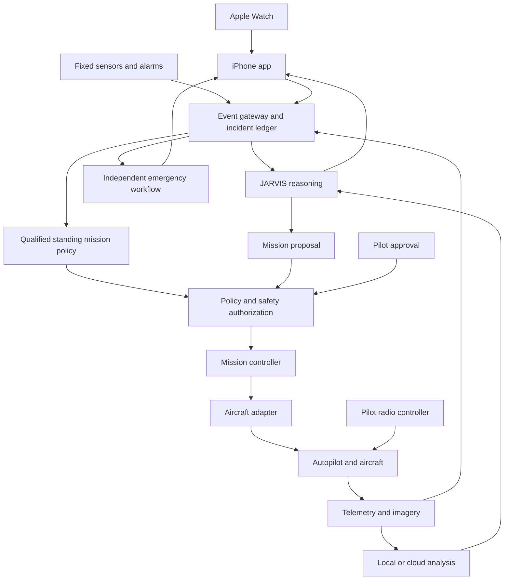
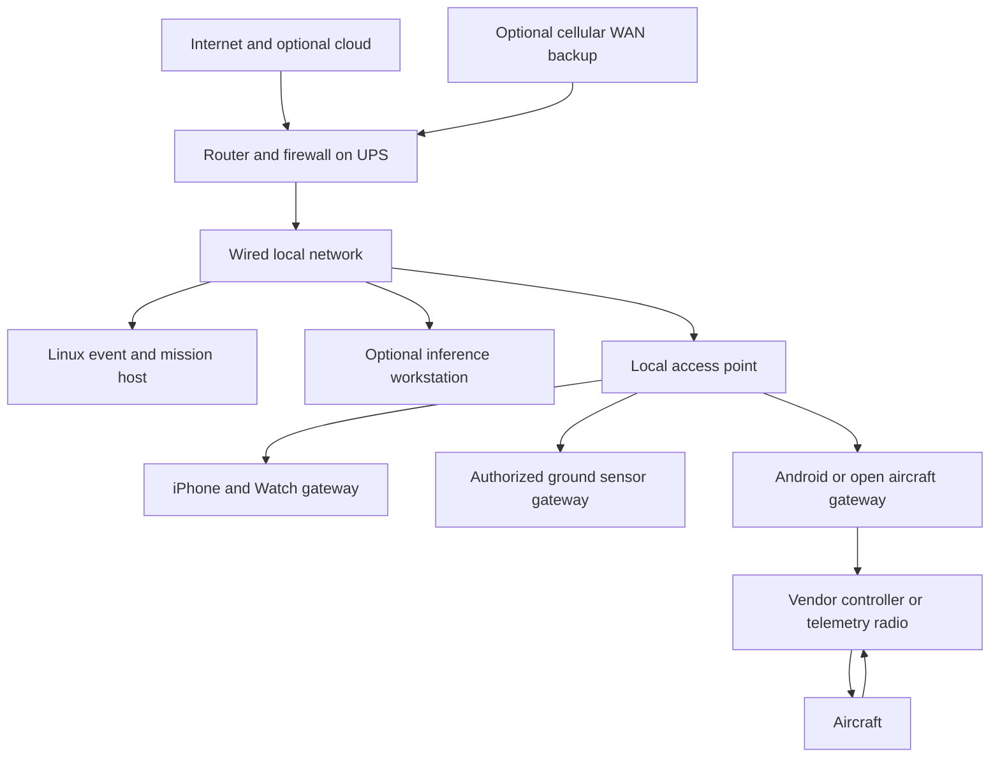
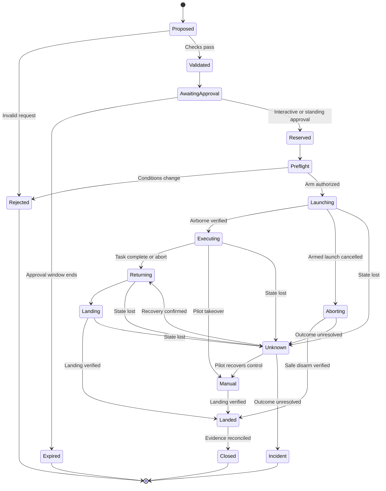
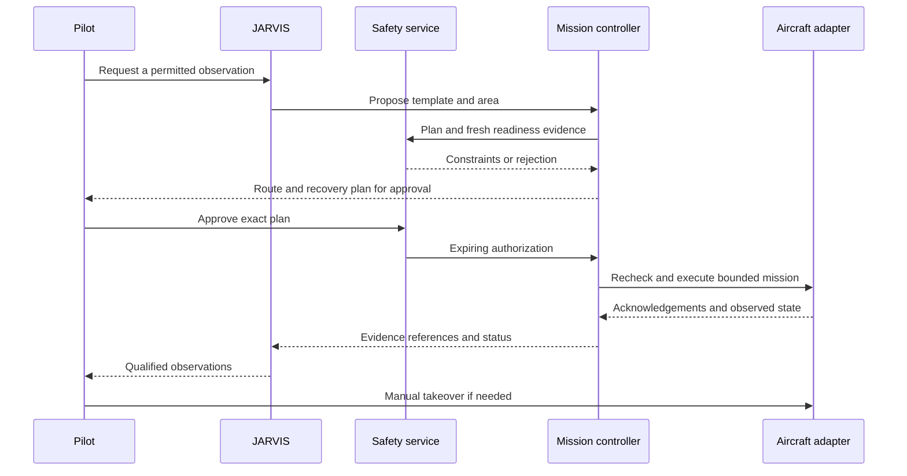
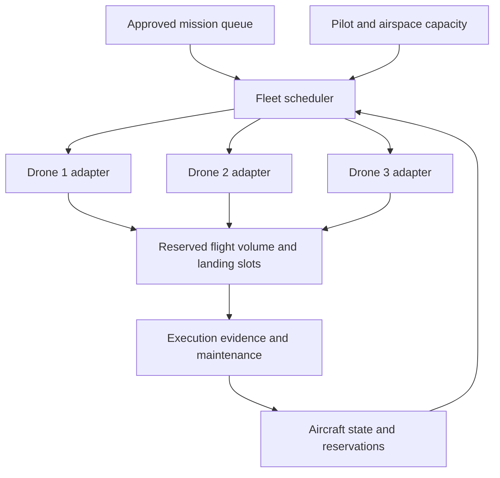
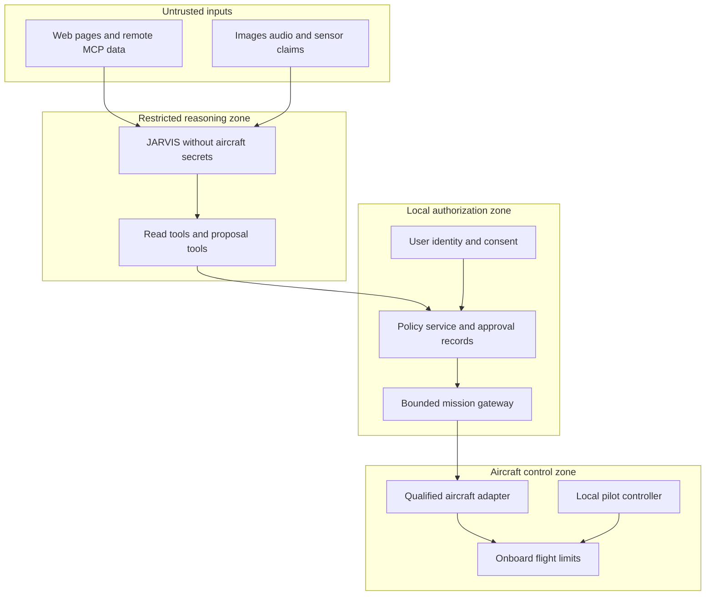
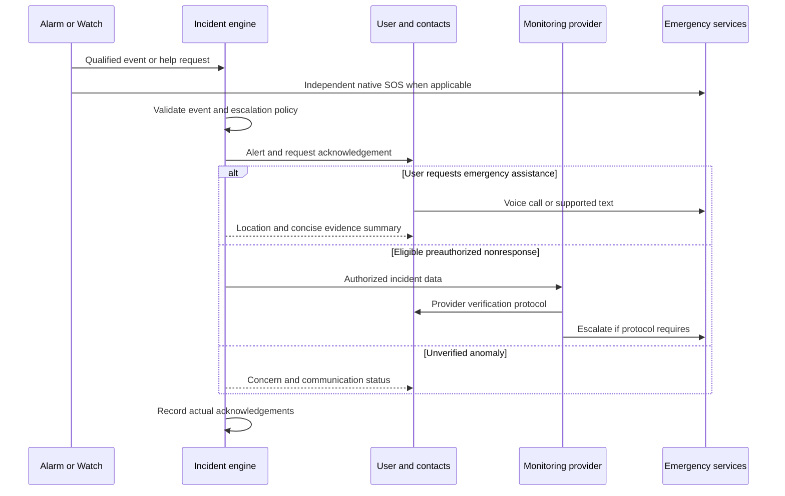

# PROJECT ASTRA — REFERENCE ARCHITECTURE v0.1

## A practical household emergency drone ecosystem

Prepared for Eric Paiz • Design study • Research checked 25 September 2026 US Eastern time

**Decision:** Build ASTRA first as a local incident assistant with dependable ground sensors and one supervised camera drone. Use a deterministic mission service between the AI and the aircraft. Keep certified alarms, native phone emergency functions, and the pilot’s controller operational independently. Add an open development aircraft only when a specific payload or control requirement exceeds the supported consumer interface.

This document defines the proposed system, its limits, a phased hardware strategy, and the evidence needed before allowing more autonomy. It contains no flight implementation code. Product support is model, controller, operating system, firmware, region, and SDK specific. A supported SDK is an invitation to validate a configuration, not proof that every advertised aircraft capability is exposed through it.

**Exploration scope:** At your request, the target architecture explores simultaneous multi aircraft operation and preauthorized dispatch while you are incapacitated without using those two regulatory constraints to limit the engineering design. Section 19 preserves deployment context separately. Early prototypes remain supervised because the technology and failsafes must first be qualified, not because the target is limited to manual operation.

Manufacturer facts and regulatory findings have numbered source references. Architecture choices, prototype limits, estimates, and acceptance criteria are engineering recommendations, not manufacturer guarantees or a certified emergency response design. Prices are USD planning allowances unless explicitly identified as a retrieved product listing. Research cannot establish local flight permission without the launch coordinates and operating circumstances.

## 1 Executive summary

Much of JARVIS is feasible now: conversational requests, authenticated device events, local incident timelines, camera analysis, controlled tool access, drone telemetry, human approved missions, and offline ground operations. The hard parts are reliable unattended flight, persistent emergency readiness, trustworthy airborne environmental sampling, and integration with real emergency response organizations.

**RECOMMENDED:** A star network centered on a local base, an iPhone and Watch interface, fixed smoke and CO alarms, a Linux mission host, an optional desktop inference worker, and one DJI Mini 4 Pro with a verified Android SDK controller arrangement. The Mini 4 Pro is a conditional consumer candidate because current DJI documentation lists Mobile SDK support. Several newer DJI consumer models do not. The iPhone remains the user interface; the Android device is a dedicated aircraft bridge. [S01–S03]

**POSSIBLE ALTERNATIVE:** A supported Parrot developer aircraft, or a professionally assembled PX4 or ArduPilot platform, if the consumer bridge fails validation. An open aircraft provides better payload access and less dependence on a phone SDK, but increases the integration, flight testing, and maintenance burden. A Holybro kit is not equivalent to a ready to fly consumer camera drone. [S06–S09]

**NOT RECOMMENDED:** Buying a fleet before testing one aircraft; reverse engineering an unsupported phone app as the emergency control path; starting with aerial mesh; flying toward an explosion or active fire; making autonomous launch depend only on a missed notification; or interpreting an AI confidence score as emergency confirmation.

**FUTURE OPTION:** A commercial dock, concurrent aircraft with reserved flight volumes, and a preauthorized incident policy that can launch a bounded observation mission without waiting for you to respond. This requires much stronger launch site assurance, navigation integrity, recovery planning and independent supervision than the first prototype.

The strongest version runs two parallel responses during incapacitation: emergency communication through an established native or monitored path, and optional drone observation under a previously approved mission policy. The aircraft can add context, but its availability or launch decision never delays getting help. Much of the protective value can therefore arrive before autonomous flight.

## 2 Reality check

### What can be built with present hardware

| Capability | Assessment | Design consequence |
| --- | --- | --- |
| Watch button or voice request to home server | Official building blocks exist; delivery depends on connectivity and app lifecycle | Add acknowledgements and visible unavailable states |
| Watch fall notification to a custom app | Official but entitlement gated | Request Apple approval; retain native SOS independently |
| Read drone telemetry and live images | Official on selected platforms | Validate the complete aircraft and controller combination |
| Computer requested camera mission | Technically practical on supported SDK or autopilot | Use predefined missions with interactive or qualified standing authorization |
| Consumer drone as a generic LAN device | Usually false | Use a controller or SDK bridge, not a direct aircraft REST assumption |
| Consumer aircraft with arbitrary sensor payload | Usually unsupported | Move to a payload capable platform when justified |
| Unattended neighborhood reconnaissance | Technical possibilities exist; severe operational and legal limits | Exclude from personal Version 1 |
| Several drones coordinated by one server | Practical resource scheduling | Sequential bench qualification, followed by concurrent operation within reserved volumes |
| Several drones supervised centrally | Technically possible with suitable interfaces | Design workload limits, collision separation and independent recovery; deployment rules are discussed separately |
| Perpetual readiness from a cheap charging pad | Impractical as a dependable emergency feature | Manual batteries first; commercial dock later |
| AI software directly dispatching police or EMS | No general consumer permission | Native emergency calling or contracted authorized service |

Use these evidence labels throughout procurement: **officially supported** means documented for the exact configuration; **technically possible** means physically or architecturally feasible; **fragile** means dependent on unsupported interfaces or unverified behavior; **custom integration** means additional engineering; **impractical** means poor value at this scale; **unsafe** means excluded from ASTRA’s operating concept; **restricted** means an operational approval or legal condition must be satisfied. A feature can have several labels at once.

### Examples translated into realistic responses

| Request | ASTRA response design |
| --- | --- |
| Check outside | Retrieve an authorized fixed camera first; offer a supervised flight if that view cannot answer the question |
| Something exploded nearby | Help contact emergency services if warranted, collect public alerts and existing camera evidence; do not automatically fly into smoke, debris, emergency aircraft activity, or unknown airspace |
| I fell and cannot get up | Start the established emergency communication path immediately; request location and acknowledgement without requiring drone evidence |
| There is smoke outside | Describe available observations, prompt protective action, and distinguish smoke appearance from a confirmed fire |
| Check whether the road is flooded | Use official reports and an existing view first; only fly from a lawful safe site with a pilot; imagery cannot establish safe driving depth |
| Someone is yelling for help | Encourage appropriate emergency contact and provide location context; do not autonomously follow a person or enter another property |
| Is the neighborhood power out | Compare UPS state, utility information, and optional consented sensors; darkness in imagery is weak evidence |
| Replace Drone 1 with Drone 2 | Later, launch the replacement into a separate corridor, verify its observation, then recover Drone 1; initial tests use sequential flights |
| Return everything home | Issue bounded recovery requests, stagger approach to landing areas, and report each aircraft’s confirmed outcome |

Version 1 should be useful even if every flight request is denied. Fixed cameras, leak sensors, certified alarms, UPS telemetry, official alerts, and a clear incident summary often answer the question faster and with less risk than a drone.

## 3 Recommended overall architecture

ASTRA has three planes of operation: human and incident services, mission authorization, and aircraft execution. A failure in the conversation service must not remove the pilot’s control or the aircraft’s configured lost link response.

The first home deployment needs a Linux host, a small durable database, an MQTT broker for local devices, a HTTPS API, an aircraft bridge, and a dashboard. Run these as a few containers or services, with restart limits and backups. Use an existing Windows workstation for optional local inference and media review. Do not place the sole mission controller on a workstation that routinely sleeps or reboots for games or updates.

Keep mission authorization in a separate service account and process from JARVIS. The aircraft adapter accepts only structured, approved mission packages. JARVIS cannot modify policy, install a tool, change firmware, edit geofences, or retrieve aircraft credentials. A single host is acceptable for the bench because it is simple; it is not a strong isolation boundary against administrator compromise. Add a physically separate controller gateway before granting meaningful flight authority.

External AI may help with language and image interpretation. Send only selected evidence with permission, and keep an offline workflow using deterministic incident rules, a local dashboard, and a smaller local model when available. The system remains functional without any model: buttons, status displays, manual flight, and emergency calling still work.

## 4 Overall architecture diagram

The ground alarm path does not pass through JARVIS before it can alert people. The radio controller communicates through the aircraft’s supported control system. On a consumer drone it may share the vendor radio with the SDK, so it is independent of the AI and home server but not necessarily a separate RF failure domain.

## 5 Device and component roles

| Component | Primary responsibility | Explicit limit |
| --- | --- | --- |
| Watch | Panic request, acknowledgement, haptic notification, selected authorized measurements | No persistent master controller or guaranteed event stream |
| iPhone | User identity, consent, location, incident UI, server communications | Mobile background execution and network access are conditional |
| Android aircraft bridge | DJI MSDK connection, telemetry, frames, bounded mission execution | Dedicated tested device; not the household identity authority |
| Linux base host | Durable events, policies, mission inventory, local dashboard | A host failure blocks new missions |
| Desktop inference worker | Speech, image analysis, optional local language model | Losing it cannot invalidate safety control |
| Aircraft autopilot | Stabilization, navigation, configured containment and recovery | Does not establish privacy or aviation permission |
| Handheld controller | Pilot takeover and supported recovery controls | Must be charged, reachable, and tested with SDK use |
| Ground sensor nodes | Local measurements and event delivery | Hobby sensors do not replace certified alarms |
| UPS and network equipment | Keep essential ground services powered | Endurance must be measured under actual load |
| Cloud services | Optional larger models, external information, notification relay | No authority to arm or bypass policy |
| Emergency contacts or monitoring service | Human acknowledgement and agreed escalation | Consent and delivery confirmation required |

Treat the battery charger and maintenance log as operational components. A physically available aircraft with an aged battery, damaged propeller, unverified firmware update, or expired inspection is unavailable for missions.

## 6 Drone platform comparison

### Consumer and developer platform selection

**RECOMMENDED consumer candidate:** DJI Mini 4 Pro, using a compatible controller and an Android device supported by the selected Mobile SDK V5 release. Current DJI documentation lists Mobile SDK support; its Android V5 repository documents Mini 4 Pro support and waypoint work. Do not infer compatibility with an iPhone SDK or an arbitrary screen controller. Validate RC N2 or the specifically supported RC N3 arrangement against the exact SDK release. [S01–S03]

**POSSIBLE ALTERNATIVE:** Mini 3 or Mini 3 Pro where price and official support justify the older aircraft. Budget Mini 2 or Air 2S purchases require careful legacy SDK, battery, mobile OS, and replacement parts checks. A phone app offering waypoint flight may simulate it through continuous control rather than upload an onboard mission; the lost connection behavior is materially different.

**NOT RECOMMENDED as an automation purchase:** A DJI model whose row lacks the required SDK, including current listings for Mini 5 Pro, Air 3 or 3S, Mavic 3 consumer variants, Mavic 4 Pro, Neo, Flip, and Avata families. A newer model number is not a better programming interface. No consumer Mini payload or onboard SDK support should be inferred from Mobile SDK support. [S01]

| Platform | Official programming and media | Mission and network implications |
| --- | --- | --- |
| DJI Mini 4 Pro | Android MSDK V5; telemetry and camera interface through supported controller | Consumer candidate; validate onboard waypoints versus streamed commands and exact firmware |
| DJI Mini 3 and 3 Pro | Selected MSDK V5 support | Lower cost alternative; capabilities vary and cannot be inherited from Mini 4 Pro |
| Unsupported DJI consumer models | Flight in vendor app does not establish an SDK | Manual camera role only unless official support changes |
| DJI Enterprise Mavic 3E or 3T and Matrice families | Model specific Mobile, Payload, Cloud, Edge or Onboard SDK combinations | Better professional integration; higher cost, controller and license constraints |
| Autel Enterprise | Mobile and other enterprise developer offerings are product specific | Conditional alternative; require current aircraft, controller, SDK and sample proof before purchase |
| Autel Nano or Lite consumer aircraft | No generic enterprise feature inheritance | Do not choose as ASTRA control platform without exact official support |
| Parrot ANAFI Ai | Olympe, Ground SDK, Air SDK ecosystem | Strong programmable candidate; premium acquisition and support check required |
| Parrot ANAFI legacy family | Olympe and Ground SDK on listed variants | Older hardware and variant differences matter; no assumed ANAFI Ai parity |
| Skydio enterprise | Enterprise APIs and remote operations products | Not an inexpensive open hobby ecosystem; access and contracts must be verified |
| PX4 aircraft | MAVLink, MAVSDK and other documented interfaces | Open local control; camera streaming and radio need separate integration |
| ArduPilot aircraft | MAVLink, documented mission and companion interfaces | Strong alternative; validate each API and failsafe against its flight stack |
| Crazyflie | Open research platform and Python tooling | Excellent indoor test platform; small payload, positioning infrastructure, modest endurance |
| Tello or Tello EDU | Legacy SDK commands and media on supported variants | Cheap bench learning if already available; aging supply and security limit long term use |
| Consumer FPV or Betaflight craft | RC and video do not imply a mission SDK | Manual flight platform; conversion can become a custom aircraft project |

Sources: DJI [S01–S03], Autel [S04], Parrot [S05], Skydio [S06], open aircraft [S07–S11].

### Capability and dependency checks

| Question | Consumer SDK aircraft | Enterprise aircraft | Open development aircraft |
| --- | --- | --- | --- |
| Programmatic flight commands | Only listed models and API functions | Often supported, model and license dependent | Supported through autopilot interfaces |
| Telemetry | Via controller SDK | Via controller, dock, or integration | MAVLink or flight stack interface |
| Live camera data | SDK stream or decoded frames where exposed | Model specific stream APIs | Separate camera and video transport usually needed |
| Waypoints | Onboard or streamed depending on model | Often onboard mission support | Autopilot mission upload supported |
| External computer commands | Through phone or controller bridge | Supported gateway or vendor integration | Local GCS, companion, or protected IP bridge |
| LAN or WAN control | LAN bridge feasible; WAN is added integration | Some official remote products | Technically feasible; use local safety authority |
| No manufacturer cloud | Local flight may work after setup | Product, activation and license dependent | Local operation can be fully self hosted |
| Multiple aircraft | Separate controller sessions; coordinator must be built | Fleet products exist | Addressable vehicles; central scheduler still required |
| Companion computer | No supported mount or power assumed | Payload or onboard interface on listed models | Documented ports and power integration possible |
| Added sensors | Generally unsupported modifications | Only approved payload envelope and interface | Engineering integration within tested mass and power budget |
| Payload rating | No useful add on allowance established for selected Mini | Published per exact aircraft and payload | Published airframe envelope must be confirmed |
| Flight time after payload | Cannot claim nominal endurance | Use payload specific data plus test reserve | Measure mass, electrical load, drag and endurance |
| Restrictions | App key, controller, firmware, OS and vendor terms | Those plus licenses and integration agreements | Component licenses, airworthiness work and radio rules |
| SDK lifetime | Pin and test release; legacy support is a risk | Obtain vendor support commitment | Active projects still require version qualification |
| Enterprise only features | No generic dock, thermal or payload SDK | Purpose built docks, thermal and supported payloads | Similar functions require integration and validation |

No source review establishes a safe unsupported payload capacity for a Mini. Use **0 g of added payload in ASTRA’s approved consumer configuration**. This is an operating restriction, not a claim about the motor’s lifting ability. Propeller guards, strobes, trackers, and larger batteries also count as configuration changes and may alter legal weight categories or manufacturer functionality.

### The point at which an open aircraft is justified

Move to PX4 or ArduPilot when you need a documented payload interface, a local companion, arbitrary sensor synchronization, a controllable camera pipeline, tested local operation without recurring vendor dependencies, or mission behavior absent from the consumer SDK. Prefer a vendor assembled and flight tested package with a flight controller, RC link, Remote ID solution, camera, charger, batteries and a defined supported firmware version.

Holybro’s X500 v2 is a useful documented development kit, but requires assembly and missing system components; it is not a complete emergency drone. ModalAI’s Starling family is an off the shelf vision development option, but the reviewed Starling 2 Max page warns of GNSS performance below target and an update in development. That warning blocks an unconditional outdoor return to home recommendation. Obtain an exact SKU specification and written resolution before selecting it for outdoor ASTRA use. [S07–S08]

The long term hybrid fleet could be a Mini class camera aircraft, a payload capable open aircraft, and a guarded micro aircraft for a dedicated indoor test area. They share mission and evidence concepts; they do not share interchangeable safety assumptions.

| Payload example | Published or established limit | ASTRA interpretation |
| --- | --- | --- |
| Mini 4 Pro | No general approved add on payload allowance established; additional payload warning with Plus battery | Existing integrated camera only in the qualified configuration |
| Crazyflie 2.1+ | Manufacturer recommended payload up to 15 g | Tiny expansion decks, not a conventional companion computer |
| Crazyflie Brushless | Manufacturer recommended payload up to 40 g | More room for research decks; guards and positioning still matter |
| X500 v2 | Store and documentation use different battery inclusive payload accounting | Get an exact all up mass and added payload envelope from the integrator; do not treat battery mass as free payload |
| Starling 2 Max | Manufacturer page claims 500 g, with configuration inconsistencies to resolve | Require a SKU specific mass and endurance statement before selecting payload |
| Enterprise Parrot, Autel or Skydio | No interchangeable generic payload figure | Use the exact supported attachment and aircraft documentation |

The small research aircraft’s stock endurance is measured in minutes, not persistent emergency coverage. More payload reduces margin even when below the nominal payload maximum. [S07–S10]

## 7 Networking design

**RECOMMENDED:** Ground coordination through a local base with direct aircraft control links. Keep aircraft command traffic small and bounded, transport video separately, and use the internet only as an optional upstream path. A vendor aircraft generally cannot join your Wi Fi mesh directly. Its controller can connect to your LAN while maintaining the vendor radio link.

Use wired Ethernet between the Linux host, inference workstation when practical, and the main access point. Give IoT devices, aircraft adapters, trusted clients, and administration separate firewall zones. Permit only necessary routes. A VLAN improves containment but does not protect against a compromised common router or host administrator.

### Radio tradeoffs

Ranges below are approximate planning orders of magnitude under favorable conditions, not deployment promises or legal flight distances. Building materials, interference, antenna placement, permitted power, terrain, and aircraft orientation dominate actual performance. Latency means network transport, not camera exposure and decoding delay. [S31–S33]

| Technology | Typical planning envelope | Suitable ASTRA use | Main limitations |
| --- | --- | --- | --- |
| Ordinary Wi Fi | Tens of meters indoors; hundreds with clear outdoor path; multi Mbps; often milliseconds to tens of ms | Base LAN, nearby video, bench aircraft | Shared spectrum, congestion and roaming; small modules roughly 0.5–5 W |
| Wi Fi Direct | Similar physical limits to Wi Fi | Dedicated peer connection where supported | Phone routing and concurrent internet behavior vary; no resilience by itself |
| Wi Fi mesh | Extends coverage through available nodes | Fixed ground coverage with wired backhaul preferred | Shared airtime and extra hops reduce useful capacity; airborne movement increases instability |
| Vendor radio | Often kilometer class advertised line of sight; video capable | Primary consumer C2 and video | Closed protocol; legal VLOS still applies; controller dependency |
| LTE or 5G | Carrier coverage; Mbps video possible; tens to hundreds of ms with long tails | Backup ground WAN; later approved aircraft backhaul | Congestion, cell handoffs, outage correlation, service terms and airborne radio restrictions |
| Private cellular | Site engineered cells; high bandwidth | Large professional site | Spectrum, core, devices and operational cost are excessive for this household |
| LoRa | Long range small packets; roughly sub kbps to tens of kbps depending on configuration | Sparse ground sensor alarms or recovery beacon | No video; latency and airtime unsuitable for a general primary flight link |
| BLE | Room to building scale for conservative planning; low power | Watch phone proximity, provisioning and buttons | Mobile scheduling, interference and range; no primary aircraft C2 |
| Thread | Low power IEEE 802.15.4 mesh; 250 kbps radio rate | Fixed household sensors | Application throughput lower; not drone video or high rate control |
| Zigbee | Similar low power mesh class | Existing home sensors | Coordinator and sleepy device behavior; no video or aircraft mission path |
| Dedicated telemetry radio | Hundreds of meters to kilometers with legal hardware; tens to hundreds of kbps | Open autopilot telemetry and mission messages | Often serial; not HD video; encryption and signing support vary |
| Point to point IP radio | Directional high throughput fixed links, potentially kilometers | Remote ground station backhaul | Alignment and line of sight; generally poor fit for a tiny moving airframe |
| Professional MANET | Mobile routing, some systems support multi Mbps video | Specialized field teams | Expensive radios, payload, heat, key management and airtime overhead |
| Drone to drone radio | Inherits selected radio limits | Research telemetry relay after a demonstrated need | A peer is another moving, battery limited dependency |

C2 means command and control. A link carrying a few mission messages is different from a link carrying continuous velocity commands. Neither LoRa range nor a 20 km vendor advertisement makes a flight beyond visual line of sight lawful. Use FCC authorized equipment, antennas and power settings; do not assume an amateur license permits encrypted safety traffic, or that a consumer cellular subscription permits airborne use. [S31–S33]

For payload planning, Wi Fi or direct Wi Fi boards typically occupy a few grams to tens of grams before antennas and enclosure, with roughly 0.5–5 W active system allowance. BLE, Thread, Zigbee and LoRa nodes can be tiny and battery efficient when sending intermittently; receiver duty cycle, transmitter bursts and attached sensors determine actual draw. Dedicated telemetry installations often add tens of grams and about 0.5–5 W. LTE or 5G modem assemblies can add tens to over 100 g and several watts with significant peaks. Professional MANET installations may require tens to hundreds of grams and several to tens of watts. Fixed point to point and private cellular ground equipment can weigh kilograms and draw tens of watts or more. These are broad engineering allowances, not specifications; select a radio only after a complete mass, power, spectrum and link budget. Vendor aircraft radio mass and power are already included in the manufacturer configuration.

### Network topology

Use an illustrative planning budget of 5 Mbps per video stream, plus 30 percent headroom, and measure the actual encoded stream. Three such streams require about 19.5 Mbps of sustained useful capacity before additional radio contention. Raw camera streams, retransmissions and low light noise can change this substantially. Do not send video frames through MQTT; pass short lived media references or frame identifiers through events.

Apply rate limits and prioritize command acknowledgements and fresh telemetry. Drop old video before delaying recovery commands. Track round trip time, packet loss, frame age, throughput, and the freshness of safety telemetry separately; signal strength alone is insufficient.

**NOT RECOMMENDED:** Drone mesh in Generations 0–3. A relay drone uses another battery and operator slot, creates a moving route, and may induce unauthorized distance expansion. First improve the fixed base location or add a fixed ground relay. **FUTURE OPTION:** A purpose built relay aircraft only when legal operations and measurements show that ground infrastructure cannot solve a specific coverage requirement.

## 8 JARVIS architecture and controlled tools

JARVIS interprets intent, asks clarifying questions, retrieves evidence, suggests a response, and explains results. It does not decide whether its own plan is authorized. A deterministic mission planner converts a permitted template into a route and required resources. The policy service checks identity, permissions, location, aircraft condition and operator readiness. The autopilot performs real time control.

| Function | Probabilistic AI role | Deterministic authority |
| --- | --- | --- |
| Understand a spoken request | Transcription and intent proposal | Authenticated user session and allowed request types |
| Choose information sources | Rank relevant tools and evidence | Source allowlist, consent and data scope |
| Describe images | Candidate detections and uncertainty | Evidence metadata and prohibited identification rules |
| Plan flight | Suggest a mission template and purpose | Geometry, limits, supervision requirements and aircraft capabilities |
| Approve flight | Explain why it may help | Policy result plus current operator approval or a narrowly scoped preauthorization |
| Respond to failure | Describe state | Autopilot failsafe and deterministic mission recovery |
| Escalate emergency | Summarize evidence | Predefined workflow, native SOS, human or contracted responder |

Use one orchestrator initially. A research agent, a vision worker, and an incident summarizer may become separate processes later, but they must not debate until an alarm deadline expires. LLM response latency is outside the emergency alarm path.

### MCP tool permissions

MCP is a useful interface for controlled tools; it is neither an aircraft protocol nor a safety certification. Apply normal API authentication, resource authorization and auditing behind it. For remote HTTP MCP, use the specification’s supported authorization approach, validate audience and scopes, and prohibit token passthrough. A local process transport still requires process isolation and credential discipline. [S34–S35]

| Permission class | Example tools | Conditions |
| --- | --- | --- |
| Read operational data | get_drone_status, get_mission_status, get_weather | Device scope, timestamps, freshness and rate limits |
| Read sensitive evidence | get_camera_frame, get_home_camera, get_sensor_reading, get_incident_history | Household consent, purpose, camera zone and retention permissions |
| Read phone or Watch state | get_watch_status | Return available, stale, unknown or permission unavailable; do not invent a heartbeat |
| Propose a mission | request_drone_mission | Creates a proposal only; allowed template, bounded area and reason required |
| Request recovery | cancel_mission, return_all | Means controlled abort or recovery, not motor shutdown; authenticated and bounded |
| Notify | notify_eric | Rate limits, severity rules, acknowledgement tracking |
| Contact a person | contact_emergency_contact | Named consented recipient, approved incident policy, deduplication and delivery state |
| Prepare a report | prepare_emergency_report | Export only authorized fields; no implicit sending or dispatch |

No tool exposes unrestricted shell access, arbitrary MAVLink messages, raw motor commands, firmware updates, geofence editing, or a general purpose network proxy. Tool names and schemas are pinned; a malicious MCP server cannot add a new flight action through its description.

Protect every mutating request with a unique request ID, aircraft identity, mission version, expiration, bounded parameters and an authorization record. AI text, retrieved web pages, audio heard by a microphone, and instructions visible in an image remain untrusted content. A printed sign saying “ignore Eric” cannot become a command.

## 9 Apple Watch and iPhone architecture

Start with a Watch button, a short status screen, haptics, and an explicit “I need help” action. Use an iPhone app as the normal gateway to ASTRA. Siri and App Intents or Shortcuts can initiate a request, but spoken words alone are not proof that Eric authorized an aircraft launch. Require device bound authentication. Prototype flights require deliberate pilot confirmation; the mature emergency mode may instead use a previously authenticated standing policy with its own strict trigger and readiness checks. [S24–S28]

Do not promise a custom always listening JARVIS wake word on a locked Watch or iPhone. Use the supported Siri or Shortcut entry point, a button, or foreground push to talk. A desktop or dedicated home voice device is a separate option, with explicit household microphone consent.

### What Apple actually exposes

| Capability | Realistic implementation | Reliability boundary |
| --- | --- | --- |
| Panic request and acknowledgement | Watch app action, local feedback, phone or direct network delivery | Must show whether the request reached the server |
| Watch to iPhone messaging | WatchConnectivity interactive messages when reachable; queued transfer for later delivery | Queued messages are not a guaranteed immediate emergency transport |
| Location | Authorized Core Location on phone or Watch where supported | Attach age, accuracy and source; no assumption of continuous background fixes |
| Heart rate and other health samples | Per type HealthKit permissions and supported query delivery | Samples can be delayed, absent, or inaccessible; no guaranteed continuous pulse stream |
| Fall events | CMFallDetectionManager with Apple granted entitlement, user authorization and required app configuration | Approval and background execution limits must be validated |
| Historical fall count | HealthKit numberOfTimesFallen | Historical data is not a substitute for a timely fall callback |
| Critical notifications | Critical Alerts entitlement and user consent | Separate approval from fall detection; delivery still depends on device and network state |
| Native Emergency SOS | User configures Apple’s built in capabilities | Independent safety channel; no assumed general third party SOS control API |

HealthKit is a permissioned local health data store and API framework. It is not a server push subscription to every Watch sensor. A custom watchOS app may access an approved fall callback; a phone companion can receive authorized data and forward a minimal signed event to ASTRA. Background observer delivery does not make iOS or watchOS a continuously running server. Do not manufacture a workout session merely to obtain indefinite background execution. [S24–S27]

The normal path is Watch app → WatchConnectivity → iPhone app → HTTPS event gateway. A suitably configured Watch app may also use its own supported network connection when available, but that is a separately tested fallback and depends on device model, cellular service or Wi Fi, permissions and lifecycle. If the phone cannot reach the home system, native SOS remains available according to Apple’s device and connectivity requirements. [S25–S28]

Store the minimum event: event type, time, device identity, user consent scope, available location with accuracy, and acknowledgement state. Health history should stay on the Apple side unless you explicitly authorize its use. Lack of permission or missing samples must appear as unknown; it must not be interpreted as “no fall” or “normal heart rate.”

**RECOMMENDED Generation 0:** Manual Watch trigger plus simulated fall events. **FUTURE OPTION:** The entitled real fall API after Apple approval and end to end validation. Never depend on getting that entitlement to make the rest of ASTRA useful.

## 10 Mission control architecture

The mission controller owns aircraft inventory, capabilities, state freshness, mission reservations, operator assignments, route templates, launch checks, recovery plans and maintenance exclusions. It records what it asked the aircraft to do separately from what telemetry proves happened.

The first templates should be narrowly defined: take a still image from a pilot positioned aircraft; observe a designated area from a preapproved viewpoint; return using the validated recovery behavior; and, later, execute a short route within a surveyed operating volume. “Check outside” must resolve to a specific permitted camera region, not an unconstrained geographical search.

### Required mission record

Record the requesting person and device, incident ID, purpose, template and version, aircraft identity, permitted polygon, altitude reference, maximum speed, launch and landing areas, route, time window, pilot identity, weather evidence, airspace authorization where needed, energy reserve, lost link behavior, approval expiration and media permissions. Distinguish altitude above ground, altitude relative to takeoff, and mean sea level; never substitute one silently.

The safety engine rejects missing or stale inputs. Immediately before arming, it rechecks the battery, position estimate, telemetry, weather, required supervision, configuration and launch area. Early versions require an available pilot. Later versions may satisfy the authorization requirement with a tightly scoped standing policy, a qualified automated launch site and a predefined recovery plan. A prior approval is bound to the exact plan and cannot authorize an arbitrary changed route. Aircraft or payload changes invalidate it.

### Mission state machine

“Unknown” is a real state. Missing telemetry is not proof of landing, and a successful command acknowledgement is not proof of execution. An unresolved outcome removes that aircraft and its occupied airspace from automatic reuse until a pilot reconciles it.

### Mission request sequence

### Flight authority and liveness

Only one adapter owns command authority for an aircraft. Use a durable lease and monotonically increasing fencing token to prevent an old controller process from regaining authority after failover. The final command gateway must enforce that token and exclusively own the SDK or radio connection: a database lease alone cannot fence a stale process that still has aircraft access. Consumer autopilots generally do not understand ASTRA tokens. Failover must revoke or disconnect the old writer before granting another writer access; if exclusivity cannot be established, no new controller takes over automatically. All retryable requests are idempotent. Following a crash, the controller reconciles actual aircraft state before sending further commands; it does not replay the last launch from a queue.

Manual takeover latches the aircraft into operator authority. Recovering network connectivity or restarting JARVIS cannot resume the old mission. Returning to automatic control requires deliberate reauthorization. A preflight failure before arming ends in rejection; a failure after arming needs an explicit safe abort and verified disarm or landing, not a record that simply says rejected.

An onboard mission and offboard control are different failure cases. PX4 offboard operation depends on a continuing proof of controller health; loss triggers configured behavior. An uploaded mission may continue after the ground station disappears unless the correct failsafe is configured. ArduPilot GCS failsafe depends on heartbeat history and configuration. Test mission, RC, GCS and offboard loss separately on the pinned stack. Never keep an autopilot heartbeat alive from a bridge while the mission logic behind it is dead. [S12–S14]

## 11 Sensor roadmap and companion computers

A sensor measures one physical quantity under specified conditions. A camera measures incoming light, a thermal camera estimates surface radiation, and a gas sensor measures air at its inlet after a finite response time. None automatically tells you whether a room, road or person is safe.

Begin with certified fixed smoke and CO alarms, a leak sensor, a protected temperature and humidity node, UPS power telemetry, and the drone’s existing camera. Add thermal only when a defined viewing task justifies it. Existing alarms must keep their local audible alarm and backup power independent of ASTRA. [S36]

### Imaging and navigation sensors

Mass and power ranges below are broad engineering allowances for small modules, wiring and simple mounting. They exclude a shared companion computer, and usually exclude a professional gimbal or weatherproof enclosure. They are not approved payload specifications. Consumer modules exist for all these categories, but “available as a breakout board” does not mean ready for flight.

| Sensor and task | Indicative integration | Placement and trust limits |
| --- | --- | --- |
| RGB camera for scene evidence | Existing camera adds no mass; separate module 5–50 g and 0.5–3 W | Best initial airborne sensor. Vibration, compression, glare and darkness affect evidence. Calibrate lens and pose before estimating geometry |
| Low light or near infrared camera | 10–100 g and 1–5 W; illuminator adds power | Useful later; NIR reflects light and is not thermal. Long exposures blur motion; built in camera preferred |
| Thermal long wave infrared | Small integration 10–50 g and 0.2–2 W; professional gimbal much larger | Good later airborne sensor. Solar heating, exhaust, reflections and emissivity cause false interpretations. Calibrate radiometry and perform required correction cycles |
| Stereo or depth camera | 50–150 g and 2–8 W plus compute | Development aircraft or indoor research. Glass, water, low texture, darkness and sunlight can impair depth; synchronize frames and pose |
| Single point LiDAR | 5–30 g and 0.3–1.5 W | Useful supported height or range input. One beam does not protect the whole aircraft; wires, rain, fog and reflectivity matter |
| Scanning LiDAR | 100–600 g or more and 5–15 W or more | Later mapping platform. Expensive mass, power, timing and calibration burden; smoke can impair returns |
| Ultrasonic ranging | 5–40 g and 0.05–0.5 W | Controlled short range experiments. Rotor acoustics, airflow, soft or angled surfaces and sensor cross talk reduce reliability |
| Optical time of flight proximity | 1–10 g and 0.03–0.3 W | Small indoor positioning aid. Sunlight, reflectivity and cover window interference limit range; not full collision avoidance |
| GNSS receiver and antenna | Usually built in; add on 15–60 g and 0.1–1 W | Outdoor navigation. Multipath, buildings, jamming and spoofing remain; log accuracy and age rather than satellite count alone |
| RTK GNSS | 30–150 g and 0.5–2 W plus correction source | Later precision mapping and landing approach. Fixed versus float solution, correction age and surveyed base location matter; not indoor positioning |
| IMU | Built in; extra board 1–10 g and 0.01–0.2 W | Flight estimation or matched vision stack. Vibration, bias, temperature and mounting alignment need calibration; inertial position drifts |
| Compass | Built in; external installation 5–30 g and below 0.1 W | Validated autopilot component. Motors, power wiring, payload magnets and nearby metal can corrupt heading |
| Barometer | Built in; small board 1–10 g and below 0.05 W | Relative altitude or fixed weather trend. Rotor pressure, enclosure airflow and temperature cause bias; not height above a roof |

For scale, FLIR’s Lepton 3.5 is a 160 by 120 pixel, 8.6 Hz module with low sensor power, but the carrier, lens, cabling, processing and mount define the practical payload. It does not provide professional gimbal resolution or long range identification. Thermal imaging does not see through normal walls or ordinary window glass. Benewake TFmini S and ST VL53L1X illustrate lightweight range modules; their nominal maximum ranges do not establish dependable obstacle protection in every scene. [S37–S40]

### Environmental and acoustic sensors

| Sensor and task | Indicative integration | Recommendation and false readings |
| --- | --- | --- |
| Temperature and humidity | 2–20 g; below 0.05 W for sensor | Ground first in a radiation shield. Sun, electronics heat, wetting and equilibration affect readings. Compare with a reference |
| Smoke alarm or smoke observation | Use complete listed fixed alarm | Fixed alarm is primary. Drone imagery can show smoke like material; steam, fog, dust and cooking aerosols are confounders |
| Electrochemical CO | 10–60 g and 0.05–0.5 W; pump can add 50–300 g and 1–5 W or more | Certified fixed alarm first. Sensor aging, cross sensitivity, temperature, humidity and response delay demand specified calibration and service |
| True optical CO2 | 5–40 g and about 0.05–0.5 W average, with peaks | Ground ventilation context. Not CO; response may be too slow for a moving plume survey. Baseline calibration assumptions matter |
| VOC metal oxide sensor | 2–20 g and 0.01–0.2 W for modern low power devices | Ground trends only initially. Cleaners, alcohol, cooking and humidity alter readings; a VOC index is not identification of a poison |
| PM2.5 particulate sensor | 30–100 g and 0.3–1 W before complex inlet | Ground first. Fog droplets, dust, particle composition and inlet flow bias optical mass estimates; clean and compare against reference |
| Specific gas instrument | 20–300 g or more, 0.1–5 W or more | Specialist future payload. Select the target gas and calibration procedure; there is no inexpensive universal toxin detector |
| Radiation counter | Roughly 65–150 g and 0.02–0.5 W for a small complete detector | Low priority. Counting needs dwell time; background, energy response and geometry matter. Gamma detection is not all radiation or contamination detection |
| Microphone | 1–10 g and 0.01–0.1 W; array and processing 20–100 g or more and 1–5 W | Phone or consented fixed node first. Rotor noise and wind overwhelm voices; directional filtering is not a solved emergency listening function |

Sensirion’s SCD41 lists an approximately 60 second CO2 response time to reach 63 percent of a step change. A drone moving through a plume cannot treat such readings as an instantaneous map. SGP40 reports a broad VOC related signal; inferred equivalent CO2 is not a direct CO2 measurement. SPS30 is a practical particulate module, but its small size does not eliminate sampling and humidity effects. [S41–S43]

### Prop wash and validation

Prop wash moves and mixes the air you are trying to sample. Rotor induced pressure changes affect pressure sensors; disturbed dust affects particle sensors; airflow and electronics heat affect temperature readings; inlet placement and response lag affect gas readings. A sensor placed underneath a drone may measure a disturbed mixture rather than the surrounding plume at the nominal GPS point.

This is not a blanket claim that airborne gas measurements are impossible. Published EPA associated experiments found that some time averaged CO, CO2 and particulate measurements tolerate particular body mounted arrangements. That does not validate a rapidly moving household gas detector. A useful airborne installation needs a defined inlet, airflow, calibration, reference comparison, spatial offset and response model. [S44]

Every measurement should carry units, raw and compensated values where available, collection interval, acquisition time, receipt time, sensor identity, calibration record, operating range, location uncertainty and quality flags. Never use an unvalidated payload to issue an all clear for smoke, CO, flammable gas, radiation, floodwater or structural safety. Do not fly ordinary drones into suspected explosive atmospheres; they are not intrinsically safe instruments.

### Companion computer decision

**RECOMMENDED:** Run initial inference on the base. If your Ryzen 9 3900X, RTX 2070 SUPER and 64 GB workstation is still available, benchmark it before buying another AI computer. Model size, image resolution, latency and memory requirements determine suitability; do not assume a large vision language model will fit or respond quickly.

| Compute class | Useful role | Estimated installed mass and power |
| --- | --- | --- |
| ESP32 class MCU | Fixed sensors, simple payload aggregation, timestamping and watchdog | 5–25 g; approximately 0.1–1 W active; not a general language model host |
| Raspberry Pi Zero 2 W | Light Linux gateway, logging, camera encoding | 20–60 g; approximately 1–4 W; 512 MB RAM constrains workloads |
| Raspberry Pi 5 | Larger sensor pipeline, conventional vision, development tools | 70–150 g; approximately 5–15 W with cooling and regulator, peripherals extra |
| Jetson Orin Nano class | Accelerated detection and vision experiments | Often hundreds of grams as a development kit; module power modes roughly 7–25 W, complete system more |
| Purpose built edge module | Matched VIO, cameras and aircraft integration | Bare board figures can be very small; plan 30–100 g or more and 5–15 W until complete assembly is measured |
| Ground workstation | Larger models, simulation, media storage and review | Zero aircraft mass; power and UPS budget remain ground responsibilities |

The Pi’s recommended supply rating is not its constant electrical draw, and Jetson TOPS is not a language model throughput measurement. Use manufacturer documentation to select the board, then measure the integrated workload. [S45–S48]

An onboard computer is justified when a needed function must survive the data link, bandwidth cannot carry useful evidence, or a validated navigation stack requires it. A 10 W payload operating for 20 minutes consumes about 3.3 Wh before conversion losses; carrying its mass consumes additional propulsion energy. Added mass, drag, center of gravity, motor margin and heat can matter more than the board’s electrical draw. No onboard model is permitted to override flight limits.

## 12 Computer vision roadmap and indoor operations

Begin with recorded media and operator review. Preserve originals and attach capture time, aircraft pose, camera orientation and image quality. Vision workers produce candidate observations rather than commands. Train or tune thresholds using representative negative examples, including steam, clouds, reflections, evening light, rain, shadows and compression defects.

| Use case | Useful output | Boundary |
| --- | --- | --- |
| Smoke or flame | Smoke like region or flame like source for review | Does not confirm fire or rule it out |
| Standing water | Possible water extent or change from baseline | Cannot establish depth, current, contamination or safe driving |
| Fallen tree or blocked road | Candidate obstruction and evidence frame | Road safety and structural condition require competent human assessment |
| Damaged infrastructure | Visible change, sagging or missing part | No electrical or structural safety certification |
| Person or animal present | Possible person shaped or animal shaped object | No face recognition, identity claim or autonomous pursuit |
| Door or window open | Known property aperture appears changed | Requires calibrated viewpoint and permission; reflections confuse it |
| Thermal anomaly | Surface region differs from baseline | Emissivity, sun, exhaust and reflections can explain the difference |
| Vehicle detection | Vehicle shaped object in authorized scene | No routine identification or tracking of private people |
| Mapping and change detection | Registered scene change with uncertainty | Moving vegetation and lighting can mimic a structural change |
| Gauge or display reading | Candidate reading and close image crop | Require sufficient pixels, angle, repeatability and human confirmation for consequential use |

Do not publish “82 percent probability of fire” unless that probability has been calibrated for this operating environment. Raw detector confidence is usually not such a probability. Prefer “The model flagged smoke like material in three recent frames; no thermal confirmation is available.” Two models analyzing the same image are correlated evidence, not two independent sensors.

Use separate thresholds for displaying a candidate, alerting a user, and admitting evidence into an emergency workflow. No image score, however high, bypasses flight policy or directly calls emergency services. Measure precision, missed detections, false alerts per hour, detection delay, and performance under degraded conditions. Include an explicit abstain state for poor images or unfamiliar conditions.

An aircraft’s GPS point is not the location of a person in its image. Estimate target position only with calibrated camera geometry, pose, a valid range or terrain assumption, and an uncertainty region. If these are missing, report a bearing or annotated image rather than fabricated coordinates.

### Indoor flight is a separate program

Use a guarded micro aircraft in a controlled room or netted test area. A large outdoor sensor platform with exposed propellers does not belong in occupied household rooms. Fixed cameras or a small ground robot are often a better indoor emergency device.

| Positioning method | Useful role | Failure conditions |
| --- | --- | --- |
| Optical flow plus height | Short range relative motion on a micro drone | Darkness, glossy floors, textureless surfaces and excessive height |
| Visual inertial odometry | Relative 3D motion with a matched camera and IMU | Lighting changes, motion blur, texture loss and accumulating drift |
| SLAM | Map based localization and navigation | Map changes, repeated rooms, computational load and false loop closures |
| UWB | Position estimate using installed anchors | Anchor survey errors, multipath and non line of sight bias |
| Fiducial markers | Known landing targets or localized position fixes | Occlusion, lighting and insufficient image size |
| Depth camera or LiDAR | Local obstacle geometry and map input | Glass, mirrors, smoke, range limits and missed thin obstacles |

Indoor lost position behavior should be a tested low energy landing or controlled recovery within the safe test area, not outdoor GPS return to home. Smoke, people, pets, ceiling fans and closed doors make autonomous emergency indoor flight a later research problem, not a credible Generation 1 safety service.

## 13 Multi drone coordination and the digital twin

**RECOMMENDED:** Central resource scheduling. The scheduler selects an available aircraft with the required camera, sufficient return reserve, a suitable link and an eligible authorization mode. Early missions require a qualified pilot; mature preauthorized missions require the separately qualified standing policy and site. It does not optimize only for remaining battery percentage. The aircraft must still be able to return against expected wind with an aged battery and any payload.

The initial qualification stage uses one airborne aircraft so each adapter and recovery behavior can be understood. The target scheduler supports N concurrent aircraft, subject to measured radio capacity, collision separation, battery reserves and available landing slots. It should increase concurrency only after the previous configuration has passed fault testing.

For a battery handoff, reserve a separate launch corridor for Drone 2, send it to a nonconflicting viewpoint, verify that its camera and navigation state are useful, then transfer the observation task and recover Drone 1. If Drone 2 fails to arrive, Drone 1 still returns when its reserve requires it. Continuous coverage is an objective, never a reason to consume emergency landing energy.

Simultaneous viewpoints and search grids require segregated operating volumes and an explicit collision risk review. Do not assume consumer obstacle sensing detects another moving drone. Reserve takeoff, approach and landing slots, account for position uncertainty and braking distance, and use separate recovery areas where possible. Exact separation distances must follow aircraft tests and the operating concept; a universal two meter rule would be misleading.

The coordinator should grant each aircraft a space and time reservation covering its route, uncertainty margin, contingency hold and recovery. Reservations remain occupied when telemetry disappears, blocking affected routes as well as landing slots. Concurrent unattended operation requires onboard containment and independently executable contingencies; a ground only software fence does not qualify an aircraft for this class. If a consumer platform cannot supply that assurance, keep it in the supervised class.

Preload disjoint hold regions, recovery corridors and landing areas whenever possible. A priority number alone cannot prevent collisions after the coordinator or clock fails. Shared corridors need a validated protocol with conservative timing, clock uncertainty handling and a fallback that preserves separation when arbitration disappears. Prefer spatial separation so loss of time synchronization does not create a collision. On a partition, aircraft follow their preloaded contingencies rather than all racing to the same home point. This is the main engineering challenge of concurrent flight.

Decentralized swarm intelligence can offer local coordination when ground links fail, but introduces distributed agreement, split authority, delayed peer state and hard to test emergent behavior. It has no compelling initial household advantage. A drone peer may report its state; it must never grant another drone flight authority or override that drone’s containment limits.

### Digital twin

Maintain a practical current state record, not a high fidelity physics simulator for every aircraft. Fields include identity, model and serial, firmware and SDK versions, capabilities, approved payload, takeoff mass, battery serial and health, charge and predicted reserve, position and uncertainty, link quality, home point, mission, operator, maintenance, errors, last flight, and the timestamp and source of each state value.

The benefit is consistent decisions across different platforms. A thermal mission cannot be assigned to an RGB only aircraft; an aircraft with stale position is unavailable; and a firmware change invalidates its previously qualified configuration. Keep desired state separate from observed state. A twin saying “return requested” must not display “returned” until landing evidence supports it.

## 14 Base station and dock design

Generation 1 needs a permitted landing area, a clear approach, a pad, manual battery handling, a supported charger, protected ground electronics, a landing area camera where appropriate, and a weather measurement point away from rotor wash. Provide a physical flight enable control on the mission gateway; disabling it blocks new arming requests but does not cut power to an airborne aircraft.

DIY feasible improvements include a marked landing pad, fiducials, occupancy and enclosure door sensors, local network coverage, UPS monitoring, and supervised precision landing experiments on a supported open platform. A weatherproof box does not make a battery charger safe for unattended use. Account for cooling, battery swelling, damaged connectors, rain, icing, animals and foreign objects.

Automatic charging needs landing accuracy, alignment verification, electrical isolation, contact integrity, temperature and battery checks, and a hard interlock preventing motor arming while charge contacts are engaged. Automatic swapping also needs battery handling, positive latching and charge inventory. Treat battery swapping as a separate robotics project.

DJI Dock 3 is a compatible enterprise aircraft system, not a charging accessory for a Mini. Its published maximum input is 800 W; the quoted 15 to 95 percent aircraft charge time is 27 minutes under stated conditions. Its backup battery does not power aircraft charging or all dock environmental functions during a mains outage. Skydio Dock for X10 similarly belongs to a professional site and support ecosystem. [S49–S50]

**FUTURE OPTION:** Commercial dock plus approved operating site, professional installation, trained response coverage and applicable aviation approvals. Obtain current US delivered pricing, annual software and support costs, battery replacement assumptions, repair turnaround and explicit local operation capabilities. Do not buy the dock before establishing that your site and intended operations are viable.

## 15 Safety architecture and operating modes

Safety is layered: the pilot can refuse a mission; the policy service limits it; the executor validates it; the autopilot applies supported onboard restrictions; and the physical aircraft has finite energy and real failure modes. These layers reduce risk but do not make crashes impossible. A damaged propeller, motor failure, spoofed navigation solution or common power fault can defeat multiple software defenses.

| Protection | Enforcement point | Required qualification |
| --- | --- | --- |
| Geographic and altitude containment | Onboard fence where supported plus gateway route validation | Confirm exact onboard capability; a server only fence is not independent containment |
| Speed and range limits | Mission template, adapter and autopilot where supported | Test units, altitude datum, stopping distance and boundary margin |
| Battery reserve | Autopilot thresholds plus mission energy estimator | Include wind, battery age, payload, landing and contingency energy |
| Lost link or dead controller | Autopilot and adapter watchdog | Separately test radio loss, SDK loss, host loss and stalled logic |
| Navigation degradation | Flight estimator and qualified recovery policy | RTH only when position, home and route remain trustworthy |
| Obstacle risk | Route survey, pilot observation, manufacturer sensing as assistance | Thin wires, darkness, reflective surfaces and dynamic objects remain hazards |
| Weather and visibility | Local observations, trusted weather and pilot | No launch if data insufficient, gusts excessive, rain, icing or visibility unsuitable |
| Human override | Physical controller and tested mode transition | Controller works without AI, cloud or home server |
| Mission timeout | Executor and onboard behavior where supported | Abort safely; do not wait indefinitely for a model response |
| Maintenance inhibit | Inventory and physical inspection | Battery, propellers, firmware and calibration are checked |
| Landing exclusion | Pilot or qualified pad occupancy system | People, animals and objects can invalidate the planned landing area |

**Prototype envelope for review:** daylight only, a surveyed open site, dry conditions, one airborne aircraft, no intentional overflight of nonparticipants or roads, and a small operating volume well within VLOS. A starting test plan might cap speed at 2 m/s, height at 15 m above takeoff and radius at 30 m, with wind below 4 m/s and gusts below 6 m/s. These are conservative experimental proposals, not universally safe limits. Site obstacles, legal altitude limits, aircraft specifications and pilot assessment can require lower values or no flight. A 15 m ceiling is unusable if a safe recovery route requires crossing a taller obstacle; select another site instead.

Do not use a universal battery percentage as the entire energy model. A provisional 30 percent landing target can supplement testing, but the actual reserve must cover return distance, wind and degraded battery behavior and must not weaken manufacturer protections.

An emergency stop in the interface should ordinarily mean **stop the mission and enter the validated hold, return or landing procedure**. Cutting motors in flight can cause uncontrolled impact. A motor kill remains only a narrowly governed manufacturer supported pilot emergency action when its consequences are preferable to continued powered flight; it is not an LLM tool or a generic network disconnect mechanism.

### Modes as separate dimensions

Do not put every mode in one mutually exclusive enum. Offline connectivity, an emergency incident and manual flight can exist simultaneously. Represent connectivity, incident severity, flight state and authorization mode separately, then derive permissions from their combination.

| Mode | Permission change |
| --- | --- |
| NORMAL | Ground monitoring and read only tools; flight still needs approval |
| WATCH | Higher observation frequency within consent; no added flight authority |
| EMERGENCY | Prioritize alarms and communications; may inhibit or recall aircraft |
| OFFLINE | Local functions remain; stale external prerequisites block new launches |
| MAINTENANCE | Disallow mission dispatch; props removed for bench work as appropriate |
| MANUAL FLIGHT | Pilot owns flight authority; AI observes and advises |
| AUTONOMOUS MISSION | Execute only the approved bounded plan under its interactive or qualified standing authorization mode |
| RETURN TO HOME | Reject new tasking and use qualified recovery behavior |
| LOCKDOWN | Reject new remote flight requests and isolate compromised services; preserve local pilot recovery |

An emergency mode never silently disables safety rules. Lockdown never blindly kills propulsion. Configuration changes require a maintenance session, authenticated administrator and a new validation record.

## 16 Security architecture and trust boundaries

Enroll each phone, bridge, server and sensor gateway with a unique identity. Use device bound keys where available, mutual TLS between capable services, and short lived user tokens. Use secure boot and signed updates where the hardware supports them; record where they are unavailable. Rotate credentials with overlap to prevent accidental loss of a needed recovery path, and revoke a stolen device’s future authority promptly.

Only the gateway has access to the aircraft adapter’s mutating interface. Sensitive sensor and video tools enforce camera region, user and incident permissions. Administrative interfaces are not reachable through the AI tool network. Allow only enrolled aircraft; MAVLink system IDs, SSIDs and a claimed device name are identifiers, not authentication.

Use signed, expiring mission authorizations bound to the aircraft, route hash, approval, configuration version, nonce and counter. Persist replay protection across restarts. Wall clock timestamps help auditing, but expiration and watchdogs need monotonic time handling and defined behavior if clock integrity is lost. Replayed or late approvals are rejected.

MAVLink 2 signing authenticates messages and provides replay protection; it does not encrypt telemetry. Where supported, use signing together with a protected transport or VPN and a gateway that denies unsafe message types. Do not expose raw MAVLink UDP, ROS control topics or a vendor SDK over the public internet. Consumer closed links may not permit your own end to end signing; document that trust boundary instead of claiming certificates extend into the aircraft. [S15]

Store video locally by default, encrypt disks and backups, and authenticate media streams. Mask neighboring private areas before routine analysis or export where practical. Preserve only authorized original evidence, with access logging and an incident reason. Disable ambient audio recording by default. Use face and license plate redaction for sharing when appropriate, without adding biometric identity recognition.

Proposed retention is 24–72 hours for routine rolling media, 30 days for a deliberately preserved incident, and longer minimal operational records where justified. These are configurable design defaults, not legal retention mandates. Consent, household expectations and any provider obligations determine final values. Revocation must stop new access; expiry jobs and backup retention must actually delete eligible copies.

An audit record connects requester, device, model and prompt version, tool calls, retrieved evidence, policy version, approval, mission hash, command issuer, aircraft acknowledgements, observed flight state, media hashes and landing outcome. Hash chaining and a separately protected periodic log copy help reveal tampering; they do not make a log truthful if the only collecting host was already compromised.

## 17 Emergency escalation architecture

ASTRA supplements established emergency mechanisms. Its job is to reduce confusion and make useful evidence available, while certified alarms, native SOS and any contracted monitoring service retain their own response logic. An LLM cannot downgrade a real alarm because an image looks normal.

| Level | Trigger | Allowed response |
| --- | --- | --- |
| 0 Information | Ordinary question | Retrieve and label evidence |
| 1 Local anomaly | Unverified vision flag or noncritical sensor change | Notify with source and uncertainty |
| 2 Potential concern | User report or incomplete corroboration | Ask a short confirmation and offer an emergency contact path; propose supervised observation only if useful |
| 3 Possible emergency | Credible alarm, report or qualified event | Strong alert and predefined contact workflow; prepare a report without waiting for AI or drone |
| 4 Confirmed need for help | Explicit request or verified monitoring workflow | Native or human emergency communication; clear aircraft from response activity |
| 5 Incapacitation procedure | Narrow preauthorized trigger plus an established verification protocol | Native SOS or monitored escalation; optional bounded autonomous observation under a separate qualified flight policy |

“No response” alone means communication failed. A phone can be dead, disconnected, charging or in another room. Preauthorization should define eligible events, evidence requirements, permitted contact methods, verification time limits, cancellation rules, location sharing, and what happens if all channels fail. Dependable unattended assistance calls for a medical alert or alarm monitoring service that explicitly accepts those responsibilities and inputs.

### Preauthorized autonomous observation during incapacitation

The target architecture can support this without asking an incapacitated user to approve the flight. Beforehand, Eric authorizes specific trigger classes, a short list of observation routes, allowed camera regions, time and weather limits, maximum concurrent aircraft, maximum mission duration and recovery locations. The incident engine selects from that policy directly, so a failed LLM does not block eligible dispatch; JARVIS may explain or suggest a template but cannot broaden it.

The standing policy also limits launch count per incident, maximum total flight time, relaunch eligibility and cooldown. Initially allow one observation launch per qualifying incident, with no automatic relaunch after an abnormal recovery. Deduplicate repeated callbacks, reject expired events, and require review before rearming an aircraft that recovered abnormally. A persistent alarm is not permission to launch indefinitely.

A concrete example is a qualified help event associated with the designated outdoor area. Emergency communication starts independently. The system checks that a prepared aircraft is docked, charge and navigation are adequate, the launch enclosure and corridor are clear, weather is acceptable, privacy constraints are satisfied and a complete recovery route exists. It may then authorize one short observation route from a stand off viewpoint. It does not approach the person, follow a moving person, enter a building, or search arbitrary neighboring property.

Automatic dispatch requires positive evidence of launch area clearance and a way to detect changes before lift off. A single vision model declaring the pad clear is insufficient for the mature design; combine physical access control, enclosure and occupancy sensing, conservative geometry and an independent abort mechanism. Unknown state inhibits launch. If the dock or intended route could be within the fire, flood or debris zone, observation is denied while the emergency workflow continues.

Initially validate this entire path in simulation and with simulated incapacity while a safety operator is present. A mature unattended mode needs a separately reviewed safety case, monitored readiness and a defined response if manual assistance is unavailable. These are engineering maturity requirements for the capability you want to explore, not a restriction of the target architecture to interactive approval.

### Emergency sequence

The native SOS arrow represents Apple’s own eligible workflow, not an ASTRA API that can silently dial 911. A fixed local alarm without monitoring may only sound locally. An integration must describe which path actually exists. Reconcile duplicate reports when possible, but never suppress an independent native safety action merely because ASTRA thinks another service may have been contacted.

### Scenario decisions

| Scenario | First useful response | Aircraft policy |
| --- | --- | --- |
| Fall or medical emergency | Native SOS, explicit help request or contracted medical response | Optional preauthorized outdoor observation if location, launch site and bounded route are qualified; never delay assistance |
| Fire, smoke or CO alarm | Follow the alarm and emergency procedure immediately | No indoor flight or plume entry; likely no launch or recall |
| Intruder alarm | Human or monitoring response and authorized own property evidence | No pursuit, confrontation or identity recognition |
| Flooding | Leak or level sensors, official warnings and user report | Supervised overview only in safe conditions; never declare a road passable from imagery |
| Severe weather | Official alerts, shelter information and local weather | No flight when wind, precipitation or visibility exceeds limits |
| Power outage | UPS and utility status | Aircraft usually unnecessary; conserve power and remain clear of response aircraft |
| Lost family member or pet | Last known position and human coordinated search | Authorized search area, pilot and privacy rules; no autonomous following |
| Crash, explosion or calls for help | Emergency communication and location | Avoid roads, crowds, incident hazards and responder airspace |
| Cannot reach Eric | Contact status and agreed check in procedure | A missed message alone cannot authorize launch; an independently qualified preauthorized trigger may |

### Interfaces that actually exist

911 voice calling is the default human channel when possible. Text to 911 exists in many areas but is not universal; official guidance prefers voice when it is safe and possible. Do not assume dispatchers can receive MMS, attachments, a group chat, or an arbitrary video URL. A distant cloud phone dialing 911 may reach the wrong jurisdiction; emergency routing belongs with the native device or a provider that supports the incident location. Do not make unarranged 911 test calls. [S29]

Apple’s native emergency features can contact services and emergency contacts under their supported conditions. A normal third party telephone link presents system calling behavior; a message composer requires user interaction. Satellite SOS is a native feature on supported hardware and in supported regions, not a general ASTRA radio or dispatch API. [S28, S54]

RapidSOS actually markets a 911 API and emergency verification services. It is therefore inaccurate to say that no such API exists. It is equally inaccurate to assume a personal script automatically has dispatch authority. Treat RapidSOS or a similar provider as a future contracted integration requiring eligibility, onboarding, geographic coverage, verification procedures, routing, data permissions and a controlled testing environment. Public safety data retrieval APIs are not interchangeable with incident origination. [S30]

Prepare a short report with incident ID, exact civic location and apartment or floor, callback number, event time, user statement, confirmed alarms, measurements with units and age, model interpretations separately labeled, authorized medical details, unknowns, and aircraft status. Optional evidence links should be access controlled and time limited. The report must also have a plain language version that works over a voice call without images.

## 18 Offline operation failure behavior and event architecture

| Failure | Immediate system behavior | New mission permission |
| --- | --- | --- |
| Cloud model unavailable | Local rules, UI and installed local models continue | Only previously qualified local workflows |
| Internet or WAN down | LAN, sensors and aircraft radio continue where powered | Deny if current airspace, weather or other prerequisites cannot be established |
| Home Wi Fi down | Wired services may survive; Watch or phone UI may be unavailable | No launch relying on unavailable interfaces; pilot controller retained |
| Home server fails | Adapter watchdog and onboard policy recover active flight; a pilot may take over if available | Denied |
| Aircraft bridge app stalls | Explicit liveness timeout, not a fake healthy heartbeat | Denied until reconciled and tested |
| Vendor controller radio lost | Tested onboard recovery; RTH only with valid navigation and route | Denied |
| GNSS degraded or suspicious | Reject new position missions; use validated pilot or estimator fallback | Denied for GNSS dependent mission |
| Video freezes | Mark last frame stale; abort observation if vision was essential | Denied for tasks requiring the lost view |
| Power fails | Native alarms continue on their batteries; measured UPS runtime for base | Normally inhibit launch and recover existing aircraft |
| AI or MCP compromised | Revoke tool authority and isolate reasoning services | Denied pending review; preserve manual recovery |
| Network returns | Reconcile state and ingest missed evidence | Never replay stale launch commands |

A UPS must protect the router, switch, access point, gateway and storage required for the promised fallback, not just the PC. For planning, 300 Wh of usable battery energy at a 60 W essential load suggests five hours before conversion and reserve adjustments; measured delivered runtime is the acceptance criterion. A desktop GPU and dock charger can exhaust a small UPS quickly. Cellular backup also depends on the tower and upstream network surviving the incident.

### Event transport choice

**RECOMMENDED:** MQTT for local sensor state and events, HTTPS for explicit requests, SQLite for the first durable incident and mission ledger, and ordinary encrypted disk storage for media. A transactional outbox in the database connects durable incident decisions to notification attempts. Move to PostgreSQL when concurrency or operational requirements justify it. Avoid a cluster before there is a failure recovery procedure for one machine.

| Mechanism | Assessment at household scale |
| --- | --- |
| REST or webhook | Best for explicit request and response; add authentication, IDs and retry rules |
| MQTT | Good fit for IoT telemetry and sensor events; per topic authorization and persistence required |
| NATS JetStream | Possible later alternative for durable distributed consumers; useful if services outgrow the simple design |
| Redis Streams | Possible if Redis is already operated and its persistence and recovery are understood |
| Kafka | Not recommended for Version 1; operational complexity provides little benefit here |

MQTT acknowledgement is not proof of physical action. QoS and broker persistence do not eliminate duplicate application events, crash windows or old data. Retained topics may hold latest state with a timestamp; they must not retain takeoff or mission execution instructions. Exactly once messaging claims do not create exactly once aircraft motion. [S16–S17]

Each event carries an ID, schema version, source identity, event and received times, sequence number where available, incident correlation, evidence category, payload reference, quality, expiration and authentication status. Handle duplicate, delayed and out of order events explicitly. Keep UTC timestamps plus local display time; record clock uncertainty after loss of time synchronization.

### Incident memory and evidence classes

| Evidence class | Example | Permitted interpretation |
| --- | --- | --- |
| OBSERVED FACT | Aircraft landed state plus pilot confirmation | A bounded observation with provenance |
| SENSOR MEASUREMENT | CO sensor reports a value in ppm at a stated time | Value from that instrument under its quality limits |
| MODEL INFERENCE | Smoke like object flagged in a frame | Candidate explanation, never silently promoted to fact |
| EXTERNAL DATA | Official weather warning or utility report | Source, area, publication time and expiry retained |
| USER STATEMENT | Eric says there is smoke outside | Attributed report; not automatically sensor corroboration |
| ASSUMPTION | Ground surface is approximately level | Explicit planning assumption that can invalidate conclusions |

Store original evidence immutably where practical. Corrections and retractions append new records rather than rewriting history. An AI summary is a derived view pointing to those records, not the canonical incident history. Keep personal medical data in a separately permissioned profile rather than ordinary logs.

An illustrative timeline might record a simulated fall callback at 21:14:03, notification submitted at 21:14:07, acknowledgement not received by 21:14:30, a provider handoff at 21:15:00 only if its policy applies, and a later human acknowledgement. The timeline must never turn “notification submitted” into “Eric saw it,” “call attempted” into “call connected,” or “provider accepted event” into “ambulance dispatched.” These times are test examples, not recommended medical response delays.

## 19 United States regulatory constraints

**Separate deployment reference:** Per your scope update, the one person multiple aircraft restriction and incapacitation related pilot constraint are documented here but do not cap the target architecture explored in Sections 13 and 17. Engineering capability and authorization to deploy it are separate questions. The study includes concurrent and preauthorized autonomous operation as target designs.

Use Part 107 as the default planning basis for purposeful household inspection and emergency support. A flight is not recreational merely because it is unpaid or uses a small consumer drone. Recreational flights must actually meet the recreational exception and its conditions, including TRUST where applicable. [S18]

| Topic | Design requirement |
| --- | --- |
| Pilot and responsibility | Assign a qualified remote pilot in command for Part 107 operations; autonomy does not remove that responsibility |
| Visual line of sight | A live camera feed or home dashboard is not a substitute for the required direct visual observation under ordinary rules |
| Multiple aircraft | A person cannot ordinarily operate, act as RPIC or visual observer for more than one aircraft at once; use sequential rotation unless approved otherwise |
| Altitude | Ordinary Part 107 limits include 400 ft AGL with a specific structure provision; ASTRA’s prototype ceiling is much lower and controlled airspace may impose lower authorization |
| People and vehicles | Category requirements and restrictions apply; under 250 g alone does not make exposed rotors acceptable over people |
| Night | Required training and anti collision lighting conditions apply; Version 1 is daylight only |
| Controlled airspace | Obtain required FAA authorization through LAANC or the applicable process; a UAS Facility Map grid is not itself permission |
| Remote ID and registration | Part 107 aircraft need registration even below 250 g; use a compliant exact configuration and applicable Remote ID path |
| BVLOS | Requires applicable authority; do not assume a new general permission exists |
| Emergency | An emergency does not automatically waive launch, airspace, people or pilot requirements |

These findings are drawn from current Part 107, FAA operational guidance and the separate registration and Remote ID pages. [S19–S23, S55–S56]

At review, the current eCFR still lists Parts 108–109 as reserved; the BVLOS rulemaking should not be treated as an effective general authorization. FAA’s Special Governmental Interest process can expedite eligible emergency approvals, but it is not a standing household exemption. Section 107.21 addresses necessary deviation for an in flight emergency; it does not authorize a preplanned illegal launch because an emergency exists on the ground. [S19, S22–S23]

For Ronkonkoma, proximity to Long Island MacArthur Airport makes exact launch coordinates and airspace checking an early gate. Apartment roofs, balconies, parking lots, courtyards and nearby parks also have property, local permission, public access and safe separation issues. This study does not establish that any specific home launch location is suitable. Use a permitted open test site rather than assume a backyard or balcony operating right.

New York’s conversation party consent rules do not authorize an unattended device to record neighbors’ conversations merely because you own it. Disable ambient recording, limit camera fields of view, and check the actual jurisdiction and setting before enabling audio or observation beyond your own authorized space. Federal airspace permission does not override applicable privacy or property rules. [S57]

### Procurement and radio restrictions

US radio and import status is a purchase gate. FCC changes affecting foreign produced UAS and components are not equivalent to a blanket grounding of already owned aircraft. Exact model authorization, import eligibility, distributor stock, warranty and repair support must be checked at purchase. September 2026 import measures also make older international prices unreliable as US delivered costs. [S58–S59]

Do not put ordinary 6 GHz Wi Fi 6E or 7 communications on a US drone: the relevant FCC rule prohibits transmitters in 5.925–7.125 GHz for UAS control or communications. CBRS rules also prohibit airborne CBSD and end user device operation absent applicable relief. Cellular aircraft use requires service, equipment, band and carrier specific review; keep LTE and 5G on the ground in v0.1. [S31–S32]

## 20 Threat model

| Threat | Principal defenses | Residual risk and response |
| --- | --- | --- |
| Stolen credentials | Device bound keys, short lived tokens, revocation and separate mission authorization | Unlocked stolen device can still act within scope; revoke and inhibit new flight |
| Compromised phone | No aircraft secrets; bounded proposals; pilot approval or independently qualified standing trigger | Attacker can create plausible nuisance events; rate limit and verify provenance |
| Compromised server | Separate flight gateway, minimal services, protected update path and onboard limits | A root compromise of the only gateway is severe; manual control and containment remain last barriers |
| Compromised AI agent | No control credentials or policy editing; strict tool schemas | Malicious proposals and bad summaries remain possible; retain original evidence |
| Prompt injection | Treat images, voice, documents and web content as data; scope tools | Detection is imperfect; authorization never depends on model obedience |
| Malicious MCP server | Allowlisted server identities and tool versions; network isolation and scoped tokens | Supply chain compromise requires isolation and credential rotation |
| Spoofed GNSS | Cross checks with inertial, visual and expected motion; conservative uncertainty gates | Consumer hardware may not detect sophisticated spoofing; no absolute prevention claim |
| Spoofed telemetry | Authenticated links and gateways, source binding, freshness and plausibility checks | Closed vendor trust and compromised onboard devices remain limits |
| Rogue drone | Enrolled identities and capability inventory; no automatic peer authority | Physical intrusion or RF interference cannot be prevented by application auth |
| Wi Fi attack | Modern encryption, client isolation, certificate validation and secure setup | RF denial of service still possible; independent supported recovery required |
| Replayed command | Persistent IDs, nonce, counters, expiry and aircraft bound approvals | Bad clock or lost state must fail closed for new actions |
| Denial of service | Resource limits, separate video and control queues, bounded retries | Shared CPU, power or spectrum can remain common failure points |
| Cloud or internet outage | Local rules, storage and mission supervision | External information and offsite notifications may disappear |
| Power outage | Independent alarm batteries and measured UPS capacity | Long outage ends compute and network availability; recover aircraft early |
| Bad sensor reading | Quality flags, calibration, bounds and independent corroboration | Correlated faults still possible; never use one hobby reading as an all clear |
| AI hallucination | Evidence typed records, abstention, constrained actions and human review | Bad language can still mislead; show source frames and uncertainty |
| Physical tampering | Inventory seals, enclosure events and inspection | Sensors can be moved or blinded; invalidate their trusted location until inspected |

Test safety and security together. For example, revoking a compromised gateway must prevent new missions while leaving a safe way to recover an airborne aircraft. A “secure” action that removes every control path can worsen the physical hazard.

## 21 Hardware categories and purchase gates

Buy the smallest complete system that can falsify the next important assumption. The first purchase is not necessarily an aircraft: a local gateway, UPS, panic button and one reliable sensor may prove more of ASTRA than another drone.

| Role | Candidate or category | Decision |
| --- | --- | --- |
| Existing compute | Existing PC and a Linux VM for bench work | RECOMMENDED before new AI hardware |
| Always on local host | Modest Linux mini PC, 16 GB RAM and SSD as a starting allowance | RECOMMENDED once the system must survive desktop shutdown |
| Watch and phone | Existing supported Apple devices | RECOMMENDED; validate model, OS, permissions and real background behavior |
| Flight bridge | Dedicated compatible 64 bit Android device and supported controller | RECOMMENDED for Mini 4 Pro SDK evaluation |
| Consumer camera drone | DJI Mini 4 Pro | CONDITIONAL RECOMMENDATION after SDK, supply, takeover and Remote ID checks |
| Inexpensive indoor developer drone | Crazyflie 2.1+ with suitable radio, guards and positioning | RECOMMENDED laboratory branch; not a camera drone substitute |
| Larger open sensor aircraft | Integrator assembled PX4 or ArduPilot package; X500 class kit as reference | POSSIBLE ALTERNATIVE when payload requirements justify it |
| Integrated vision development drone | DEXI 5 or Starling family | CONDITIONAL FUTURE OPTION; resolve current positioning and SKU limitations |
| Ground sensing | Listed smoke and CO alarms; leak sensor; local temperature and humidity | RECOMMENDED first sensor layer |
| Air quality research | SPS30 class PM and SCD41 class CO2 at a fixed node | POSSIBLE ALTERNATIVE for contextual measurements, not certified alarm substitution |
| Thermal | Integrated enterprise thermal camera or a supported Lepton class development payload | FUTURE OPTION after testing useful resolution and range |
| Dock | Compatible commercial system with installation and support | FUTURE OPTION after site and readiness validation |

A Mini 4 Pro purchase must resolve Remote ID on the exact US firmware and battery configuration. DroneDeploy’s current integration guidance specifies the Intelligent Flight Battery Plus for its Remote ID requirement; do not assume the standard sub 249 g setup emits the needed broadcast. Verify against the aircraft, manufacturer guidance and FAA accepted compliance record. A supported Plus battery changes takeoff weight, and DJI warns against additional payload with that battery. An external Remote ID module would itself be a payload modification needing review. [S51, S55, S61]

The retrieved manufacturer store listed the Mini 4 Pro RC N2 package at $759 but out of stock. That is a listing, not an available purchase quote. Bitcraze listings provide lower cost research aircraft; Holybro’s kit price excludes a complete flight and imaging system. DEXI 5’s reviewed page describes GPS as a coming addition, and the Starling 2 Max page contains a current GNSS warning. Neither should be silently promoted to a dependable outdoor ready to fly recommendation. [S07–S10, S51–S53]

Before committing money, require a written bill of materials and verify: exact aircraft and controller; firmware and SDK; mobile OS; telemetry and video access; pause, cancel and recovery behavior; offline cold start; usable onboard containment; Remote ID; approved payload and electrical interface; parts and batteries; lawful US supply; warranty and return rights; and a support horizon. A manufacturer page with a recent copyright date is not proof of SDK maintenance.

For SDK lifecycle, DJI’s reviewed V5 repository is active and lists 5.18.0. Parrot exposes current Olympe documentation. Autel’s reviewed V2.5 release page lists a 2024 release and firmware dependent enterprise support; that is insufficient evidence to label it abandoned, but it warrants a support roadmap request. Tello’s old SDK documentation and uncertain new stock make it a legacy learning option. Freeze a tested stack, then requalify intentional updates instead of relying on automatic upgrades. [S02, S04–S05, S11]

## 22 Budget tiers

These are **incremental engineering planning ranges**, excluding an already owned Watch, iPhone and main computer. They are not vendor quotations. Include local taxes, tariffs, shipping, spare batteries, registration or training, insurance where appropriate, and your integration time in the actual decision. Aircraft or professional services may be unavailable at historical list prices. [S58–S59]

| Tier | Capital planning range | What it can credibly buy |
| --- | --- | --- |
| 1 Experimental | $300–$1,500 | Simulation, local gateway or reused PC, buttons and ground sensors; optional Crazyflie lab package |
| 2 Serious prototype | $2,000–$5,500 | One supported consumer camera drone, Android bridge, batteries and spares, UPS, basic base equipment and local host if needed |
| 3 Advanced personal lab | $8,000–$25,000 | Two or more mixed aircraft, a supported open payload platform, thermal or positioning equipment, stronger compute and redundant ground networking |
| 4 Near professional | $35,000–$100,000 or more | Enterprise aircraft and dock, installation, environmental control, specialty sensors, operational support and more substantial safety validation |

### A defensible Tier 2 allowance

| Item | Planning allowance |
| --- | --- |
| Supported camera aircraft and controller | $800–$1,500 |
| Dedicated compatible Android device | $200–$450 |
| Supported batteries, charging and spares | $300–$650 |
| Gateway or mini PC if existing host is unsuitable | $250–$600 |
| UPS and necessary network improvements | $200–$500 |
| Pad, basic weather and ground sensors | $150–$450 |
| Subtotal | $1,900–$4,150 |
| Contingency of about 20 percent | $380–$830 |
| Planning total | $2,280–$4,980 |

This bill of materials fits within the broader Tier 2 range. It does not include professional monitoring or a guaranteed thermal aircraft. A low advertised airframe price without the necessary controller, batteries, video path and Remote ID is not a lower priced complete system.

Retrieved price anchors illustrate scale: Crazyflie 2.1+ about $240 and Brushless about $480 before accessories; Holybro X500 v2 about $609 or $769 for selected flight controller kit configurations; DEXI 5 listed variants about $2,149–$2,645; selected Starling 2 Max drone only SKU about $3,199.99 with a stated long lead time. These prices do not override the limitations in Section 21. [S07–S10, S53]

Reserve recurring budgets separately. A personal prototype might allocate $0–$100 per month for optional inference, connectivity and storage depending on use, plus annual battery and parts replacement. Monitoring, enterprise software, cellular aircraft services and support require quotations and can exceed that substantially. Avoid a permanent cloud video stream until its privacy and operating cost have been measured.

## 23 Development generations

Move resilience earlier than the original sequence. A reliable alarm and event pipeline is useful before a second drone; a mesh radio is not. Use exit criteria rather than calendar promises.

| Generation | Deliverable | Exit criterion |
| --- | --- | --- |
| 0 Research bench | Watch or phone request, simulated aircraft, event ledger, controlled tools and recorded image analysis | No real flight authority; duplicate and stale requests cannot cause an action |
| 1 One supervised aircraft | Manual flight with real telemetry and camera evidence in ASTRA | Exact configuration documented; fresh data, offline bench behavior and pilot control verified |
| 2 Bounded mission assistance | One or two predefined missions with explicit approval | Simulator faults handled; props off validation complete; supervised route and abort demonstrated |
| 3 Resilient ground operation | Independent gateway, UPS, local inference fallback and notification testing | WAN, AI and host failures have observed, documented outcomes |
| 4 Selected sensor payload | Thermal or another justified sensor on a supported airframe | Mass, power, calibration, navigation interference and endurance measured |
| 5 Coordinated fleet | Sequential then concurrent aircraft, battery handoff and reserved flight volumes | No conflicting reservations, split authority or unsafe common landing behavior in fault tests |
| 6 Automated base | Qualified dock, readiness checks and bounded automatic launch policy | Repeated supervised recovery, charge and occupancy tests across expected conditions |
| 7 Mature incident system | Preauthorized incapacitation observation plus independent emergency response integration | Full operational drills, provider tests, privacy review, maintenance process and documented residual risks |

The numbering is not a promise that an inexpensive consumer drone can reach every stage. The ground system and evidence model carry forward; the aircraft and dock may need to change. The indoor micro drone branch can run alongside Generations 0–4 without sharing the outdoor mission permissions.

## 24 Recommended Generation 0 experiment

Build a simulated incident room on your existing computer. Use a Linux VM or host with a small event service, MQTT, SQLite, a local dashboard and one MCP facade. Use PX4 software in the loop with Gazebo and QGroundControl as the primary simulator candidate, or ArduPilot SITL and its supported ground station as an alternative. A simulator validates your mission service, not the real DJI SDK or aircraft behavior. [S09, S60]

The user action is a manual Watch or phone button labeled “Request outside check.” The gateway records it, retrieves a prerecorded authorized camera clip and simulated weather, then lets JARVIS recommend a predefined observation. The policy service evaluates a simulated aircraft, returns an approval request, and creates an incident timeline. No production aircraft credentials or real emergency contact destinations belong in this environment.

Use synthetic scenarios for smoke like imagery, stale telemetry, low battery, no GPS, camera freeze and user nonresponse. Disable the model while running the same scenarios: deterministic alerts and the incident ledger should continue. Disconnect the internet and prove that local requests, simulated mission status and evidence review still work.

The experiment succeeds when every observation can be traced to an event or frame, every action to a bounded authorization, and every failure to a defined visible state. It fails if a repeated request launches twice in simulation, old imagery is called live, an AI answer overrides policy, or an emergency simulation waits for a drone to finish before notifying the test recipient.

## 25 Recommended Generation 1 prototype

Use one supported camera drone as a manually flown evidence source. The conditional reference purchase is Mini 4 Pro with RC N2, a compatible Android device, an appropriate documented battery and Remote ID configuration, spare props, charger and at least one additional supported battery. Verify stock and exact support before ordering. RC 2 does not offer the same custom application route; DJI documents that it does not install third party apps. [S03, S51–S52]

First prove read only telemetry and camera frames with the aircraft disarmed. Connect the Android bridge to the local base over the ground network while the supported controller maintains the vendor aircraft link. Show model, battery, position quality, link, home point, frame time and camera availability on the dashboard. Do not turn a missing field into a guessed value.

Then fly manually at an appropriate open test site. JARVIS may answer “What do you see?” using the live evidence stream while the pilot retains ordinary flight control. Record latency and frame age. This is already an end to end ASTRA prototype: natural language, real drone evidence, local analysis, status and incident memory.

The first programmatic airborne action should be a small supported camera or gimbal operation, followed only later by a bounded flight task after separate testing. Verify manual takeover and actual command acknowledgement. Bench tests with props removed can prove API behavior and fault reporting; they cannot prove airborne recovery or aerodynamic safety.

If the Mini cannot expose a needed onboard containment or recovery function reliably, keep it as a manual camera aircraft. Select a supported open or enterprise airframe for autonomous missions. Do not compensate with an increasingly elaborate unsupported app workaround.

## 26 Open technical questions and decisions

| Question | Why it matters | How to resolve it |
| --- | --- | --- |
| What exact Watch and phone models and OS versions are available | Determines independent connectivity and Apple API availability | Device inventory and app lifecycle test |
| Can Apple grant the fall and Critical Alerts entitlements for this project | Gates those integrations | Request through Apple; keep manual trigger independent |
| Is there a suitable private launch and recovery area | Determines meaningful outdoor capability | Physical site survey, ownership and separate deployment review |
| Which Mini configuration is obtainable and supported | Avoids buying the wrong controller or battery | Supplier confirmation plus returnable bench test |
| Which SDK features work on the chosen firmware | Generic API documentation can overstate actual support | Capability probe and recorded acceptance checklist |
| Is containment genuinely onboard | Determines whether server failure can breach the intended area | API and autopilot qualification; otherwise limit to supervised use |
| What happens when the bridge process dies but radio remains connected | Vendor lost radio response may not activate | Simulator then controlled hardware fault test |
| What does offline cold start require | Cached credentials can hide cloud dependencies | Power cycle after WAN removal and repeat after days offline |
| What observation actually helps in incapacitation | Avoids launching a drone without a useful mission | Scenario review and simulated drills with household participants |
| Can a clear launch corridor be positively established | Needed for preauthorized unattended dispatch | Site design and independent occupancy sensing tests |
| What is the required coverage and concurrency | Drives aircraft count, radio capacity and dock design | Measure task durations, travel, charge time and reserves |
| Which sensor is the next justified payload | Prevents a heavy collection of weak instruments | Define measurable question, calibration and ground alternative first |
| Who provides dependable unattended emergency escalation | Software delivery is not response coverage | Explicit monitoring contract and provider sandbox tests |
| What household recording and medical sharing is acceptable | Sensitive evidence crosses personal boundaries | Written consent, retention and camera region decisions |

These questions do not block Generation 0. They are procurement and promotion gates for later capabilities.

## 27 Technologies to research next

Research in this order: DJI MSDK V5 capability and controller matrix; PX4 SITL, Gazebo and MAVSDK mission semantics; Apple App Intents and WatchConnectivity; CMFallDetectionManager entitlement and HealthKit consent; MQTT and durable application outboxes; MAVLink signing and authenticated transport; platform specific failsafes; Bitcraze positioning for the indoor branch; calibrated thermal imaging; and professional dock or monitoring integrations only after the basic system works.

For open aircraft, choose one autopilot ecosystem initially. Learn its mission, estimator, battery, radio loss and GCS loss semantics in depth before adding a second. ROS 2 may later help integrate navigation and perception, but is unnecessary for the first incident assistant and creates another control surface to secure.

For home automation, investigate local integrations for the devices you already own. A local MQTT event from a gateway is preferable to a cloud only automation when resilience matters, but verify whether the actual alarm still works and whether its integration is documented. Do not replace certified alarm logic with Home Assistant, an ESP32 or an AI model.

## 28 PROJECT ASTRA — REFERENCE ARCHITECTURE v0.1

This is the concrete reference configuration and target expansion path. Component names describe roles; they are not claims that a finished ASTRA product already exists.

| Named component | Initial implementation category | Information it sends or receives |
| --- | --- | --- |
| ASTRA Wrist | Native watchOS companion | Help requests, acknowledgements, authorized future fall events and status |
| ASTRA Pocket | iPhone app with App Intents | Authenticated requests, consent, location, local outbox and user notifications |
| ASTRA Ground | Fixed alarms and local sensor gateway | Alarm events, leak, weather, power and sensor health |
| ASTRA Gateway | Local HTTPS API and MQTT ingress | Validated, timestamped events with deduplication |
| ASTRA Ledger | SQLite initially and encrypted media store | Incidents, provenance, measurements, inferences, approvals and media references |
| JARVIS | Restricted local or cloud reasoning service | Natural language interpretation, evidence retrieval and mission proposals |
| ASTRA Policy | Deterministic authorization service | Allowed templates, consent, scope, safety checks and approval records |
| ASTRA Mission | Durable mission controller and later fleet scheduler | Aircraft reservation, mission state, recovery and concurrency management |
| ASTRA Bridge | Android MSDK adapter initially | Approved vendor commands, telemetry, frames and observed execution state |
| ASTRA Aircraft A | Mini 4 Pro candidate with qualified controller configuration | Stabilized camera view and supported autopilot behavior |
| ASTRA Aircraft B | Future open development aircraft | Selected sensors, companion compute and qualified mission functions |
| ASTRA Vision | Ground image analysis worker | Candidate detections with source frames and uncertainty |
| ASTRA Console | Local web dashboard and physical controller | Pilot review, manual control, incident view and recovery requests |
| ASTRA Response | Deterministic emergency workflow | Native UI assistance, consented contact notifications and future contracted handoff |
| ASTRA Base | Network, UPS, pad and future dock | Readiness, energy, launch clearance, charging and maintenance status |

Information travels from ASTRA Wrist through ASTRA Pocket to ASTRA Gateway. Ground sensors go directly to the gateway and retain their independent local alarm function. The gateway commits an event to ASTRA Ledger before downstream work is acknowledged as durable. JARVIS reads the incident and asks for permitted evidence or proposes a mission. ASTRA Policy authorizes an exact plan; ASTRA Mission reserves resources and passes it to ASTRA Bridge. The adapter issues supported aircraft commands and returns acknowledgements and observed state.

Telemetry and images flow back to ASTRA Ledger and ASTRA Vision. JARVIS produces a qualified description with source references. ASTRA Pocket and Console show the result. ASTRA Response independently follows the eligible emergency workflow and prepares a concise report for a person or authorized provider. It can operate with JARVIS and every aircraft unavailable.

The mature incapacitation path substitutes a preauthorized incident and mission policy for interactive approval. The mature fleet path expands ASTRA Mission to concurrent aircraft with reserved volumes, staggered recovery and capacity limits. Neither requires decentralized swarm intelligence. Aircraft remain interchangeable only at the capability interface; each retains its own qualified adapter and failure policy.

## 29 First ten experiments before significant autonomous flight

These are ordered. Each produces a record of what happened and a decision about whether the next experiment is justified. Emergency contacts and dispatch endpoints remain simulated unless a test has been arranged through the appropriate service.

| Order | Experiment | Pass condition |
| --- | --- | --- |
| 1 | Define three useful scenarios and a forbidden action list; inventory devices and create a simulated operating area | Every scenario has a ground only response and explicit unknowns; no real aircraft or emergency credentials in the bench |
| 2 | Run one simulated aircraft and inspect telemetry, mission upload, pause, abort and landing state | Controller distinguishes requested, acknowledged and observed state, including unknown outcomes |
| 3 | Send a manual Watch or phone help event to the local ledger; retry it and delay it | One incident from duplicate transport; timestamps and delivery state remain accurate |
| 4 | Connect JARVIS through read only MCP tools and a proposal only mission tool | Requests outside tool scope fail; malicious text in images or tool results cannot gain flight authority |
| 5 | Add deterministic approval, expiring authorization, aircraft binding and event replay tests in simulation | Stale approvals, changed routes, wrong aircraft, duplicate launch and restart replay are rejected |
| 6 | Validate the exact hardware API with props removed or equivalent manufacturer safe bench configuration | Fresh telemetry and camera access, supported controller, account behavior and manual controls are documented |
| 7 | Remove WAN and cloud access, then cold restart phone, bridge and base; measure the media path | Local functions behave as claimed; unavailable dependencies are visible; old frames are never labeled live |
| 8 | Inject server crash, stalled bridge, telemetry loss, low battery, bad position and restart into simulation | Correct qualified recovery occurs; no split authority, blind retry or fake heartbeat; manual recovery path is retained |
| 9 | Rehearse concurrent aircraft and incapacitation dispatch entirely in simulation, with a mock dock and mock emergency provider | Conflicting paths and occupied pad block launch; replacement failure preserves reserve; emergency workflow proceeds even if every mission fails |
| 10 | Conduct a supervised manual evidence flight, then only a very small separately approved bounded demonstration if prior checks pass | Pilot takeover, frame freshness, observation quality, recovery and landing evidence are recorded; no complex autonomous mission yet |

Do not deliberately fall, create a real smoke or gas hazard, jam GNSS or radios, or interfere with emergency services to perform these tests. Use recorded media, simulator faults, software permission changes and controlled disconnected bench equipment. Actual airborne fault demonstrations require a dedicated test plan, suitable site and a competent safety operator.

The decision after experiment 10 is concrete: retain the consumer aircraft as a manual observation tool, promote its specific tested interface to a bounded mission role, or move that role to an open or enterprise aircraft. The evidence should decide which route ASTRA takes.

## Sources and evidence register

Checked for this study on 25 September 2026. Dynamic pages can change; archive the exact versions used for a purchase or flight qualification. Manufacturer and official project documentation supports interface claims, not an independent certification of ASTRA. Software vendor support pages are primary evidence for that vendor’s integration, not a substitute for manufacturer or FAA confirmation. Broad mass, power, latency, budget and prototype limits in this report are labeled engineering estimates.

**S01** DJI [Product SDK compatibility matrix](https://support.dji.com/help/content?customId=01700000763&documentType=&lang=en&paperDocType=ARTICLE&re=US&spaceId=17). Exact consumer and enterprise SDK distinctions.

**S02** DJI [Mobile SDK Android V5 repository](https://github.com/dji-sdk/Mobile-SDK-Android-V5). Supported products and current release information. The reviewed repository lists 5.18.0.

**S03** Dronelink [Mini 4 Pro support overview](https://support.dronelink.com/hc/en-us/articles/39718021407379-Mini-4-Pro-Support-Overview). Integration specific controller, Android and mission support evidence.

**S04** Autel [Android MSDK V2.5 release notes](https://developer.autelrobotics.com/doc/v2.5/mobile_sdk/en/00/1). Enterprise products, firmware dependency, media and multi device APIs.

**S05** Parrot [Olympe overview](https://developer.parrot.com/docs/olympe/overview.html) and [Air SDK overview](https://developer.parrot.com/docs/airsdk/general/overview.html). Linux control and model specific onboard development.

**S06** Skydio [Developer tools](https://www.skydio.com/developer-tools). Enterprise interfaces, including local network deployment options and platform specific control or attachment programs.

**S07** Holybro [X500 v2 development kit](https://holybro.com/products/px4-development-kit-x500-v2) and [kit documentation](https://docs.holybro.com/drone-development-kit/px4-development-kit-x500v2). Kit contents, assembly and configuration dependent performance.

**S08** ModalAI [Starling 2 Max](https://www.modalai.com/products/starling-2-max). Product configuration, price, lead time and current GNSS caveat. Claims that differ within product material remain unresolved purchase questions.

**S09** [PX4 guide](https://docs.px4.io/main/en/), [MAVSDK guide](https://mavsdk.mavlink.io/main/en/) and ArduPilot [companion computers](https://ardupilot.org/dev/docs/companion-computers.html). Open flight stack architecture. Use a qualified stable release rather than assuming the main documentation branch matches installed firmware.

**S10** Bitcraze [Crazyflie 2.1+](https://www.bitcraze.io/products/crazyflie-2-1-plus/), [Crazyflie Brushless](https://www.bitcraze.io/products/crazyflie-2-1-brushless/) and [2.1+ store listing](https://store.bitcraze.io/products/crazyflie-2-1-plus). Payload, interfaces, research positioning and price scale.

**S11** Ryze [Tello SDK 2.0 user guide](https://dl-cdn.ryzerobotics.com/downloads/Tello/Tello%20SDK%202.0%20User%20Guide.pdf). Legacy 2018 interface evidence; no current supply or support commitment established.

**S12** PX4 [Offboard mode](https://docs.px4.io/v1.16/en/flight_modes/offboard). Controller liveness and offboard loss semantics. This pinned documentation version is an example to qualify, not a recommendation to ignore later releases.

**S13** PX4 [Safety configuration](https://docs.px4.io/v1.16/en/config/safety). Different failure triggers and recovery options.

**S14** ArduPilot [GCS failsafe](https://ardupilot.org/copter/docs/gcs-failsafe.html). Heartbeat history, timeout and configuration dependent behavior.

**S15** MAVLink [Message signing](https://mavlink.io/en/guide/message_signing.html). Authentication and replay protection, distinct from confidentiality.

**S16** Eclipse Mosquitto [MQTT overview](https://mosquitto.org/man/mqtt-7.html) and [configuration reference](https://mosquitto.org/man/mosquitto-conf-5.html). QoS and persistence mechanics.

**S17** NATS [JetStream documentation source](https://github.com/nats-io/nats.docs/blob/master/nats-concepts/jetstream/README.md). Durable delivery and deduplication semantics.

**S18** FAA [Recreational flyers](https://www.faa.gov/uas/recreational_flyers). Recreational purpose and exception conditions.

**S19** eCFR [14 CFR Part 107](https://www.ecfr.gov/current/title-14/chapter-I/subchapter-F/part-107). Operating responsibilities, VLOS, multiple aircraft and in flight emergency provisions.

**S20** FAA [Operations over people](https://www.faa.gov/uas/commercial_operators/operations_over_people). People, vehicles and night conditions.

**S21** FAA [UAS Facility Maps](https://www.faa.gov/uas/commercial_operators/uas_facility_maps). Maps and airspace authorization distinction.

**S22** eCFR [Air traffic and general operating rules](https://www.ecfr.gov/current/title-14/chapter-I/subchapter-F). Current listing of Parts 108–109 as reserved at review.

**S23** FAA [Emergency situations](https://www.faa.gov/uas/advanced_operations/emergency_situations). Special Governmental Interest process and eligible emergency approvals.

**S24** Apple [CMFallDetectionManager](https://developer.apple.com/documentation/coremotion/cmfalldetectionmanager) and [fall detection entitlement](https://developer.apple.com/documentation/bundleresources/entitlements/com.apple.developer.health.fall-detection). Fall callbacks, permissions and entitlement requirements.

**S25** Apple [WCSession](https://developer.apple.com/documentation/watchconnectivity/wcsession) and [App Shortcuts](https://developer.apple.com/documentation/appintents/app-shortcuts). Phone Watch transfer and user initiated intent integration.

**S26** Apple [HealthKit authorization](https://developer.apple.com/documentation/healthkit/authorizing-access-to-health-data) and [HealthKit user privacy](https://developer.apple.com/documentation/healthkit/protecting-user-privacy). Permissioned access and treatment of unavailable health data.

**S27** Apple [Critical Alerts entitlement](https://developer.apple.com/documentation/bundleresources/entitlements/com.apple.developer.usernotifications.critical-alerts) and [background notifications](https://developer.apple.com/documentation/usernotifications/pushing-background-updates-to-your-app). Entitlement and delivery limits.

**S28** Apple [Use Fall Detection with Apple Watch](https://support.apple.com/en-us/108896). Native emergency workflow, device limitations and authorized Medical ID sharing.

**S29** National 911 Program [Frequently asked questions](https://www.911.gov/calling-911/frequently-asked-questions/). Voice, text, app limitations, location and arranged testing.

**S30** RapidSOS [API offering](https://rapidsos.com/api/) and [emergency verification](https://rapidsos.com/enterprise/emergency-verification/). Actual enterprise integration and verification offering; procurement and operational terms need direct confirmation.

**S31** eCFR [47 CFR 15.407](https://www.ecfr.gov/current/title-47/chapter-I/subchapter-A/part-15/subpart-E/section-15.407). Includes the 6 GHz UAS communications restriction.

**S32** eCFR [47 CFR 96.39](https://www.ecfr.gov/current/title-47/chapter-I/subchapter-D/part-96/subpart-E/section-96.39) and [47 CFR 22.925](https://www.ecfr.gov/current/title-47/chapter-I/subchapter-B/part-22/subpart-H/section-22.925). Airborne CBRS prohibition and service specific cellular rule.

**S33** [Semtech LoRa overview](https://www.semtech.com/lora/what-is-lora), [Bluetooth LE primer](https://www.bluetooth.com/bluetooth-le-primer/), [Thread fundamentals](https://www.threadgroup.org/Portals/0/documents/support/Thread%20Network%20Fundamentals_v3.pdf), and [PX4 telemetry guide](https://docs.px4.io/main/en/telemetry/). Technology categories; the deployment ranges and power allowances are engineering estimates.

**S34** MCP [Authorization specification](https://modelcontextprotocol.io/specification/2025-11-25/basic/authorization). Remote HTTP authorization, audience and token handling. Pin the version implemented by the selected tooling.

**S35** MCP [Security best practices](https://modelcontextprotocol.io/docs/tutorials/security/security_best_practices). Tool integration threats and authorization boundaries.

**S36** CPSC [Carbon monoxide fact sheet](https://www.cpsc.gov/safety-education/safety-guides/carbon-monoxide/carbon-monoxide-fact-sheet) and [smoke and CO alarm guidance](https://www.cpsc.gov/Newsroom/News-Releases/2023/Save-Daylight-Save-Lives-Replace-Batteries-in-Smoke-and-Carbon-Monoxide-Alarms). Listed alarms and independent household protection.

**S37** Teledyne FLIR [Lepton catalog](https://oem.flir.com/products/lepton/). Resolution, frame rate, power and model lifecycle.

**S38** FLIR [Thermal imaging limitations](https://www.flir.com/discover/home-outdoor/can-thermal-imaging-see-through-walls/). Glass, walls and interpretation of thermal views.

**S39** Benewake [TFmini S](https://en.benewake.com/TFminiS/index.html). Lightweight single point range sensor example.

**S40** ST [VL53L1X datasheet](https://www.st.com/resource/en/datasheet/vl53l1x.pdf). Optical time of flight sensor capabilities and conditions.

**S41** Sensirion [SCD41](https://sensirion.com/products/catalog/SCD41). CO2 sensing and response time.

**S42** Sensirion [SGP40](https://sensirion.com/products/catalog/SGP40). VOC sensing for indoor air quality.

**S43** Sensirion [SPS30](https://sensirion.com/products/catalog/SPS30). Optical particulate module.

**S44** Aurell and Gullett [Effects of UAS Rotor Wash on Air Quality Measurements](https://www.mdpi.com/2504-446X/8/3/73), Drones 2024, with [federal dataset record](https://catalog.data.gov/dataset/effects-of-uas-rotor-wash-on-air-quality-measurements-data-set). Scope specific experimental evidence, not blanket validation of airborne gas sensing.

**S45** Espressif [ESP32 S3 module datasheet](https://documentation.espressif.com/esp32-s3-wroom-2_datasheet_en.html). MCU, radio and memory capabilities; installed mass and power are design allowances.

**S46** Raspberry Pi [Zero 2 W](https://www.raspberrypi.com/products/raspberry-pi-zero-2-w/). Board features and memory constraints.

**S47** Raspberry Pi [Pi 5](https://www.raspberrypi.com/products/raspberry-pi-5/). Interfaces and power supply guidance.

**S48** NVIDIA [Jetson Orin Nano developer guide](https://docs.nvidia.com/jetson/orin-nano-devkit/user-guide/latest/). Platform and development kit scope. Complete airborne packaging requires separate engineering.

**S49** DJI [Dock 3 specifications](https://enterprise.dji.com/dock-3/specs). Power, charging conditions, backup battery limitations and supported system scope.

**S50** Skydio [Dock for X10 FAQ](https://www.skydio.com/dock/faqs). Enterprise dock context and integration.

**S51** DJI [Mini 4 Pro specifications](https://www.dji.com/mini-4-pro/specs) and [FAQ](https://www.dji.com/mini-4-pro/faq). Weight, payload cautions, activation, weather and controller restrictions; some FAQ controller text may lag newer SDK support, so validate the exact release.

**S52** DJI [Mini 4 Pro store listing](https://store.dji.com/product/dji-mini-4-pro). Retrieved $759 RC N2 listing marked out of stock; not a guaranteed purchase price.

**S53** DroneBlocks [DEXI 5 hardware](https://droneblocks.io/hardware/dexi-5/) and [product variants](https://droneblocks.io/product/autonomous-drone-kit-level-iii-dexi-px4-rtf/). Development hardware, pricing variants and GPS availability caveat.

**S54** Apple [Phone links](https://developer.apple.com/library/archive/featuredarticles/iPhoneURLScheme_Reference/PhoneLinks/PhoneLinks.html) and [message composer](https://developer.apple.com/documentation/messageui/mfmessagecomposeviewcontroller). User mediated calling and SMS building blocks; validate current OS behavior rather than assuming silent emergency dialing.

**S55** FAA [Remote Identification](https://www.faa.gov/uas/getting_started/remote_id). Compliance paths and declaration of compliance checks.

**S56** FAA [Drone registration](https://www.faa.gov/uas/getting_started/register_drone). Registration and weight distinctions.

**S57** New York [Penal Law 250.00](https://www.nysenate.gov/legislation/laws/PEN/250.00), [250.05](https://www.nysenate.gov/legislation/laws/PEN/250.05), and [250.45](https://www.nysenate.gov/legislation/laws/PEN/250.45). Eavesdropping definitions and specific unlawful surveillance provisions.

**S58** FCC [UAS Covered List FAQs](https://www.fcc.gov/covered-list-faqs-uas-and-uas-critical-components) and [January 2026 fact sheet](https://docs.fcc.gov/public/attachments/DOC-417528A1.pdf). Regulatory procurement context. Some direct FCC pages were inaccessible during review; indexed primary material was available. Exact current SKU status remains a purchase check.

**S59** White House [August 2026 UAS import proclamation](https://www.whitehouse.gov/presidential-actions/2026/08/adjusting-imports-of-unmanned-aircraft-systems-and-unmanned-aircraft-systems-components-into-the-united-states/). Category specific import measures and exceptions; not a universal flight ban or uniform tariff on all products.

**S60** PX4 [Simulation](https://docs.px4.io/main/en/simulation/) and ArduPilot [SITL simulator](https://ardupilot.org/dev/docs/sitl-simulator-software-in-the-loop.html). Software in the loop environments.

**S61** DroneDeploy [Mini 4 Pro requirements](https://help.dronedeploy.com/hc/en-us/articles/33534052002583-DJI-Mini-4-Pro). Its integration specific controller and Remote ID battery requirements; confirm the exact aircraft configuration independently.
