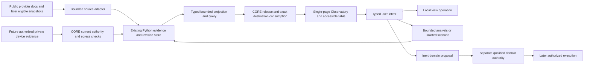
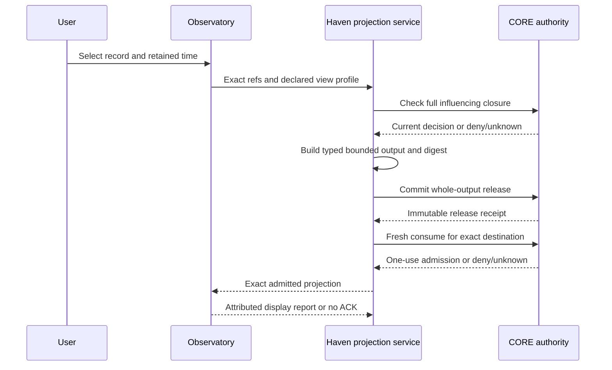

# Observatory design — useful God/admin POV

This is a proposed experience and architecture, not an implemented product. Architecture closure waits for accepted MM-FUSION; preliminary public-source/UX decisions below do not bypass that hard input. Existing H00/H01/H02/H04/H07/H08/H09/H10/H11/H12 owners remain. There is no new omnipotent Observatory authority.

## Experience

Open on a regional scene with a clear mode ribbon: RECORDED, CURRENT SOURCE SNAPSHOT or SCENARIO. “Current” always names source timestamp, retrieval age and validity, not a universal LIVE badge. The user can zoom out to a globe, select a source event, inspect its evidence, rewind the knowledge available at an earlier moment and compare a hypothetical change. A resource can be followed in a simulated view without being commanded.

Desktop layout: map/scene centre; compact layer/source-health controls left; inspector right; time/knowledge controls bottom; question field and finite task drawer. The event table is a coequal view, keyboard reachable and usable without WebGL. Inspector begins with plain-language claim, source time, support and uncertainty; detailed IDs/frames/rights sit behind “Evidence details.” Credits remain visible. Unknown support uses text/pattern, not colour alone. The question field resolves selected object/time before asking a model anything.

iPhone field mode prioritizes one selected record, offline pack state, text/large controls, battery-aware reduced detail and deliberately shared pin. It does not assume an iOS native sensor route exists. Future glasses deliver short eligible private cues through exact R04/R14-qualified device/session/output tuples; no automatic camera capture, raw gaze, face recognition or silent thought-reading. Headphone/display route changes recheck audience, never fall back to a public speaker.

## Eighteen opportunity cards

All experiment numbers below are proposed and NOT_EXECUTED. “Near” means plausible after documentary and implementation gates, not available now. Ordinary/science/community utility is explicit in cards01–16;17–18 retain later protective/embodied ambition. Sources T/D refer to SOURCES_AND_COSTS; internal contract references refer to accepted upstream designs, not working implementations.

### OBS-01 — Regional world inspector (ordinary; deep dive1)
Interaction: select an alert polygon and see “what, when, source and limits,” then ask what actually changed. Value: less context switching and fewer wrong-time conclusions. Evidence: immutable provider record, native ID, times, support geometry and rights. Blocks: GEV selection/annotations, D01, COREI02/R07 MapView; new work is a typed selection-to-evidence adapter. Weakest assumption: users gain from the map beyond a table. Simpler: sorted event table. Maturity: near public-only prototype. Cost: small metadata/renderer RAM and adaptation. Permission: public read/retain and exact export rights. Experiment: matched source lookup versus GEV plus separate table, caseT19.

### OBS-02 — Two-clock time machine (ordinary; deep dive2)
Interaction: rewind both event time and “known by this time,” then reveal a later correction. Value: explains delayed reports without rewriting history. Evidence: received/processed/source times and correction graph. Blocks: SQLite append-only revisions, COREI02, R07 replay; new two-cutoff query and linked inspector. Weakest: source history may not exist before local capture. Simpler: dated revision list. Maturity: near fixture replay. Cost: retained raw revisions/storage. Permission: present-day retrieval/release, not historical grants. Experiment: delayed/corrected record casesT04/T07/T22.

### OBS-03 — Honest fog and next measurement (science; deep dive3)
Interaction: inspect an unmeasured area and compare one additional permitted observation. Value: turns “not known” into an answerable science task. Evidence: calibrated support masks, frame/time uncertainty and finite candidate costs. Blocks: R07 support states and bounded selector; new accessible overlays and candidate explanations. Weakest: expected information gain is not yet calibrated. Simpler: fixed coverage heuristic/manual checklist. Maturity: synthetic comparison first; real sensing later. Cost: evidence preparation and ground truth. Permission: proposal only; capture and carrier motion separate. Experiment: unknown-versus-empty comprehensionT10 plus later held-out selector protocol; do not pool R07 E07-B with original R06 E0.

### OBS-04 — Owned-resource board (daily research logistics)
Interaction: select a simulated rover or instrument and see ready/unavailable/unknown with the missing qualification. Value: makes constraints actionable. Evidence: exact owner/configuration/inspection/battery/lease/qualification refs. Blocks: R09/R10/R11 readiness, COREI07; new read-only card projection. Weakest: a stale heartbeat is often mistaken for readiness. Simpler: inventory spreadsheet. Maturity: near synthetic board; actual enrollment later. Cost: metadata upkeep. Permission: display only; mission proposal separately admitted. Experiment: stale/unknown/contended resourcesT17/T18/T23.

### OBS-05 — Isolated alternate timeline (ordinary planning; deep dive4)
Interaction: remove a fictional relay and compare which modeled links disappear. Value: exposes dependency assumptions before field planning. Evidence: pinned topology and declared link model, not scanning. Blocks: simple graph algorithm and ScenarioSpec; new immutable branch/diff UI. Weakest: configured topology may differ from measured connectivity. Simpler: annotated diagram. Maturity: near inert model. Cost: low CPU, source qualification. Permission: none to mutate live resources. Experiment: meaningful alternate outcome and escape rejectionT16/T20.

### OBS-06 — Planet to workbench (science; deep dive5)
Interaction: from missing coverage, follow an instrument to fixture revision, failed trial and reviewed improvement proposal. Value: unifies why a physical design exists and whether it helped. Evidence: exact R08 protocol/measurement/calibration/material lineage. Blocks: accepted inert-scalar profile and engineering notebook; new evidence joins/inspection view. Weakest: no measured physical improvement is currently supplied. Simpler: linked notebook pages. Maturity: synthetic lineage near; metrology/fabrication later. Cost: independent measurements/fixtures dominate. Permission: read; CAD/fabrication remains separate. Experiment: retain failed candidate and refuse unsupported metric promotionT24.

### OBS-07 — Cooperative private pin (ordinary field work)
Interaction: A shares only one selected public-field annotation with B, who chooses private display and acknowledges. Value: useful cooperation without sharing the whole workspace. Evidence: exact pin/output/destination, current grants and receipt tuple. Blocks: COREI01/I06, accepted R01 amendment, R14 cues; new scoped projection/export. Weakest: disconnected peers cannot prove current revocation. Simpler: manually exchange a public reference. Maturity: simulated receipt UI first. Cost: authority integration, future device support. Permission: exact share/retain/display, no inherited location grant. Experiment: lostACK/revoke/wrongaudienceT11/T12/T18/T25.

### OBS-08 — “What changed in this region?” (ordinary environmental science)
Interaction: a finite brief compares dated weather/earthquake records and missing intervals. Value: daily regional awareness and learning. Evidence: D01/D02 source revisions, quality and geometry. Blocks: deterministic filtering/counting and source-linked text. New: change taxonomy that separates new observation, correction and missing coverage. Weakest: absence of records is not absence of change. Simpler: provider site bookmarks. Maturity: first-demo candidate. Cost: bounded requests/storage. Permission: public read/retain; no watcher created. Experiment: answerable and missing-data casesT01–03/T19.

### OBS-09 — Portable field kit (ordinary/community)
Interaction: prepare a small eligible pack with maps, source notes and public instructions; distinguish saved, relayed and received. Value: continuity without pretending mesh equals internet. Evidence: licensed bounds/version/expiry, R11 pathway receipts. Blocks: T04 or original static geometry, accepted public R11 contracts. New: pack manifest and receipt view. Weakest: offline data may be old and private authority unavailable. Simpler: printed public sheet. Maturity: public offline bundle near after rights review; private relay deferred. Cost: bytes/power/maintenance. Permission: explicit cache/export; no tile scraping. Experiment: offline and rights-denialT21/T26.

### OBS-10 — Capability research tree (ordinary)
Interaction: choose “localize behind an obstacle” and see the next experiment, failed evidence and owners. Value: keeps ambitious targets visible without fiction. Evidence: exact requirement/experiment/version/reviewer refs. Blocks: original102REQ/102AT/32EX and campaign graph; new read-only capability projection. Weakest: dashboard status can overstate qualification. Simpler: indexed research documents. Maturity: near inert read view. Cost: maintaining accurate links. Permission: public-safe projection only. Experiment: distinguish accepted research from qualified operationT27.

### OBS-11 — Cinematic evidence director (ordinary communication)
Interaction: turn a reviewed regional brief into a narrated camera tour with persistent source/mode labels. Value: compelling explanation and easier sharing. Evidence: exact permitted scene, source sidecar and output manifest. Blocks: GEV Directorv6, COREI06. New: source-preserving timeline and export admission. Weakest: cinematic interpolation can look observed. Simpler: slides with source links. Maturity: static tour near, speech later. Cost: rendering, optional qualified audio. Permission: share/export and output route; no grant restoration. Experiment: mode labels survive replay/import/exportT04/T12/T28.

### OBS-12 — Satellite-pass field notebook (science; combination1)
Interaction: compare a dated satellite product with a deliberate permitted field note at the same study site. Value: teaches scale, cloud gaps and collection timing. Evidence: D04/D05 product/band/QA and independent field metadata. Blocks: T07 plus R07 alignment; new compare-to-support view. Weakest: temporal/spatial co-registration may be unqualified. Simpler: paired images with dates. Maturity: later licensed replay. Cost: imagery/processing/operator time. Permission: collection/field consent and provider access. Experiment: reject mismatched footprint/time rather than claim validationT07–10. Prior art: STAC/EO comparison; novelty of Haven workflow unestablished.

### OBS-13 — Network-dependency atlas (ordinary; combination2)
Interaction: inspect which owned service depends on power, relay and actual backhaul, then fork one outage. Value: useful networking and resilience reasoning. Evidence: configured versus observed topology kept separate. Blocks: accepted R11 pathways, graph scenario. New: link evidence/age and dependency diff. Weakest: a logical path is not measured connectivity. Simpler: inventory diagram and manual checks. Maturity: synthetic near. Cost: later approved test time. Permission: no network scans; live tests separately scoped. Experiment: local-connectivity-but-no-internetT20/T21. Prior art: network maps/graph analysis; Haven's evidence/receipt coupling is a proposed integration.

### OBS-14 — Temporary citizen-science station (community; combination3)
Interaction: a team poses a finite shade/temperature question, deploys no device until approved, and later compares calibrated records with missing coverage. Value: accountable local science rather than indefinite collection. Evidence: placement/participant scope, calibration, protocol and retrieval plan. Blocks: R07/R08 and research tree. New: study episode projection. Weakest: convenience samples support only bounded conclusions. Simpler: manual observation sheet. Maturity: research proposal. Cost: instruments, reference measurements and stewardship. Permission: each acquisition/participant/retention separately qualified. Experiment: protocol-locked missing/calibration/confound casesT10/T24. Prior art: citizen-science protocols; no scientific novelty claim.

### OBS-15 — Sun/shade hypothesis planner (ordinary science)
Interaction: change time/geometry assumptions to compare a hypothetical shaded field station. Value: helps choose a question or placement to measure. Evidence: dated geometry, solar model and uncertainty. Blocks: globe/view geometry, simple deterministic model. New: modeled-versus-measured side-by-side. Weakest: vegetation/building geometry may be outdated/coarse. Simpler: manual sun/shade notes. Maturity: model research. Cost: geometry rights and later ground truth. Permission: simulation only. Experiment: altered geometry changes only scenario, not observation layerT09/T16.

### OBS-16 — Accessible evidence companion (daily)
Interaction: ask the same spatial question using table/keyboard or short eligible audio without reading a dense globe. Value: inclusion, mobile efficiency and lower visual load. Evidence: same selected records and source locators. Blocks: R01 accessible presentation, optional MM-AV qualified outputs. New: equivalent textual selection and mode status. Weakest: concise output may hide uncertainty. Simpler: accessible table. Maturity: near text first. Cost: UI testing, optional device qualification. Permission: output route/audience, no microphone default. Experiment: comprehension without colour or WebGLT19/T29.

### OBS-17 — Regional incident after-action review (protective ambition)
Interaction: replay public records and explain what was known before an incident notice. Value: learning and coordination without claiming current emergency certainty. Evidence: retained history, correction and authenticated human reports. Blocks: R11 public-safe summary/R07 replay. New: differing source-time explanation. Weakest: incomplete records make causation unknowable. Simpler: chronology. Maturity: public historical exercise only. Cost: curation/review. Permission: no professional dispatch or clinical inference. Experiment: source-gap/no-causation controlsT07/T22.

### OBS-18 — Qualified embodied observation proposal (later robotics)
Interaction: follow a simulated rover, then separately draft an observation request for an exact qualified real resource. Value: preserves strategy-game agency with genuine domain boundaries. Evidence: R09/R10 capability tuple, map/support, supervision/lease/recovery and current authority. Blocks: COREI07/R07 NextObservationRequest. New: clear proposal handoff, never direct generic map execution. Weakest: platform qualification and physical outcomes remain unavailable. Simpler: human observation plan. Maturity: inert proposal now, real operation separately reviewed. Cost: complete hardware/energy/insurance/regulatory/maintenance unknown. Permission: sensing, carrier motion and publication separate. Experiment: synthetic/live ID, unknown dispatch and stop-state separationT16/T17/T23/T30.

## Five deep dives

### 1. Inspector plus regional brief
Proposed input is one eligible NWS snapshot,12bounded fixture events and three visibly simulated resources. No private position is used: the study area is a public regional extent selected manually. The user selects a polygon, opens native source/time/resolution, asks “what changed since yesterday?” and sees deterministic added/corrected/expired/missing categories. A new provider update appends a revision rather than mutating the selected historical event. A missing polygon stays an area-description/table record, not a guessed centre point.

Output is a grounded answer with record links and an exact query manifest. No-model counting/filtering can be useful immediately after implementation; semantic explanation is an explicitly qualified later comparison. Errors preserve source gap, quota and observation-versus-forecast distinctions. Baseline is GEV and a separate event table with the same data; the contribution to test is lower lookup effort and correct source association, not decorative animation. T19 uses eight matched tasks/user, fixed answer key and counterbalanced order; proposed target at least20% lower median completion time without worse correctness. Two participants yield a descriptive formative result, not population efficacy.

### 2. Time machine with visible hindsight
There are two controls: event interval and knowledge cutoff. “As known then” uses only records received/available by the cutoff; “corrected view now” includes later eligible corrections. Both query current rights and tombstones. Retained uncorrected history is explanatory evidence when still eligible, not authority to republish deleted data.

Example fixture: sensor event10:00, received10:04, corrected10:20. At10:02knowledge cutoff it is absent; at10:10 original appears; corrected-now shows the revision plus change explanation. Clock uncertainty can make ordering indeterminate. Gaps use an empty interval ribbon, never an invented interpolated observation. Replay pauses before selecting a new object to prevent accidental cross-time referents. Proposed evaluation freezes six timeline cases including one unknowable order; correct abstention/clarification matters alongside positive retrieval. Rendering can be smooth while evidence steps discretely.

### 3. Fog of war plus useful active perception
The scene separates observed occupied/free, occluded, unobserved and conflict, while inferred geometry is an independently labeled overlay. “Show least observed area” refers to a bounded source support map, not a claim about all possible sensors. RF silence is not emptiness; a neural completion cannot fill the observed mask. Unknown transform or scale yields a source-local nonmetric view/table, not a misleading global point.

A finite catalog offers one handheld/fixed/rover/aerial candidate or STOP with declared expected benefit/cost and footprint. The first comparison is a deterministic coverage heuristic; model gain is research. R06 original E0 and R07 E07-B have different splits/catalogs and cannot pool results. An observation suggestion is useful even when no qualified platform exists: “a permitted measurement from this side would distinguish hypotheses; no acquisition requested.” Later physical admission remains with H08 and H05/H10.

### 4. Scenario fork with a visible boundary
Copy exact eligible evidence references and a frozen parameter set into a branch whose profile permits no live connectors. Original facts remain immutable; user edits produce assumptions, not corrections to reality. The header says SCENARIO throughout map, table, answer and exported tour. Scenario actors have separate IDs and cannot resolve as enrolled physical resources.

For the initial relay exercise, a small graph computes reachability after removing one edge; each edge is CONFIGURED, OBSERVED or ASSUMED with age. This avoids installing a simulator before one is needed. “No modeled path” does not establish radio impossibility; a path does not prove internet connectivity. Useful output is a changed dependency list and proposed verification question. Tests deliberately inject real adapter/capability IDs and require rejection. Physical simulation later needs its own qualified model/geometry/protocol, not a flag in this profile.

### 5. Planet-to-workbench evidence chain
Select a measurement gap, then instrument, fixture revision, synthetic scalar observation and reviewer decision. Retain failures and exact baseline/analysis/held-out procedure. R08's ±1m representation and decimal precision are storage-profile bounds, not instrument accuracy. A ruler-like interface must not imply nine-decimal metrology; UNKNOWN uncertainty/calibration prevents promotion.

The first lineage uses inert authored records and no CAD executable. A changed enclosure revision invalidates current applicable calibration until reviewed; it does not rewrite historical decisions. A “design improved” claim requires accepted measurement evidence for that metric and configuration. R08's20% repeatability and30% other improvement targets stay distinct; no scene-level score combines them. The small test asks users to find why a candidate was rejected and what remains unmeasured. The full growth path to restricted template CAD, supervised fabrication and later machine gateway retains independent owners/gates.

## Architecture and three flows

Public flow: fixed eligible adapter → raw-byte SourceRecord plus native metadata → revision/lineage store → bounded query → viewer/answer. Private flow: future explicitly acquired data → complete current authority checks → retained qualified evidence → exact private projection/release/consumption; public providers cannot see private viewport/query by default. Intent flow: classify first; camera view operation, source refresh, analysis, annotation, share, digital action or physical proposal are distinct. A renderer cannot jump to X.

The sequence is a proposed contract illustration, not a global exactly-once display guarantee. Revocation after consumption can race in-flight display. Receipt history and future eligibility remain separate.

## Three routes and provisional choice

| Route | Strength | Limit and selection rule |
|---|---|---|
| Separate top-level GEV sidecar | Lowest initial coupling; stock page owns lifecycle; suitable public tour/bundle inspection. | Default CSP/X-Frame deny embedding. Two windows and a new validated selection bridge reduce UX integration; bundle cannot carry live grants. Useful comparator/fallback specialist view, not private authority. |
| Source-pinned one-page composition | Real constructors/catalog/source interfaces can connect one map selection directly to Haven evidence. | Must prove no unwanted providers/assets/voice import, teardown and exact selection interface. Estimated24–40h+review; public-only first. Provisional preferred route after hard input closure. |
| Thin custom 2D view | Accessible, low dependency boundary; original geometry/table can work without photoreal content. | Less cinematic/deep3D; MapLibre optional after source/build review. Preferred fallback if120minute composition proof fails, not a rewrite of Python foundation. |

Use only selected imports, not the standalone all-layer shell as a permission engine. Choose local-only search and caller-supplied original presets; never default network fallback for private text. Hold source-pinned patch set outside shared/main source and upstream changes behind exact diff/tests/notices. Keep public wall, privateA, privateB and explicitly shared destinations distinct even when the same frontend code is reused.

## Bounded workers

These are existing H02-style roles, not autonomous services. All require sponsor, exact source/context closure, I04attempt/lease/deadline, I05reservation, I06release and explicit cancellation. No schedule is created by asking for a brief.

| Role / trigger | Bound and output | Stop/freshness |
|---|---|---|
| Regional researcher / manual question | ≤32sources, one256KiB whole answer, deterministic first; proposed30s analysis ceiling | Missing source eligibility or exhausted original deadline stops; no hidden refresh |
| Source-health steward / explicit check | Registry/status from last permitted request; one status summary | No probe unless separately admitted; stale remains stale |
| Change investigator / selected snapshots | Two immutable revisions, one diff, no causal claim by default | Correction/withdrawal invalidates derivative; incomplete lineage denies |
| Scenario runner / frozen branch | One finite graph,≤32nodes/64edges, no connector capability,≤5s planned CPU task | No rerun with fresh budget after timeout; outcome unknown if cessation unobserved |
| Active-perception investigator / ambiguity | Fixed eligible candidate catalog or STOP; no acquisition | R07episode bounds and current footprint qualification |
| Engineering investigator / selected campaign | Exact protocol/baseline/candidate evidence; no evaluator changes | Missing calibration/holdout/owner makes claim inconclusive |
| Briefing editor / selected public brief | One source-linked scene/tour manifest, optional later qualified narration | Export/current audience rechecked; no release on unknown commit |

All numeric limits are proposed task ceilings to validate, not measured latency or containment. P0 has no model worker and no autonomous polling. Model-bearing experiments retain CORE VA-01/P01 lifecycle and exact adapter containment prerequisites.

