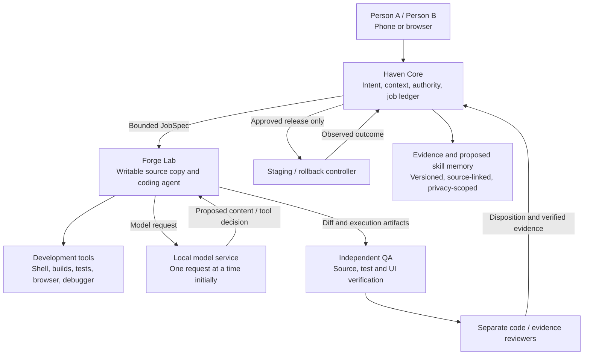
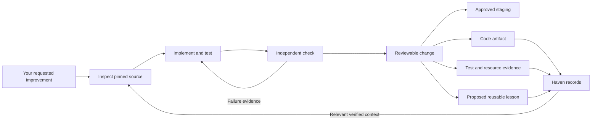
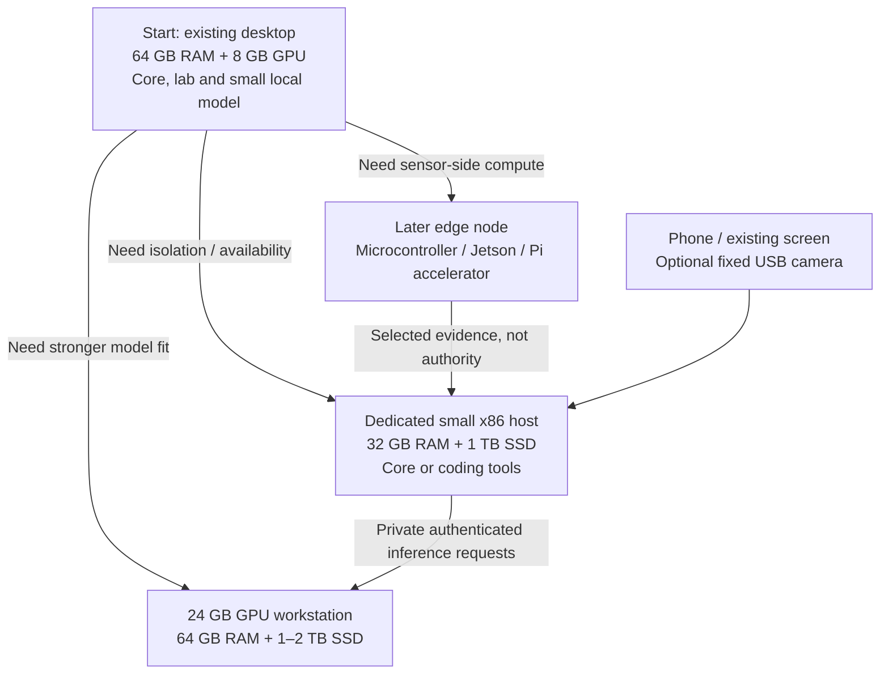

# Visual system designs

All diagrams are proposed logical designs, not observed deployment topology. 'Forge' is a suggested local coding-worker label. The first version can occupy one existing computer; boundaries must be implemented, not assumed from boxes.

## 1. Three zones and the feedback boundary

The inference service does not receive deployment credentials. The builder does not own production memory or its acceptance decision. Ordinary lab work is writable and executable.

## 2. What feeds back into Haven

This is code/evidence/skill feedback, not automatic model-weight training. A proposed lesson is not automatically a trusted rule.

## 3. Hardware placement, selected by bottleneck

These branches are alternatives driven by measured needs, not a required shopping sequence. Edge TOPS and core language-model capacity are different. No robot or flight controller is connected by this diagram.
