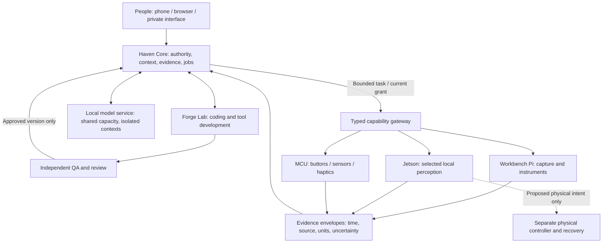

# Modular edge layer — Raspberry Pi, Jetson, microcontrollers and instruments

2026-09-29 / additive operator-requested design / PROPOSED_NOT_IMPLEMENTED. No device or agent has been started, ordered or configured. This broadens the future hardware design, not the current IP-01 execution grant. The core coding-worker design remains in SYSTEM_DESIGN.md.

## 1. Responsibility is not physical location

An agent is a bounded responsibility with context and tools. A node is a computer or microcontroller providing capabilities. A model is a particular computation. They need not have a one-to-one relationship.

A perception investigator can use two Pi camera nodes and one Jetson estimator. A workbench Pi can provide tools to both the engineering and memory agents. A tiny button/sensor node can use deterministic firmware and no LLM. A central GPU can serve several role-specific contexts sequentially. Put work near sensors when latency, bandwidth, privacy or offline operation makes that useful—not because every named agent needs a body.

## 2. Suggested node classes and role ownership

Friendly names below are proposed aliases only; existing Hxx ownership remains controlling.

| Node / alias | Hardware class | Local functions | Haven owner / consumer |
|---|---|---|---|
| Senselet | ESP32-S3 / RP2040-RP2350 class MCU | Button, contact, temperature, IMU or bounded haptic commands; timestamps and buffering | H07/H08 tools; no general reasoning needed |
| Workbench | Raspberry Pi 5, selected 4/8 GB configuration | Fixed camera, USB/serial instruments, small display, capture service, local buffer, preprocessing | H08 perception and H09 engineering; H04 data scope |
| Perception | Jetson Orin Nano Super | Compatible detector/segmenter/tracker, selected speech or compact VLM, perception pipeline near sensor | H02 runtime + H08 spatial/fusion |
| Scene accelerator | Pi 5 + AI HAT+ 2 | Supported compiled vision or generative models through Hailo runtime | H02/H08; not arbitrary CUDA or every Ollama artifact |
| Interface | Existing phone/tablet first; Pi display/audio node later | Deliberate private input/output, selected scene view, approved audio interface | H01/H07/H12, H04 recipient/authority |
| Relay/cache | Pi-class host | Time-bounded store-and-forward for authorized records; network state and duplicate handling | H11/H02; not permission to continue stale actions |
| Physical supervisor | Task-specific MCU / flight controller | Deterministic control, actuator limits, watchdog and apparatus-specific recovery | H10 ground robotics, H05 aircraft, H09 fabrication |
| Forge | x86 development host or VM | Code, builds, browser tests, simulation and firmware compilation in a lab | Root dispatch; implementation writers; separate QA/review |

No remote motor command or full sensor study is authorized by this table. Existing consumer-drone interfaces remain unknown until separately verified. Medical instruments are not replaced by a generic sensor board.

## 3. Proposed modular topology

The gateway is a logical adapter in the existing application, not a demand to add a new service or broker. Start with a small authenticated API and typed events. MQTT or a robotics middleware can be evaluated later when event rate, reconnect behavior or an actual robot requires it. GPIO/serial device access stays behind a typed node tool, not a generic remote shell exposed to every model.

## 4. Work near the sensor without inventing evidence

Example: a fixed camera supplies a selected workbench image. Local code detects a possible change and preserves the relevant original frame. A Jetson may run a compatible object model. Haven receives the original reference, derived result, time and uncertainty; it associates the event with currently eligible task/object records. The user receives a source-linked answer. The coding worker may improve the detector adapter in a separate source copy and submit test evidence; it does not remotely replace the running sensor software on its own.

Local processing can reduce uplink/storage needs, but a lossy summary cannot replace source evidence needed for a claim. A frame-difference detector is not an object identity oracle. An environmental change is not a diagnosis. RF sensing, estimated depth and measured geometry retain separate evidence and calibration classes.

For a multi-stage pipeline, measure total latency: capture + buffer + local inference + transfer + central retrieval/reasoning + output. A fast board does not solve a slow network or oversized model context. Avoid running multiple unmeasured heavy models on one 8 GB node.

## 5. Minimum node manifest and evidence envelope

A capability manifest should declare: logical node ID, boot ID, hardware/firmware/runtime identity, exact sensors and supported commands, input/output schema versions, frame/units/clock mapping, calibration revision, current resource headroom, authentication identity, eligible audiences and data retention, and last confirmed status. It contains no inference that ownership or a heartbeat automatically permits an action.

Each evidence envelope needs event ID, source sequence/boot ID, capture and receipt times, source clock uncertainty, raw artifact digest/reference, transformation/model identity, coordinate frame/units, known quality/coverage limitations, source lineage and current access dependencies. Idempotent ingestion must distinguish duplicate history from a new observation.

On disconnect, show last-known/unknown instead of live status. Buffer only already authorized data within a finite retention budget. Do not replay expired actions when reconnecting. Accepting a device certificate identifies a node; it does not establish the truth of its measurements or a person's consent.

For health-related sensors, retain the exact instrument and stated measurement limitations. A sensor board is not a clinical diagnosis and this design does not provide medical treatment or autonomous emergency dispatch.

## 6. Control timing is separate from language reasoning

A model can propose which view is useful or which tool to test. A task-specific controller handles electrical/motion timing, limits and recovery. The right response to a communication loss depends on the apparatus; do not universally cut a motor where that could drop a load.

Espressif documents watchdog facilities [E04], but a watchdog alone is not a complete safety system. Observe stop/recovery on the actual apparatus under a separate physical assignment. Never make time-critical control depend on an LLM round trip, cloud availability, or a GitHub checkpoint.

## 7. Practical parts bundles, not a mandatory shopping cart

### Tiny sensor/control learning node

One ESP32-S3 or RP2350-class development board, one actual measurement/input component, USB data/power cable, breadboard/connectors where appropriate, simple enclosure and strain relief. Proposed USB-powered bench budget: $25–50; task-specific sensor costs may exceed that. No battery charging circuit or mains switching is required for the first proof. Prefer a deliberate button or harmless environmental measurement to always-on household audio/video.

### General workbench node

One Raspberry Pi 5 (4 GB is a reasonable starting specification for a modest sensor gateway; 8 GB only if the software needs it), correct 5 V/5 A-class supply, active cooling, suitable case, storage, Ethernet, and one selected UVC/CSI camera or USB instrument. Verify camera connector/cable and OS support. Budget board price PLUS roughly $70–150 of selected storage/power/cooling/capture accessories, rather than assuming the bare board is a complete system. A write-heavy state store should be selected and backed up deliberately.

The official Pi 5 page currently lists its 16 GB board at $305 [E01]. This is a current observation of that variant, not the price of 4/8 GB versions. Do not buy 16 GB just to host a sensor service or reuse old launch prices. A configured Pi can cost more than a suitable used x86 mini-PC; compare the complete node and its I/O needs.

### Perception node

One Jetson Orin Nano Super developer kit, compatible storage (microSD or NVMe as applicable), selected camera, enclosure/mount and the power/cooling components actually required by the bundle. Official regional NVIDIA page lists $249 USD; 8 GB LPDDR5 and 7–25 W are module specifications [E02]. Check local price/stock and package contents. Allow roughly $350–500 for a simple complete bench node; this is an estimate and can be exceeded by specialized depth/thermal sensors. No specific frame rate or model concurrency is proven here.

### Pi accelerator alternative

One Pi 5 plus AI HAT+ 2 and its required power/cooling/storage/camera arrangement. The current HAT product page is $200, with Hailo-10H, 8 GB onboard memory and 40 INT4 TOPS [E03]. The HAT price does not include the Pi. Model/compiler/runtime support is the first procurement check. The HAT's RAM is not automatically pooled with the host's memory for arbitrary models. Compare complete price and measured task performance against Jetson; do not buy both by default.

### Compute modules and custom carriers

Compute Module 5 is a future packaging choice once interfaces, enclosure and power are stable [E05]. It is not an ordinary Pi with all ports attached: use a suitable carrier, thermal and power design. The same distinction applies to a bare Jetson module versus a developer kit. Prototype with an exposed supported board first; pursue custom packaging after the task works.

## 8. Recommended sequence

Keep the existing desktop as Core/model/Forge starting capacity. Prove one software job returning evidence. Add ONE USB-powered MCU/button/sensor node to demonstrate capture → typed event → Haven → useful response. Then choose ONE Pi or Jetson workbench node according to the sensor/perception workload. Only later split the core onto an always-on host or buy more inference memory if measured availability/latency warrants it.

Do not build a Raspberry Pi cluster merely to imitate a GPU workstation. Multiple independent boards can parallelize different jobs; they do not transparently pool GPU/unified memory. Cross-device model parallelism is a separate software/network engineering project. No Kubernetes, distributed training or always-running LLM per board is needed for the first Haven ecosystem.

## 9. Edge source update and limitations

[E01] Raspberry Pi 5 official page: https://www.raspberrypi.com/products/raspberry-pi-5/ — inspected 2026-09-29. 16 GB price $305; variants, 5V/5A supply, active-cooling recommendation, camera/PCIe interfaces. No parsed quote for 4/8 GB variants. Do not substitute a historical price.

[E02] NVIDIA Jetson Orin Nano Super: https://www.nvidia.com/en-us/autonomous-machines/embedded-systems/jetson-orin/nano-super-developer-kit/ and regional price page https://www.nvidia.com/en-sg/autonomous-machines/embedded-systems/jetson-orin/nano-super-developer-kit/ — specifications and $249 USD regional vendor listing. Exact kit/region availability and included parts require checkout verification. No benchmark reproduced.

[E03] Raspberry Pi AI HAT+ 2: https://www.raspberrypi.com/products/ai-hat-plus-2/ — current $200, Hailo-10H, 8 GB memory and supported model ecosystem. TOPS is not tokens/second or reliable-agent task completion.

[E04] ESP-IDF watchdog documentation: https://docs.espressif.com/projects/esp-idf/en/stable/esp32s3/api-reference/system/wdts.html — implementation reference only; watchdog presence does not qualify an apparatus.

[E05] Compute Module 5: https://www.raspberrypi.com/products/compute-module-5/ — module/form-factor integration reference, not a complete assembled node quote.

Previously recorded Seeed and webcam prices in HARDWARE/SOURCES are dated observations; the newly fetched Seeed HTML did not expose a directly reconfirmable price. Use the estimated complete starter-node allowance rather than a guaranteed $13.99 checkout claim. No module was acquired, energized, connected, benchmarked or independently qualified by this research.
